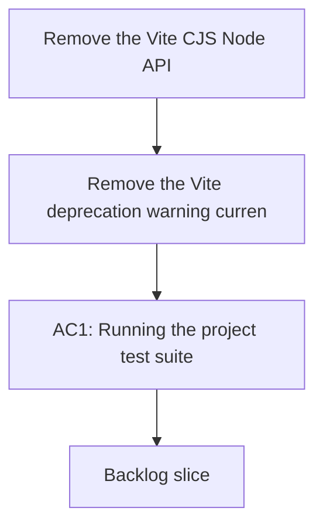

## req_034_remove_vite_cjs_node_api_deprecation_warning_from_test_runs - Remove the Vite CJS Node API deprecation warning from test runs
> From version: 1.9.3
> Status: Done
> Understanding: 100% (refreshed)
> Confidence: 100%
> Complexity: Low
> Theme: Tooling hygiene and test-run clarity
> Reminder: Update status/understanding/confidence and references when you edit this doc.

# Needs
- Remove the Vite deprecation warning currently shown during test runs.
- Keep test output focused on actual failures and useful signals.
- Align the project test/tooling setup with the non-deprecated Vite/Vitest integration path.

# Context
Current test runs complete successfully, but they emit a warning similar to:
- "The CJS build of Vite's Node API is deprecated."

This does not currently fail the suite, but it still pollutes the output and introduces avoidable noise in the developer workflow.
Warnings like this are easy to ignore repeatedly until they hide real issues or turn into future breakage after a dependency update.

This request is not about changing application behavior.
It is about tooling hygiene:
- keep CI and local test output cleaner;
- reduce misleading noise;
- and move the project away from a deprecated integration path before it becomes a harder migration.

# Acceptance criteria
- AC1: Running the project test suite no longer emits the Vite CJS Node API deprecation warning.
- AC2: The chosen fix uses a supported Vite/Vitest configuration path rather than suppressing the warning cosmetically.
- AC3: The change does not break existing test execution locally.
- AC4: The change does not break existing smoke-test or packaging-related workflows.
- AC5: Any required config or module-format change is documented or made explicit enough to remain maintainable.
- AC6: Test and validation commands continue to pass after the warning is removed.

# Scope
- In:
  - Investigate why the project currently triggers the deprecated Vite CJS Node API path.
  - Update the relevant test/tooling configuration to use the supported path.
  - Validate that existing test commands still work.
  - Keep the resulting setup explicit and maintainable.
- Out:
  - Broad dependency upgrades unrelated to the warning.
  - Refactoring unrelated build or runtime code.
  - Cosmetic log filtering that hides the warning without fixing its cause.

# Dependencies and risks
- Dependency: current Vitest/Vite integration and config files remain the starting point for the fix.
- Dependency: any module-format adjustment must stay compatible with the rest of the project tooling.
- Risk: a hasty config migration can remove the warning while subtly breaking tests, scripts, or packaging commands.
- Risk: upgrading too much at once can turn a narrow tooling fix into a broader dependency migration.
- Risk: suppressing the warning without removing the root cause would create false confidence and technical debt.

# Clarifications
- The target is the warning observed during test execution, not a change in product behavior.
- The preferred solution is to stop using the deprecated path, not to silence stderr.
- A small configuration or module-format adjustment is acceptable if it removes the warning cleanly.
- The validation bar should include the project’s existing automated test commands, not only a minimal isolated test.

# Definition of Ready (DoR)
- [x] Problem statement is explicit and user impact is clear.
- [x] Scope boundaries (in/out) are explicit.
- [x] Acceptance criteria are testable.
- [x] Dependencies and known risks are listed.

# Backlog
- `logics/backlog/item_039_remove_vite_cjs_node_api_deprecation_warning_from_test_runs.md`

# Companion docs
- Product brief(s): (none yet)
- Architecture decision(s): (none yet)
