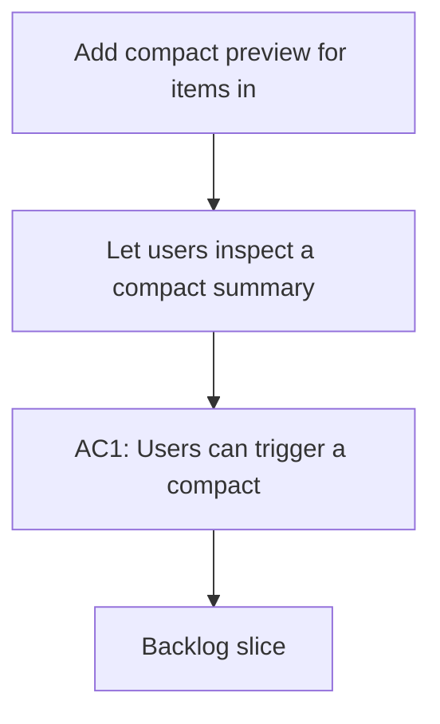

## req_038_add_compact_preview_for_items_in_the_plugin - Add compact preview for items in the plugin
> From version: 1.9.3
> Status: Done
> Understanding: 100% (refreshed)
> Confidence: 100%
> Complexity: Medium
> Theme: Information preview and navigation efficiency
> Reminder: Update status/understanding/confidence and references when you edit this doc.

# Needs
- Let users inspect a compact summary of an item without fully opening or reading it.
- Reduce back-and-forth between the main surface and deeper item views.
- Make dense workspaces easier to scan quickly.

# Context
The plugin already supports selection, details, and read/open actions.
That is good for committed inspection, but it can still feel heavy when users only want a quick glimpse before deciding what to open.

A compact preview could expose a small set of high-value signals such as:
- indicators/status;
- key references;
- used-by summary;
- recent update metadata.

This request is about reducing friction in everyday navigation.
It is not about replacing the detail panel or read view.
It is about adding a quicker inspection layer before those heavier actions.

# Acceptance criteria
- AC1: Users can trigger a compact preview of an item without opening the full read flow.
- AC2: The preview exposes a concise set of high-value metadata for quick inspection.
- AC3: The preview does not replace or regress the current detail panel and read/open actions.
- AC4: The preview behaves coherently in board mode and list mode where applicable.
- AC5: The preview can be dismissed cleanly without disrupting selection state.
- AC6: Tests cover the preview trigger and visible preview content where practical.

# Scope
- In:
  - Add a compact preview interaction.
  - Define a concise preview information set.
  - Preserve current details/open/read behaviors.
  - Add regression coverage for the preview flow.
- Out:
  - Replacing the existing detail panel.
  - Full markdown rendering in the preview.
  - Adding a second full document reader.

# Dependencies and risks
- Dependency: current item metadata and details rendering provide the likely source for preview content.
- Dependency: preview interaction must coexist cleanly with current selection behavior.
- Risk: a preview that is too heavy can duplicate the detail panel and add complexity without enough value.
- Risk: poor trigger design can create accidental popups or visual noise.
- Risk: exposing too much content in preview can blur the boundary between preview and read.

# Clarifications
- The request is for a compact preview, not another full view mode.
- The preferred preview should be fast to open, quick to scan, and easy to dismiss.
- The goal is to shorten the path from “I think this is the right item” to “yes/no”.
- The exact trigger can be decided later, as long as it works coherently in the plugin surface.

# Definition of Ready (DoR)
- [x] Problem statement is explicit and user impact is clear.
- [x] Scope boundaries (in/out) are explicit.
- [x] Acceptance criteria are testable.
- [x] Dependencies and known risks are listed.

# Backlog
- `logics/backlog/item_043_add_compact_preview_for_items_in_the_plugin.md`

# Companion docs
- Product brief(s): (none yet)
- Architecture decision(s): (none yet)
