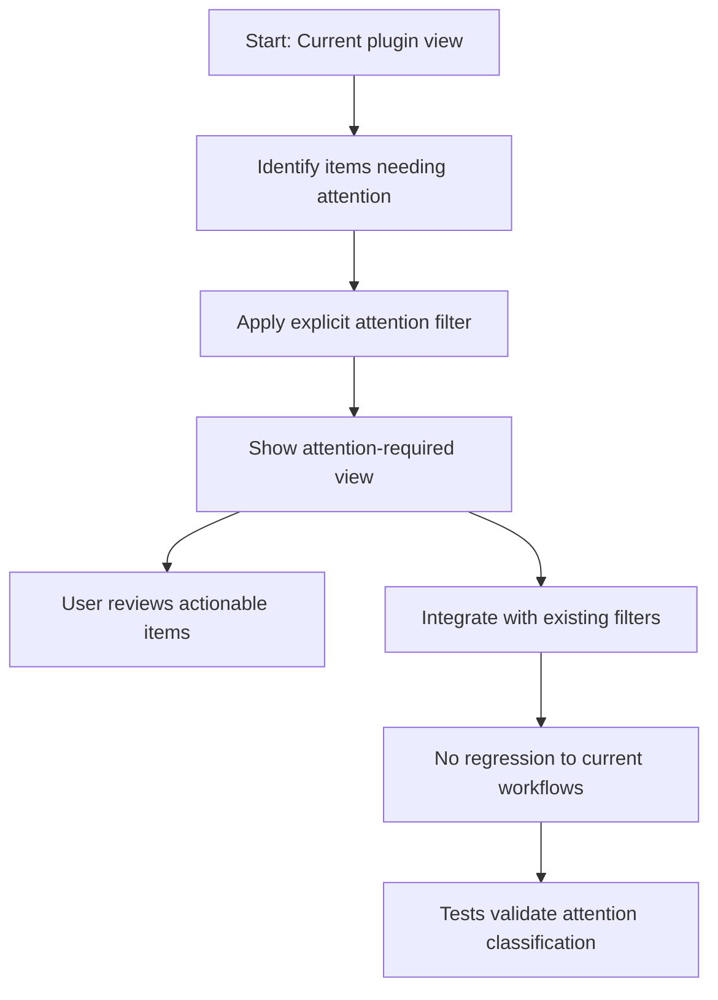

## req_040_add_attention_required_view_to_the_plugin - Add an attention-required view to the plugin
> From version: 1.9.3 (refreshed)
> Status: Done
> Understanding: 100% (refreshed)
> Confidence: 100%
> Complexity: Medium
> Theme: Operational focus and workflow triage
> Reminder: Update status/understanding/confidence and references when you edit this doc.

# Needs
- Add a focused way to surface items that likely need action or review.
- Help users identify bottlenecks, stale work, missing links, or incomplete workflow progression faster.
- Turn the plugin into a more proactive orchestration cockpit rather than only a passive browser.

# Context
The current plugin is good at showing the structured state of Logics items, but it still expects users to infer where attention is needed.
An explicit “attention required” lens could help highlight items such as:
- unprocessed requests;
- blocked or stale work;
- missing companion docs;
- orphaned or weakly linked items;
- inconsistent progress/status situations.

This request is not about adding complex analytics.
It is about giving users a practical triage view that reduces manual scanning and helps them focus on what likely needs intervention.

# Acceptance criteria
- AC1: The plugin exposes an explicit view, filter, or mode dedicated to items requiring attention.
- AC2: The criteria used to mark items as needing attention are explicit enough to be understandable.
- AC3: The attention-required surface helps users identify actionable items faster than the default browsing modes.
- AC4: The feature composes coherently with current filters and navigation behavior.
- AC5: The feature does not regress existing board/list workflows.
- AC6: Tests cover the core attention-classification behavior where practical.

# Scope
- In:
  - Define a first useful set of “attention required” signals.
  - Expose a dedicated way to view or filter those items.
  - Keep the feature understandable and operational.
  - Add regression coverage for the core behavior.
- Out:
  - A full reporting or analytics dashboard.
  - Predictive scoring beyond practical workflow heuristics.
  - Replacing the current board/list views.

# Dependencies and risks
- Dependency: the current item metadata must support clear attention heuristics.
- Dependency: the new view/filter must compose with existing plugin navigation affordances.
- Risk: vague or noisy heuristics can reduce trust quickly.
- Risk: if too many items are flagged, the feature loses value.
- Risk: if the criteria are hidden, users may not understand why something appears in the view.

# Clarifications
- The goal is practical triage, not perfect intelligence.
- The first version should prefer a smaller set of explainable signals over a broad opaque score.
- The feature should help answer “what needs me now?” quickly.
- The result can be a dedicated mode, view, or focused filter path as long as the workflow value is clear.
- The recommended first implementation is a simple dedicated view or focused filter path driven by roughly four to five high-confidence heuristics, not a broad scoring system.
- The preferred initial heuristics should be strict and low-noise rather than broad and debatable.
- Signals that depend on weak inference should be deferred; explicit workflow signals should carry the first version.

# Definition of Ready (DoR)
- [x] Problem statement is explicit and user impact is clear.
- [x] Scope boundaries (in/out) are explicit.
- [x] Acceptance criteria are testable.
- [x] Dependencies and known risks are listed.

# Backlog
- `logics/backlog/item_045_add_attention_required_view_to_the_plugin.md`

# Companion docs
- Product brief(s): (none yet)
- Architecture decision(s): (none yet)
