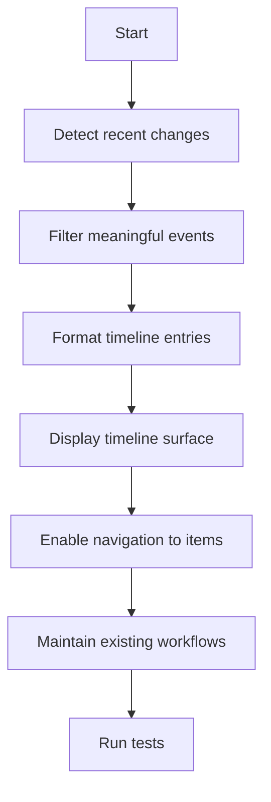

## req_041_add_activity_timeline_to_the_plugin - Add an activity timeline to the plugin
> From version: 1.9.3 (refreshed)
> Status: Done
> Understanding: 100% (refreshed)
> Confidence: 100%
> Complexity: Medium
> Theme: Change visibility and workflow awareness
> Reminder: Update status/understanding/confidence and references when you edit this doc.

# Needs
- Expose recent Logics activity in a timeline-like surface.
- Help users understand what changed recently without manually re-scanning the whole workspace.
- Improve workflow awareness across requests, promotions, lifecycle changes, renames, and companion-doc updates.

# Context
The plugin currently shows the current state of items well, but it is weaker at answering:
- what changed recently;
- what moved forward;
- what was renamed;
- what new companion or supporting docs appeared.

An activity timeline would make the plugin more useful as an orchestration tool by highlighting recent movement in the workspace.
This is especially valuable when:
- several users or automated flows touch the docs;
- the workspace evolves quickly;
- or a user returns after some time and wants a quick summary of recent changes.

This request is not about full git history.
It is about a practical timeline of meaningful recent Logics events surfaced inside the plugin.

# Acceptance criteria
- AC1: The plugin exposes a visible activity timeline or recent-changes surface.
- AC2: The timeline highlights a meaningful set of recent events relevant to Logics workflow.
- AC3: Timeline entries are understandable enough to tell users what changed and on which item.
- AC4: Users can navigate from a timeline entry to the relevant item or document.
- AC5: The activity surface does not regress current board/list/details workflows.
- AC6: Tests cover at least the basic event rendering or recent-activity logic where practical.

# Scope
- In:
  - Define a first useful set of recent activity event types.
  - Add a timeline or recent-activity UI surface.
  - Enable navigation from entries back to the relevant item.
  - Add regression coverage for the core activity behavior.
- Out:
  - Full git blame/history UI.
  - Multi-user audit logging beyond what the local plugin can reasonably infer.
  - Replacing the main board/list workflows with a timeline-first UX.

# Dependencies and risks
- Dependency: recent-activity detection needs a reliable source of meaningful change signals.
- Dependency: the chosen event set must stay small and understandable enough for an initial version.
- Risk: if activity entries are too noisy, the timeline becomes another dense stream users ignore.
- Risk: if the event model is too weak, the feature will feel shallow and untrustworthy.
- Risk: building a timeline without easy navigation back to items would limit practical value.

# Clarifications
- The first goal is useful recent-change visibility, not exhaustive audit history.
- The timeline should emphasize meaningful workflow events, not every tiny file mutation.
- The activity surface should be actionable, not just informational.
- The feature should help users regain context quickly when returning to the project.
- The preferred event model is derived workflow events such as creation, promotion, lifecycle change, rename, or companion-doc linkage changes, not a thin wrapper around raw filesystem churn.
- The recommended first presentation is a small recent window, roughly ten to twenty entries, ordered by recency before any notion of event importance is introduced.
- The first version should be derived from meaningful current and recent workspace state rather than introducing a fully persistent event journal.

# Definition of Ready (DoR)
- [x] Problem statement is explicit and user impact is clear.
- [x] Scope boundaries (in/out) are explicit.
- [x] Acceptance criteria are testable.
- [x] Dependencies and known risks are listed.

# Backlog
- `logics/backlog/item_046_add_activity_timeline_to_the_plugin.md`

# Companion docs
- Product brief(s): (none yet)
- Architecture decision(s): (none yet)
