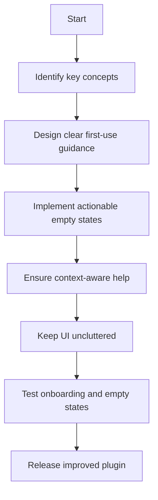

## req_043_improve_plugin_onboarding_and_empty_states - Improve plugin onboarding and empty states
> From version: 1.9.3
> Status: Done
> Understanding: 100% (refreshed)
> Confidence: 100%
> Complexity: Medium
> Theme: Discoverability and first-use clarity
> Reminder: Update status/understanding/confidence and references when you edit this doc.

# Needs
- Make the plugin easier to understand for first-time or occasional users.
- Improve empty states so they guide users instead of only stating absence.
- Reduce the amount of workflow knowledge users must already have before the UI becomes useful.

# Context
The plugin has grown richer, but that also means more concepts to understand:
- board vs list mode;
- filters;
- companion docs;
- promote;
- details actions;
- responsive behaviors.

For users who are new to the plugin or to the Logics workflow itself, the current UI can be functional but under-explained.
Stronger onboarding and better empty states would make the surface easier to adopt without requiring external docs first.

This request is not about adding a tutorial product.
It is about making the plugin self-explanatory enough to reduce confusion and dead-end moments.

# Acceptance criteria
- AC1: Empty states provide actionable guidance instead of only reporting “no items” or “nothing selected”.
- AC2: The plugin exposes clearer first-use guidance for core concepts such as board/list mode, filters, and details.
- AC3: The onboarding/help affordances do not clutter the UI for experienced users.
- AC4: Guidance remains context-aware rather than generic boilerplate.
- AC5: The feature does not regress current workflows for experienced users.
- AC6: Tests cover the most important onboarding or empty-state rendering paths where practical.

# Scope
- In:
  - Improve empty-state copy and actions.
  - Add lightweight onboarding/help affordances where valuable.
  - Keep onboarding contextual and non-intrusive.
  - Add regression coverage for the new states where practical.
- Out:
  - A full multi-step tutorial engine.
  - Rewriting the whole UX copy system.
  - Broad redesign of the plugin structure.

# Dependencies and risks
- Dependency: current UI states and empty states are the starting points for the improvement.
- Dependency: the onboarding approach must respect the limited space of the plugin surface.
- Risk: too much guidance can become clutter or feel patronizing.
- Risk: generic help text can add noise without improving understanding.
- Risk: onboarding that is too hidden fails to solve the discoverability problem.

# Clarifications
- The goal is lightweight guidance, not a heavyweight onboarding framework.
- Empty states should help users recover or proceed, not merely report absence.
- The plugin should become easier to understand without making the UI noisier for experienced users.
- Guidance should be contextual and tied to the actual current state.
- The preferred first focus is contextual workspace and empty-state guidance rather than a broad first-run tutorial flow.
- Lightweight onboarding or help affordances should be dismissible when appropriate so they do not become persistent noise for regular users.

# Definition of Ready (DoR)
- [x] Problem statement is explicit and user impact is clear.
- [x] Scope boundaries (in/out) are explicit.
- [x] Acceptance criteria are testable.
- [x] Dependencies and known risks are listed.

# Backlog
- `logics/backlog/item_048_improve_plugin_onboarding_and_empty_states.md`

# Companion docs
- Product brief(s): (none yet)
- Architecture decision(s): (none yet)
