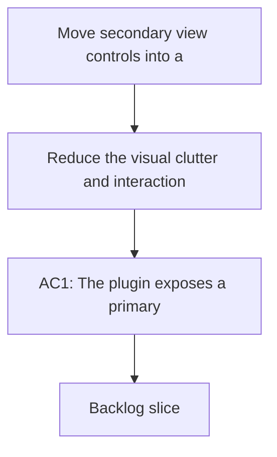

## req_045_move_secondary_view_controls_into_a_toggleable_second_toolbar_row - Move secondary view controls into a toggleable second toolbar row
> From version: 1.10.0
> Status: Done
> Understanding: 100% (refreshed)
> Confidence: 100% (refreshed)
> Complexity: Medium
> Theme: Toolbar information architecture and control density
> Reminder: Update status/understanding/confidence and references when you edit this doc.

# Needs
- Reduce the visual clutter and interaction friction created by the current filter/tools panel model.
- Make secondary controls easier to discover without forcing them to stay visible all the time.
- Keep the primary toolbar compact while still exposing search, sort, grouping, filters, and reset controls efficiently.

# Context
The current toolbar mixes primary actions with a floating panel for secondary view controls.
That model works functionally, but it creates avoidable friction:
- secondary controls feel hidden behind an extra click,
- the panel can read as overloaded once search, sort, grouping, and multiple toggles accumulate,
- the relationship between “show controls” and the current active filter state is not very visible when the panel is closed.

A better model would be a compact first toolbar row for primary actions, plus a second row that can be shown or hidden on demand.
This second row would host the denser view controls without permanently occupying space.

# Acceptance criteria
- AC1: The plugin exposes a primary toolbar row that stays focused on the main actions.
- AC2: Secondary view controls move into a second toolbar row rendered directly below the primary row.
- AC3: The second row can be shown and hidden from the primary row with a clear toggle button.
- AC4: The open/closed state of the second row persists per workspace.
- AC5: When the second row is closed, the primary row still gives a useful signal if non-default view controls are active.
- AC6: The second row remains usable in narrow widths, including wrapped or stacked layout behavior when needed.
- AC7: The change does not regress existing filtering, search, grouping, sorting, reset, or responsive behavior.

# Scope
- In:
  - Replace the current floating/popup-style secondary controls model with a second toolbar row.
  - Add a first-row toggle to show or hide that second row.
  - Place secondary controls such as search, sort, grouping, filter toggles, and reset in that row.
  - Persist the disclosure state by workspace.
  - Add a lightweight active-state signal when non-default controls are applied while the row is hidden.
- Out:
  - Reworking the meaning of existing filters or sort/group options.
  - Introducing a full command palette or advanced filter builder.
  - Redesigning unrelated board/list/details behavior.

# Dependencies and risks
- Dependency: the toolbar structure must support a clean split between primary and secondary controls.
- Dependency: persisted UI state should absorb one more per-workspace disclosure flag without becoming inconsistent.
- Risk: the second row could become too dense if spacing and wrapping are not handled carefully.
- Risk: if the active-state signal is too subtle, users may not realize filters are still affecting the view.
- Risk: if the row is always opened accidentally on narrow widths, the UI could feel noisier instead of cleaner.

# Clarifications
- The goal is not just to move controls visually; it is to improve information architecture and reduce the feeling of a “bazar” popup.
- The first toolbar row should stay oriented around primary actions such as toggling the secondary row, switching view mode, refreshing, and similar top-level actions.
- The second toolbar row should be explicitly show/hide-able, not permanently visible.
- The disclosure state should persist per workspace, similar to other UI state.
- When the second row is hidden, the primary-row toggle should still indicate that non-default filters or view controls are currently active.
- `Reset` should live in the second row, ideally in the trailing position.

# Definition of Ready (DoR)
- [x] Problem statement is explicit and user impact is clear.
- [x] Scope boundaries (in/out) are explicit.
- [x] Acceptance criteria are testable.
- [x] Dependencies and known risks are listed.

# Implementation notes
- The primary toolbar row now keeps only the first-order controls: view-controls toggle, tools, activity, attention, view mode, and refresh.
- Search, grouping, sorting, filter toggles, and reset now live in a second row rendered directly under the primary row.
- The second row is shown or hidden by the former filter button, which now behaves as a persistent view-controls disclosure toggle.
- The disclosure state is persisted per workspace via webview state.
- When the second row is hidden and search/group/sort/filter settings differ from defaults, the toggle shows a clear active-state hint.

# Backlog
- `logics/backlog/item_050_move_secondary_view_controls_into_a_toggleable_second_toolbar_row.md`

# Companion docs
- Product brief(s): (none yet)
- Architecture decision(s): (none yet)
