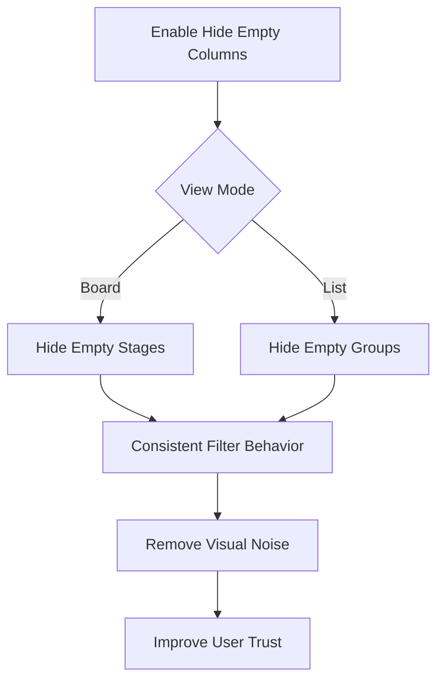

## req_046_apply_hide_empty_columns_consistently_in_list_mode - Apply hide empty columns consistently in list mode
> From version: 1.10.0 (refreshed)
> Status: Done
> Understanding: 100% (refreshed)
> Confidence: 100% (refreshed)
> Complexity: Low
> Theme: Filter consistency across board and list views
> Reminder: Update status/understanding/confidence and references when you edit this doc.

# Needs
- Make the `Hide empty columns` option behave consistently across board and list views.
- Remove the confusion created when empty groups still appear in list mode even though the option is enabled.
- Keep the mental model of the filter simple: empty stages/groups should not stay visible just because the user switched view mode.

# Context
The plugin now exposes `Hide empty columns` as a default-on filter.
In board mode, the option behaves as expected: empty stages disappear.
In list mode, the same option currently leaves empty groups visible, which creates an inconsistent experience and weakens trust in the filter model.

This is especially visible with groups like `REQUESTS (0)`, `BACKLOG (0)`, or `TASKS (0)` that continue to occupy vertical space in list mode.
The result is extra visual noise and the impression that the filter is only partially applied.

# Acceptance criteria
- AC1: When `Hide empty columns` is enabled, list mode does not render empty stage groups.
- AC2: When `Hide empty columns` is disabled, list mode may render empty stage groups again.
- AC3: The behavior is consistent between board and list modes for the same filter state.
- AC4: Companion-doc stages and `SPEC` continue to respect their own visibility rules before empty-group filtering is applied.
- AC5: The change does not regress status-based grouping in list mode.

# Scope
- In:
  - Apply empty-group hiding to list mode when grouping by stage.
  - Keep the current behavior for non-stage grouping unless a separate product decision says otherwise.
  - Add regression coverage for this behavior.
- Out:
  - Renaming the filter.
  - Redesigning empty states more broadly.
  - Changing the meaning of grouping modes beyond this consistency fix.

# Dependencies and risks
- Dependency: list grouping must distinguish clearly between stage-based grouping and other grouping modes.
- Risk: if empty groups are removed too aggressively, users could lose orientation in groupings where structure is still useful.
- Risk: status grouping could be accidentally changed if the fix is not scoped to stage-group list mode.

# Clarifications
- The intent of `Hide empty columns` should stay simple and predictable for users, even though list mode technically renders groups instead of columns.
- In stage-group list mode, empty groups should be treated as the list-mode equivalent of empty board columns.
- The fix should preserve current visibility rules for `SPEC`, companion docs, and other existing filters before deciding whether a resulting stage group is empty.
- In stage-group list mode, empty groups should be fully removed, not reduced to header-only placeholders.
- The first implementation should stay scoped to stage-group list mode; status grouping does not need to reinterpret `Hide empty columns`.

# Definition of Ready (DoR)
- [x] Problem statement is explicit and user impact is clear.
- [x] Scope boundaries (in/out) are explicit.
- [x] Acceptance criteria are testable.
- [x] Dependencies and known risks are listed.

# Implementation notes
- Stage-group list mode now treats `Hide empty columns` the same way board mode does: empty stage groups are removed when the filter is enabled.
- The change is intentionally scoped to stage-group list mode and does not reinterpret status grouping.
- Regression coverage now verifies the list-mode behavior directly.

# Backlog
- `logics/backlog/item_051_apply_hide_empty_columns_consistently_in_list_mode.md`

# Companion docs
- Product brief(s): (none yet)
- Architecture decision(s): (none yet)
