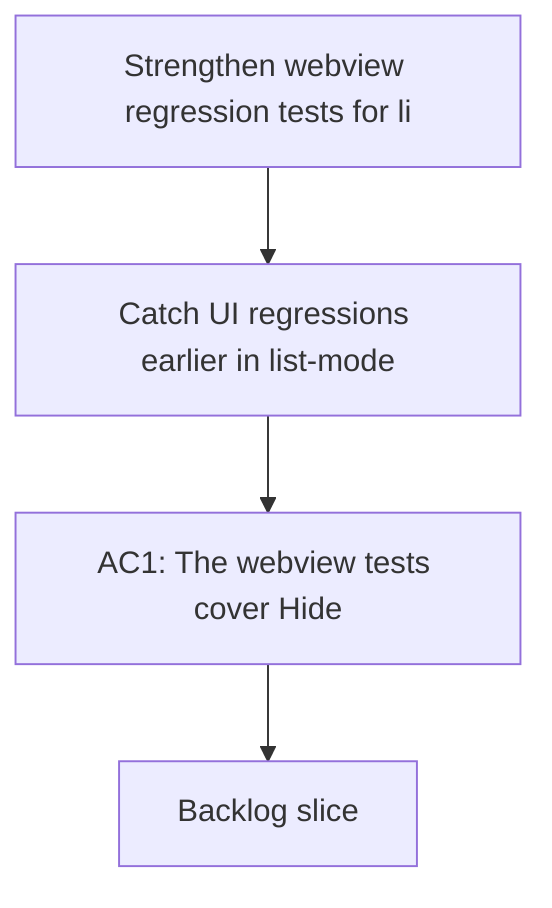

## req_048_strengthen_webview_regression_tests_for_list_filters_and_layout_css - Strengthen webview regression tests for list filters and layout CSS
> From version: 1.10.0
> Status: Done
> Understanding: 100% (refreshed)
> Confidence: 99%
> Complexity: Medium
> Theme: UI regression coverage and test trustworthiness
> Reminder: Update status/understanding/confidence and references when you edit this doc.

# Needs
- Catch UI regressions earlier in list-mode filtering and stacked layout behavior.
- Increase confidence that CSS/layout tests validate the intended selectors and rules, not just generic strings.
- Reduce the chance that visible regressions slip through while the suite still passes.

# Context
Recent layout and list-mode regressions were not prevented by the current test suite.
The suite covers many useful cases, but there are still two notable gaps:
- list-mode behavior does not currently assert that `Hide empty columns` removes empty groups,
- some CSS/layout checks rely on broad `includes(...)` string assertions that can pass even if the targeted selector is not the one actually carrying the rule.

The result is a test suite that passes while a user-visible behavior can still be wrong.

# Acceptance criteria
- AC1: The webview tests cover `Hide empty columns` behavior in list mode, not only in board mode.
- AC2: Layout/CSS assertions are strengthened so they validate the intended selector/rule pairing more precisely than broad string-presence checks.
- AC3: The strengthened tests remain maintainable and do not become brittle for harmless visual refactors.
- AC4: The updated suite still covers stacked-layout and splitter-related regressions that were recently fixed.

# Scope
- In:
  - Add regression coverage for list-mode empty-group filtering.
  - Improve CSS/layout assertions where they are currently too broad to protect the intended rule.
  - Keep the suite focused on behavioral trust, not snapshot sprawl.
- Out:
  - Introducing full visual regression tooling.
  - Rewriting all tests around snapshots.
  - Locking down every minor CSS detail.

# Dependencies and risks
- Dependency: the tests need stable hooks or selectors to assert targeted behavior without overcoupling to markup trivia.
- Risk: overcorrecting into overly brittle CSS assertions could slow down harmless UI iteration.
- Risk: if the suite stays too loose, future regressions in list/layout behavior will continue to slip through.

# Clarifications
- The goal is stronger behavioral protection, not maximal DOM rigidity.
- CSS assertions should be precise enough to prove that the right selector owns the rule, but not so strict that harmless spacing or formatting changes cause noise.
- This request is directly motivated by regressions that were visible in the plugin while tests still passed.
- Prefer behavior- and DOM-level assertions first, and use targeted CSS rule checks only for layout guarantees that are hard to prove otherwise.
- Scope the first pass to regressions already seen plus a small number of adjacent high-risk cases, instead of trying to exhaustively lock down every UI variation.

# Definition of Ready (DoR)
- [x] Problem statement is explicit and user impact is clear.
- [x] Scope boundaries (in/out) are explicit.
- [x] Acceptance criteria are testable.
- [x] Dependencies and known risks are listed.

# Implementation notes
- List-mode coverage now asserts that `Hide empty columns` removes empty stage groups, not only board columns.
- Critical layout CSS checks now target the intended selector blocks instead of relying on broad string-presence assertions.
- The updated tests stay behavior-oriented and avoid snapshot-style overlocking.

# Backlog
- `logics/backlog/item_053_strengthen_webview_regression_tests_for_list_filters_and_layout_css.md`

# Companion docs
- Product brief(s): (none yet)
- Architecture decision(s): (none yet)
