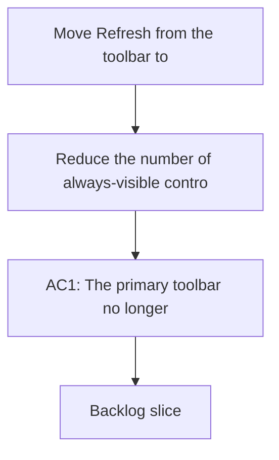

## req_051_move_refresh_from_the_toolbar_to_the_tools_menu - Move Refresh from the toolbar to the Tools menu
> From version: 1.10.0
> Status: Done
> Understanding: 100% (refreshed)
> Confidence: 100%
> Complexity: Low
> Theme: Toolbar prioritization and tools-menu cleanup
> Reminder: Update status/understanding/confidence and references when you edit this doc.

# Needs
- Reduce the number of always-visible controls in the primary toolbar.
- Reposition `Refresh` as a secondary utility action rather than a permanent top-level button.
- Place `Refresh` in the `Tools` menu under `Use workspace`, where users already expect workspace-scoped utility actions.

# Context
The toolbar has been progressively cleaned up so the primary row stays focused on the most important browsing controls.
`Refresh` is still useful, but it is not a first-order action in the same way as view switching, filters, or focused guidance toggles.

Leaving it permanently visible keeps extra pressure on the top row, especially in narrower widths.
A better fit is the `Tools` menu, where workspace-oriented utility actions already live.

The expected move is specific:
- remove the standalone `Refresh` button from the toolbar,
- add `Refresh` to the `Tools` menu,
- position it below `Use workspace`,
- preserve the same behavior once invoked.

# Acceptance criteria
- AC1: The primary toolbar no longer shows `Refresh` as a standalone button.
- AC2: The `Tools` menu exposes a `Refresh` action.
- AC3: The `Refresh` action is positioned under `Use workspace` in the `Tools` menu ordering.
- AC4: Triggering `Refresh` from the `Tools` menu preserves the current refresh behavior and rerender flow.
- AC5: The move does not regress keyboard, accessibility, or narrow-width usability of the toolbar and tools menu.

# Scope
- In:
  - Remove the toolbar-level `Refresh` button.
  - Add `Refresh` to the `Tools` menu in the intended position.
  - Preserve the current refresh implementation and user-visible effect.
  - Update regression coverage and related docs where needed.
- Out:
  - Changing what `Refresh` actually does.
  - Broad redesign of the `Tools` menu.
  - Reworking unrelated toolbar actions.

# Dependencies and risks
- Dependency: the `Tools` menu must already provide a stable place for workspace utility actions.
- Dependency: the refresh action wiring should be reusable from a different UI entrypoint without behavior drift.
- Risk: if the menu ordering is inconsistent, users may struggle to rediscover `Refresh`.
- Risk: removing the button without preserving a clear alternative could reduce discoverability for some users.

# Clarifications
- The goal is to demote `Refresh` from a persistent toolbar action, not to remove refresh capability.
- `Refresh` should stay easy to reach, but it should read as a utility action rather than prime toolbar real estate.
- The intended placement is specifically under `Use workspace` in the existing `Tools` menu.

# Definition of Ready (DoR)
- [x] Problem statement is explicit and user impact is clear.
- [x] Scope boundaries (in/out) are explicit.
- [x] Acceptance criteria are testable.
- [x] Dependencies and known risks are listed.

# Implementation notes
- `Refresh` is no longer rendered as a standalone primary-toolbar button.
- The same refresh action is now exposed from the `Tools` menu directly under `Use Workspace Root`.
- The existing refresh wiring was reused, so the move changes placement, not behavior.

# Backlog
- `logics/backlog/item_060_move_refresh_from_the_toolbar_to_the_tools_menu.md`

# Companion docs
- Product brief(s): (none yet)
- Architecture decision(s): (none yet)
