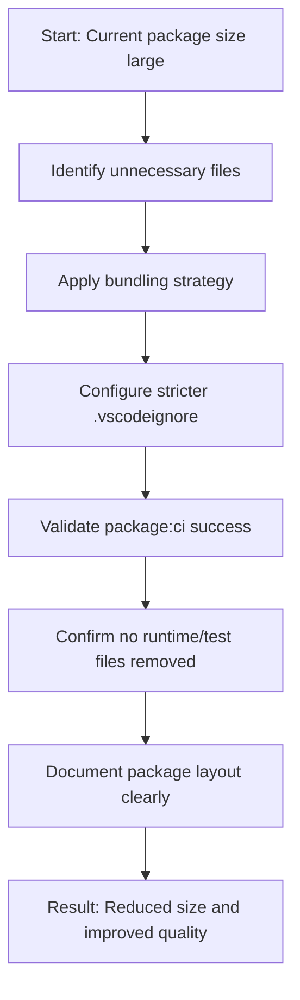

## req_052_reduce_extension_package_size_and_file_count_for_release_quality - Reduce extension package size and file count for release quality
> From version: 1.10.0 (refreshed)
> Status: Done
> Understanding: 100% (refreshed)
> Confidence: 100%
> Complexity: Medium
> Theme: Extension packaging hygiene and runtime performance
> Reminder: Update status/understanding/confidence and references when you edit this doc.

# Needs
- Reduce the number of files and unnecessary payload shipped in the VSIX.
- Address the `vsce` warning about the high JavaScript file count and packaging footprint.
- Improve release quality, install footprint, and extension startup/perf posture without changing plugin behavior.

# Context
The current `package:ci` flow succeeds, but `vsce` warns that the extension ships a large number of JavaScript files and recommends:
- bundling the extension for performance,
- and excluding unnecessary files with a stricter `.vscodeignore`.

This is not an immediate functional bug, but it is a release-quality issue.
If left untreated, it keeps packaging noisier than necessary and makes the shipped extension heavier than it should be.

# Acceptance criteria
- AC1: The packaged VSIX includes fewer unnecessary files than the current baseline.
- AC2: The extension packaging strategy is tightened through bundling, `.vscodeignore`, or a justified combination of both.
- AC3: The change does not remove files required for runtime behavior, tests, or release validation.
- AC4: `package:ci` still succeeds after the packaging cleanup.
- AC5: The resulting package layout is documented clearly enough that future changes do not accidentally reintroduce the same bloat.

# Scope
- In:
  - Audit which shipped files are actually needed at runtime.
  - Tighten `.vscodeignore` and/or packaging inputs.
  - Evaluate whether host-side bundling is warranted and practical.
  - Preserve current runtime behavior and release validation.
- Out:
  - Rewriting the extension build stack without a clear packaging payoff.
  - Changing plugin features under cover of packaging cleanup.
  - Premature optimization of unrelated frontend/runtime concerns.

# Dependencies and risks
- Dependency: packaging changes must remain compatible with the current extension runtime and test flows.
- Dependency: if bundling is introduced, source layout and debugging ergonomics should stay reasonable.
- Risk: an overaggressive ignore/bundle step could omit files still needed at runtime.
- Risk: a packaging-only task could accidentally become a large build-system rewrite if not kept scoped.

# Clarifications
- The goal is to improve the shipped artifact, not to change the plugin feature set.
- A stricter `.vscodeignore` may be enough if it removes obvious dead weight; bundling should be used if it materially improves package quality.
- This request is driven by the current `vsce` warning, but the desired outcome is better release hygiene overall, not just silencing a message.

# Definition of Ready (DoR)
- [x] Problem statement is explicit and user impact is clear.
- [x] Scope boundaries (in/out) are explicit.
- [x] Acceptance criteria are testable.
- [x] Dependencies and known risks are listed.

# Backlog
- `logics/backlog/item_061_reduce_extension_package_size_and_file_count_for_release_quality.md`

# Companion docs
- Product brief(s): (none yet)
- Architecture decision(s): (none yet)
