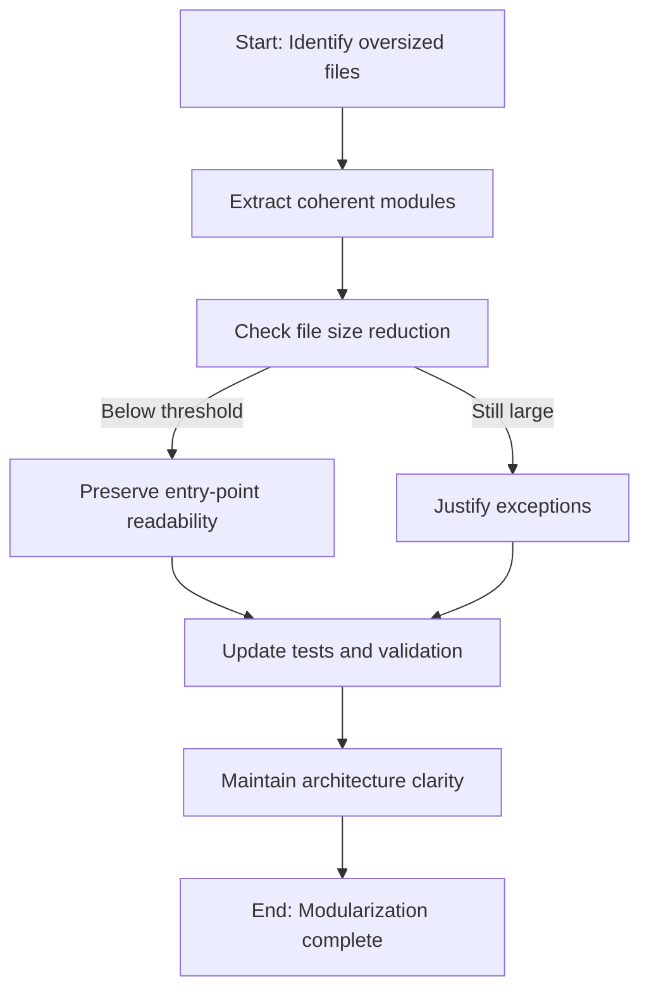

## req_054_reduce_remaining_oversized_files_after_the_first_modularization_pass - Reduce remaining oversized files after the first modularization pass
> From version: 1.10.2 (refreshed)
> Status: Done
> Understanding: 100% (refreshed)
> Confidence: 99%
> Complexity: Medium
> Theme: Codebase modularity and maintainability
> Reminder: Update status/understanding/confidence and references when you edit this doc.

# Needs
- Finish the modularization effort by reducing the few source files that still sit above the intended comfort zone after the first refactor pass.
- Keep the codebase navigable and easier to evolve without letting new aggregation points silently regrow.
- Preserve the architecture already established for plugin host logic, webview orchestration, and Logics flow support.

# Context
The first modularization pass already split the worst monoliths, but a few files still remain above the intended range:
- `src/logicsViewProvider.ts` — `1522` lines
- `media/main.js` — `1184` lines
- `logics/skills/logics-flow-manager/scripts/logics_flow_support.py` — `1022` lines

These files are smaller than the previous monoliths, but they are still large enough to concentrate multiple responsibilities:
- `src/logicsViewProvider.ts` still mixes provider lifecycle, command handling, quick-pick flows, document mutations, and webview HTML/data wiring.
- `media/main.js` still acts as the main orchestration hub for view state, event wiring, host-api integration, and render coordination.
- `logics_flow_support.py` still concentrates shared workflow helpers, reporting guidance, companion-doc heuristics, and document mutation support for the CLI.

The goal here is not another cosmetic split by line count.
It is a second, more surgical pass that removes the remaining oversized responsibility clusters while preserving the entry-point readability gained in the first pass.

# Acceptance criteria
- AC1: Each targeted file is reduced by extracting one or more coherent responsibility modules instead of continuing to centralize unrelated logic.
- AC2: The resulting files move toward the intended `500` to `1000` line ceiling, with any remaining exception explicitly justified by boundary clarity.
- AC3: The host/webview/kit entry points remain easy to discover and still read as the main orchestration entry for their domain.
- AC4: No user-visible behavior or workflow semantics change as a side effect of the refactor.
- AC5: Imports and module boundaries remain understandable and do not introduce circular or opaque indirection.
- AC6: Existing validation stays green, and targeted regression tests are updated or added where a newly extracted boundary needs protection.

# Scope
- In:
  - Reduce `src/logicsViewProvider.ts` by extracting focused modules around provider actions, document mutations, webview HTML/bootstrap helpers, and workspace/watch lifecycle where coherent.
  - Reduce `media/main.js` by extracting additional focused modules around UI orchestration seams such as view-state transitions, host-api action handling, or render scheduling where still concentrated.
  - Reduce `logics_flow_support.py` by separating remaining clusters such as decision-framing heuristics, output/report helpers, or document-update utilities where boundaries are now clear.
  - Update tests and imports to match the resulting structure.
- Out:
  - Repeating a broad repo-wide modularization campaign.
  - Mechanical extraction of tiny helper files with poor naming or weak ownership.
  - Changing workflow semantics under the cover of structural cleanup.

# Dependencies and risks
- Dependency: the split should stay aligned with `adr_004` and the responsive/layout contracts already captured in `adr_005`.
- Dependency: the first modularization pass should be treated as a baseline to extend, not to partially undo.
- Risk: over-extracting from `logicsViewProvider.ts` could make the provider bootstrap harder to follow.
- Risk: over-extracting from `media/main.js` could hide orchestration flow behind too many weakly named helpers.
- Risk: `logics_flow_support.py` may still contain coupled helper behavior that needs tests tightened before extraction.
- Risk: chasing line count too aggressively could produce fragmentation without meaningful maintenance gains.

# Clarifications
- This is a second-pass refinement request, not a restart of the original large refactor.
- The intended outcome is fewer oversized aggregation points, not a blanket rule that every file must be small.
- The preferred seams are:
  - `src/logicsViewProvider.ts`: provider actions, prompt/quick-pick flows, mutation helpers, webview HTML/data assembly
  - `media/main.js`: orchestration state changes, host-message handling, rerender scheduling, UI action wiring
  - `logics_flow_support.py`: workflow guidance/report text, companion-doc heuristics, shared mutation or normalization helpers
- A resulting file can remain near `1000` lines if the remaining boundary is genuinely cohesive and documented.
- Outcome: `src/logicsViewProvider.ts` now sits at `810` lines after extracting document flows and HTML rendering, `logics_flow_support.py` now sits at `826` lines after extracting decision support, and `media/main.js` now sits at `1129` lines after extracting DOM wiring into `media/mainInteractions.js`; that remaining exception is accepted because the file still serves as the single readable webview orchestration entrypoint.

# References
- Architecture decision(s): `logics/architecture/adr_004_scale_the_plugin_around_a_derived_model_and_explicit_ui_state.md`
- Architecture decision(s): `logics/architecture/adr_005_define_responsive_layout_scroll_and_sizing_rules_for_plugin_views.md`
- Related request(s): `logics/request/req_050_split_oversized_source_files_into_coherent_modules.md`

# Definition of Ready (DoR)
- [x] Problem statement is explicit and user impact is clear.
- [x] Scope boundaries (in/out) are explicit.
- [x] Acceptance criteria are testable.
- [x] Dependencies and known risks are listed.

# Backlog
- `logics/backlog/item_063_reduce_remaining_oversized_files_after_the_first_modularization_pass.md`

# Companion docs
- Product brief(s): (none yet)
- Architecture decision(s): (none yet)
