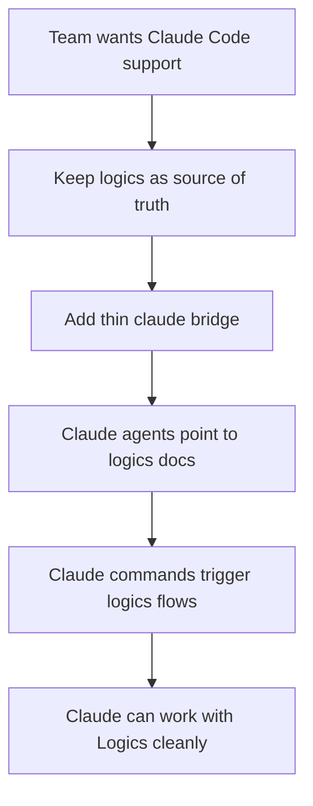

## req_055_add_a_minimal_claude_code_bridge_for_logics_agents - Add a minimal Claude Code bridge for Logics agents
> From version: 1.10.3
> Status: Ready
> Understanding: 98%
> Confidence: 95%
> Complexity: Medium
> Theme: Agent orchestration and Claude Code compatibility
> Reminder: Update status/understanding/confidence and references when you edit this doc.

# Needs
- Make Logics more natively usable from Claude Code without turning `.claude/` into a second source of truth.
- Keep the project memory, workflow rules, and skill logic anchored in `logics/`, while exposing only a minimal Claude-facing integration layer at repo root.
- Reduce the friction for teams that want to use the existing Logics kit with Claude Code but do not want a large parallel configuration tree beside `logics/`.

# Context
The current Logics setup is already portable at the document and script level:
- workflow state lives in `logics/request`, `logics/backlog`, `logics/tasks`, `logics/specs`, `logics/product`, and `logics/architecture`;
- reusable automation lives under `logics/skills/`;
- the VS Code plugin currently discovers agents from `logics/skills/*/agents/openai.yaml` and prepares Codex-specific chat flows.

This means the Logics kit itself is usable by Claude Code today, but not in a native Claude Code project structure.
Claude Code expects project-local integration files such as `.claude/agents/*.md` and `.claude/commands/*.md`, which creates an immediate cleanliness concern:
- adding a large `.claude/` tree at repo root would feel like a second workflow system beside `logics/`;
- duplicating prompts and behavior across `openai.yaml`, `SKILL.md`, and `.claude/*.md` would create drift and maintenance noise;
- keeping `.claude/` tiny and intentionally derivative would preserve the existing Logics architecture.

The desired direction is therefore a bridge, not a migration:
- `logics/` remains the source of truth;
- `.claude/` exists only as a thin Claude Code integration layer;
- the bridge should point Claude Code back toward `logics/instructions.md` and the relevant skill docs/scripts instead of copying detailed logic into root files.

# Acceptance criteria
- AC1: The solution defines a minimal Claude Code integration layout rooted at `.claude/` without relocating Logics workflow sources out of `logics/`.
- AC2: Claude-facing agent files are intentionally thin and direct Claude Code toward canonical project sources such as `logics/instructions.md`, `logics/skills/*/SKILL.md`, and existing workflow scripts.
- AC3: The bridge does not introduce a second detailed prompt corpus that must be maintained manually in parallel with `logics/skills/*/agents/openai.yaml` and `SKILL.md`.
- AC4: The initial integration covers at least the core Logics workflow entrypoint needed to create and manage request/backlog/task flows from Claude Code.
- AC5: The repository documents the contract clearly:
  - `logics/` remains the canonical workflow and agent knowledge base;
  - `.claude/` is only a Claude Code adapter layer;
  - future agent additions should follow the same thin-wrapper rule.
- AC6: The proposal keeps existing Codex-oriented plugin behavior intact and does not require replacing current `openai.yaml` agent support.
- AC7: The defined approach is clean enough that a future implementation can either:
  - maintain a very small number of `.claude/*` files manually; or
  - generate/sync them from existing Logics sources without changing the conceptual ownership model.

# Scope
- In:
  - Define the minimal `.claude/agents` and optional `.claude/commands` structure needed for Claude Code integration.
  - Define how Claude bridge files should reference existing Logics instructions, skills, and scripts.
  - Define the source-of-truth policy so `.claude/` stays derivative and intentionally small.
  - Cover the first workflow-oriented Claude entrypoint, starting with the Logics flow manager and request-authoring path.
  - Document the maintenance rule for adding future Claude bridge files without creating prompt duplication.
- Out:
  - Full rework of the VS Code plugin to support Claude-native chat injection in the same milestone.
  - Immediate one-to-one Claude wrappers for every existing Logics skill.
  - Replacing `openai.yaml` manifests as the current plugin contract.
  - Broad MCP setup for every external connector as part of this initial bridge.

# Dependencies and risks
- Dependency: Claude Code project conventions remain based on `.claude/agents/*.md` and `.claude/commands/*.md`.
- Dependency: the existing Logics instructions and skill docs stay strong enough to act as the real source referenced by thin Claude bridge files.
- Risk: if bridge files become too detailed, the repo will accumulate duplicated agent logic across three places: `openai.yaml`, `SKILL.md`, and `.claude/*.md`.
- Risk: if the bridge is too minimal or vague, Claude Code usability will still feel half-native and fail to justify the added root folder.
- Risk: a root `.claude/` directory may still feel visually noisy unless file count and purpose are kept intentionally tight.
- Risk: future support for Claude-native plugin UX could be conflated with this request even though the current goal is only the repository integration layer.

# Clarifications
- This request is about repository-level Claude Code compatibility, not a full Claude rewrite of the VS Code plugin.
- The preferred solution is a thin adapter layer at `.claude/`, not a second workflow tree.
- The bridge should favor indirection toward existing Logics sources over prompt duplication.
- A generated or syncable `.claude/` layer is acceptable if it keeps conceptual ownership in `logics/`.

# References
- Related request(s): `logics/request/req_018_support_vscode_agent_selection_from_skills_openai_yaml.md`
- Related request(s): `logics/request/req_020_add_tools_new_request_action_for_codex_prompt_bootstrap.md`
- Reference: `README.md`
- Reference: `src/agentRegistry.ts`
- Reference: `src/logicsViewProvider.ts`

# Definition of Ready (DoR)
- [x] Problem statement is explicit and user impact is clear.
- [x] Scope boundaries (in/out) are explicit.
- [x] Acceptance criteria are testable.
- [x] Dependencies and known risks are listed.

# Companion docs
- Product brief(s): (none yet)
- Architecture decision(s): `adr_006_keep_claude_code_bridge_files_thin_and_derivative_of_logics`

# Backlog
- `item_064_add_a_minimal_claude_code_bridge_for_logics_agents`
