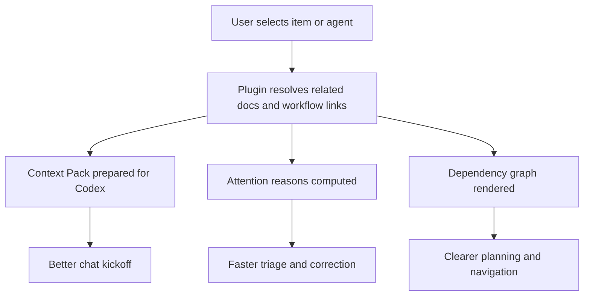

## req_056_add_codex_context_pack_attention_explain_and_dependency_map - Add codex context pack, attention explain, and dependency map
> From version: 1.10.5
> Status: Ready
> Understanding: 98%
> Confidence: 95%
> Complexity: Medium
> Theme: AI workflow context and dependency visibility
> Reminder: Update status/understanding/confidence and references when you edit this doc.

# Needs
- Help users start Codex work with the right project context already assembled from Logics docs instead of forcing them to manually gather the current item, its upstream rationale, and related delivery documents.
- Make the existing `Attention` workflow more actionable by explaining why an item needs attention and what the user should do next.
- Expose the dependency structure of requests, backlog items, tasks, and companion docs visually so the plugin supports navigation, diagnosis, and planning instead of only list/board inspection.

# Context
The plugin already indexes managed Logics documents, understands references and reverse `Used by` relationships, and surfaces status signals in the board and details panel. Recent iterations added search, grouping, sorting, activity, health indicators, suggested actions, lifecycle actions, agent selection, and companion doc awareness. The next product step is not another isolated control, but a stronger understanding layer built on top of data the extension already parses.

Three product ideas stand out because they reinforce one another:
- `Context Pack for Codex`: when a user selects an item or agent, the extension should be able to assemble a compact context bundle from the current doc, its related workflow parents/children, and relevant companion docs before the user starts a chat.
- `Attention Explain`: the current attention filter is useful, but users still need to infer the exact reason an item was flagged. The extension should explain the condition explicitly and point to the most relevant next action.
- `Dependency Map`: the underlying request/backlog/task/spec/product/architecture graph already exists in the indexed data, but the plugin does not yet present it as a navigable relationship map.

This request intentionally combines the three ideas into one planning unit because they depend on the same underlying graph model and would benefit from shared heuristics for relationship discovery, missing-link detection, and task launch context.

The outcome should be a plugin that not only shows workflow state but actively helps users:
- understand the graph around a selected item;
- know why an item is risky or incomplete;
- launch Codex work with a tighter, more reliable context window.

# Acceptance criteria
- AC1: The request defines a `Context Pack for Codex` feature that describes:
  - which related documents should be considered in scope by default;
  - how the extension should prioritize or trim included context;
  - where in the UI the user launches or previews that pack.
- AC2: The request defines an `Attention Explain` feature that turns each attention state into an explicit, user-visible reason instead of a silent aggregate flag.
- AC3: `Attention Explain` includes guidance for at least the core conditions already implied by current plugin behavior, such as blocked items, orphaned items, processed or inconsistent workflow states, or missing supporting docs.
- AC4: The request defines a `Dependency Map` feature that visualizes the managed Logics graph across at least requests, backlog items, tasks, and companion docs already indexed by the extension.
- AC5: The dependency map proposal includes a basic navigation contract:
  - selecting a node should reveal or synchronize the details panel;
  - the user can jump from the map back to the underlying document actions.
- AC6: The request explains how the three features should share common relationship data and avoid introducing duplicate indexing logic beside the current Logics item graph.
- AC7: Scope boundaries are explicit enough that implementation can be phased if needed, for example by shipping shared graph reasoning first and exposing UI entrypoints incrementally.

# Scope
- In:
  - Define the product behavior and implementation direction for `Context Pack for Codex`.
  - Define explicit attention-reason semantics and the expected remediation guidance in the UI.
  - Define a first dependency-map experience grounded in the data the plugin already indexes.
  - Reuse the current Logics indexing and reference model as the base for the three features.
  - Clarify how these features should strengthen Codex workflows without replacing existing board/list/details behaviors.
- Out:
  - Shipping all three features fully in one implementation slice.
  - Replacing the current board or list views as the main plugin surface.
  - Introducing a second persistence model outside the existing Markdown-backed Logics docs.
  - Building a generalized graph editor that mutates workflow links visually in the first iteration.

# Dependencies and risks
- Dependency: the current indexed relationships in the extension remain reliable enough to support higher-level graph reasoning.
- Dependency: Codex prompt injection and agent selection flows stay available as the launch point for a future context-pack experience.
- Risk: if the context pack is too broad, it will increase prompt size without improving relevance.
- Risk: if attention reasons are too noisy or overly heuristic, users will stop trusting the signal.
- Risk: if the dependency map is visually dense, it may add complexity without improving navigation.
- Risk: bundling the three ideas in one request could blur implementation order unless follow-up backlog items split the work clearly.

# Clarifications
- This request is a product-planning request for a coherent feature cluster, not a demand to ship every part in one commit.
- The shared value across the three points is better use of the existing Logics relationship graph.
- The preferred implementation direction is additive: strengthen the current plugin rather than redesign it around a new primary surface.

# References
- Related request(s): `logics/request/req_018_support_vscode_agent_selection_from_skills_openai_yaml.md`
- Related request(s): `logics/request/req_020_add_tools_new_request_action_for_codex_prompt_bootstrap.md`
- Related request(s): `logics/request/req_040_add_attention_required_view_to_the_plugin.md`
- Related request(s): `logics/request/req_041_add_activity_timeline_to_the_plugin.md`
- Reference: `README.md`
- Reference: `src/logicsIndexer.ts`
- Reference: `src/logicsViewProvider.ts`

# Definition of Ready (DoR)
- [x] Problem statement is explicit and user impact is clear.
- [x] Scope boundaries (in/out) are explicit.
- [x] Acceptance criteria are testable.
- [x] Dependencies and known risks are listed.

# AC Traceability
- AC1 -> `item_065` and `task_070`. Proof: the backlog slice and orchestration task define default context-pack scope, structure, and selected-item launch behavior.
- AC2 -> `item_066` and `task_070`. Proof: the backlog slice and orchestration task define explicit attention reasons instead of a silent aggregate signal.
- AC3 -> `item_066` and `task_070`. Proof: the planned reason taxonomy and remediation guidance are captured for blocked, orphaned, inconsistent, and missing-supporting-doc cases.
- AC4 -> `item_067` and `task_070`. Proof: the backlog slice and orchestration task define a dependency-map feature built from the managed Logics relationship graph.
- AC5 -> `item_067` and `task_070`. Proof: the selected-item subgraph and node-selection synchronization contract are captured in the dependency-map slice.
- AC6 -> `item_065`, `item_066`, `item_067`, `task_070`, and `adr_007`. Proof: the backlog slices, orchestration task, and ADR all require one shared relationship-reasoning layer instead of separate feature-local traversal logic.
- AC7 -> `task_070`. Proof: the orchestration task fixes the implementation order as shared reasoning first, then context pack, then attention explain, then dependency map, and allows phased release across multiple versions.

# Companion docs
- Product brief(s): (none yet)
- Architecture decision(s): `adr_007_centralize_plugin_relationship_reasoning_for_context_packs_attention_explain_and_dependency_map`

# Task
- `task_070_orchestration_delivery_for_req_056_context_pack_attention_explain_and_dependency_map`

# Backlog
- `item_065_build_codex_context_pack_for_related_logics_docs`
- `item_066_explain_attention_reasons_and_suggested_remediation`
- `item_067_add_dependency_map_for_logics_workflow_relationships`
