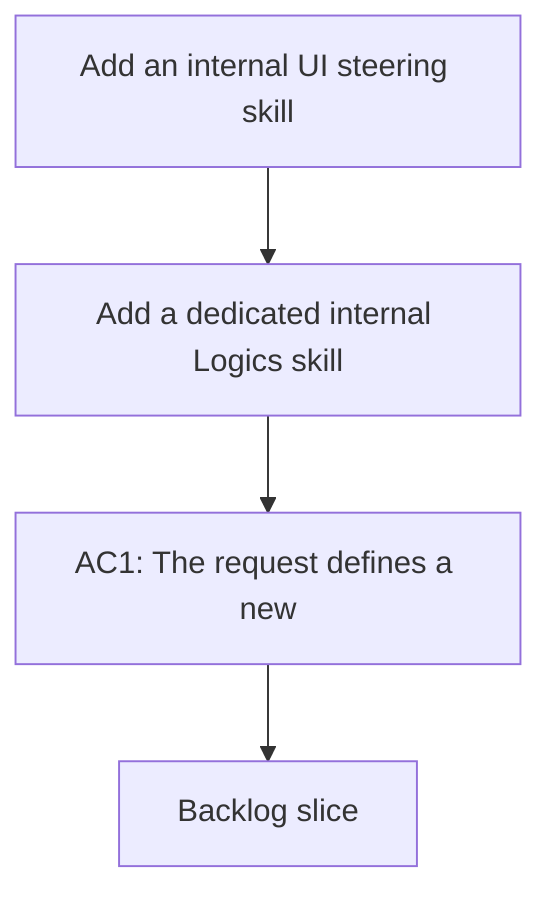

## req_057_add_an_internal_ui_steering_skill_and_agent_for_grounded_interface_generation - Add an internal UI steering skill and agent for grounded interface generation
> From version: 1.10.4
> Status: Done
> Understanding: 100%
> Confidence: 99%
> Complexity: Medium
> Theme: Internal skill design and agent UX steering
> Reminder: Update status/understanding/confidence and references when you edit this doc.

# Needs
- Add a dedicated internal Logics skill that steers UI generation away from generic AI-looking interfaces and toward grounded, product-native layouts.
- Pair that skill with a selectable agent so the guidance is easy to invoke from the existing agent-selection flow instead of relying on ad hoc prompt repetition.
- Keep the resulting skill, agent, and related documentation fully internal to this repository:
  - no external project names;
  - no external repository references;
  - no attribution-oriented wording in docs or agent manifests.

# Context
The repository already supports reusable skills under `logics/skills/*` and agent discovery from `agents/openai.yaml`. It also already contains a broad `logics-uiux-designer` skill focused on UX analysis, redesign framing, and Logics handoff artifacts.

What is currently missing is a narrower execution-time steering layer for frontend generation itself. When coding agents generate UI without stronger constraints, they often fall back to repetitive patterns that look synthetic instead of product-specific:
- floating panels and detached shells;
- overly rounded cards and buttons used everywhere;
- decorative labels and filler copy;
- gradient-heavy dashboards and fake metrics;
- visual hierarchy driven by effects instead of structure.

The desired capability is not a full design system and not a replacement for product UX work. It is an internal guardrail skill that helps agents produce calmer, stricter, more believable interfaces by default while still respecting project context:
- reuse project colors and existing tokens first when available;
- prefer standard layout and component behavior over decorative novelty;
- keep guidance practical for implementation tasks, mockups, and UI reviews;
- remain compatible with the current Logics agent manifest contract.

The skill should be packaged as a normal Logics skill with a paired agent so it can be invoked explicitly during UI work, but all naming and wording should be internal to the Logics kit and repository. The documentation should describe the behavior on its own merits rather than pointing back to any outside source.

This request is intentionally asking for a substantial internal rule corpus, not a lightweight summary. The future implementation should absorb the full behavioral shape of a dedicated UI anti-defaulting skill:
- a clear philosophy section explaining that the goal is to avoid generic AI-looking UI habits;
- a strong "keep it normal" baseline describing what standard, grounded implementation looks like across common UI primitives;
- a "hard no" section enumerating anti-patterns the skill should reject by default;
- a more concrete mistake inventory showing repeated bad frontend moves the skill should explicitly watch for;
- color-selection rules that prioritize project-native palettes before any fallback inspiration;
- agent wording that makes this guidance easy to invoke during frontend generation, refinement, and review.

To make the request self-sufficient, the future skill should cover guidance for at least the following implementation areas:
- layout structure for dashboards, landing pages, forms, tables, sidebars, headers, toolbars, tabs, modals, lists, and footers;
- component-level defaults for buttons, cards, panels, badges, avatars, icons, inputs, dropdowns, and navigation;
- typography, spacing, border, radius, shadow, and transition discipline;
- content hygiene, including the rejection of filler copy, ornamental labels, and fake product voice;
- common failure modes in dark themes, metric dashboards, decorative charts, and mobile stacking behavior.

The expected implementation should preserve breadth, not just intent. If the resulting `SKILL.md` would become too dense, the implementation may split the corpus into internal reference files, but the combination of `SKILL.md` plus references must still encode the full guidance set rather than a compressed paraphrase.

# Acceptance criteria
- AC1: The request defines a new internal skill under `logics/skills/` dedicated to UI steering for implementation-time generation and refinement.
- AC2: The request defines a paired agent manifest under `agents/openai.yaml` that works with the existing Logics agent-selection flow and uses only internal naming.
- AC3: The skill scope explicitly covers practical UI steering guidance for at least:
  - layout and information hierarchy;
  - typography and spacing;
  - cards, panels, buttons, forms, and tables;
  - color selection and motion restraint;
  - responsiveness and accessibility sanity checks;
  - copy and labeling discipline.
- AC4: The request makes clear that existing project styles, tokens, and brand choices take priority over generic fallback aesthetics when such context exists.
- AC5: The request explicitly positions the new skill as complementary to `logics-uiux-designer`, not as a replacement for broader UX analysis, redesign planning, or handoff work.
- AC6: The request defines a documentation rule that the new skill, agent manifest, and any related repository docs must not mention external repository names, external skill names, or attribution to an outside prompt corpus.
- AC7: The request is implementation-ready enough that a follow-up backlog item can choose an internal name, write `SKILL.md`, add `agents/openai.yaml`, and optionally add references/assets without re-deciding the product intent.
- AC8: The request preserves compatibility with the existing `openai.yaml` contract and agent registry behavior already used by the VS Code extension.
- AC8b: The request explicitly requires the capability to be activatable through the existing Logics agent flow:
  - the skill package must be able to expose `agents/openai.yaml`;
  - the derived invocation id from the skill folder name must remain valid for explicit `$logics-...` use;
  - the manifest wording must be suitable for `Logics: Select Agent` and prompt injection.
- AC9: The request explicitly requires the future implementation to encode a broad internal rule corpus, not a short stylistic note, with coverage across:
  - a philosophy and trigger section;
  - a "normal UI defaults" section for common primitives;
  - a banned-pattern section;
  - a specific repeated-mistakes section;
  - a color-selection policy;
  - implementation-time usage guidance for generation and refinement.
- AC10: The request defines the default banned-pattern inventory strongly enough that implementation should reject, by default, at least these families of UI moves unless the product explicitly calls for them:
  - oversized border radii, pill overload, floating shells, glassmorphism, glow-heavy panels, and decorative gradients;
  - eyebrow labels, uppercase micro-headings, ornamental helper copy, and fake premium/product-marketing language inside working UIs;
  - generic dark SaaS compositions, fake charts, default KPI-card grids, right-rail filler panels, quota/progress theater, and non-functional status badges;
  - transform-heavy hover motion, dramatic shadows, overpadded sections, and layout choices that create dead space for effect rather than clarity.
- AC11: The request defines the preferred positive defaults strongly enough that implementation should guide agents toward:
  - simple containers, solid surfaces, restrained radii, subtle borders, and low-drama shadows;
  - predictable grid/flex layouts with standard spacing scales and readable hierarchy;
  - straightforward forms, tables, tabs, and toolbars with functional states rather than decorative styling;
  - calm colors, restrained motion, and components that feel product-native rather than showcase-oriented.
- AC12: The request requires a palette-selection rule order:
  - first reuse project colors/tokens when available;
  - otherwise use a small curated internal fallback palette set;
  - do not invent arbitrary color combinations by default.
- AC13: The request allows the final implementation to distribute the corpus across `SKILL.md` and internal references, but only if the full practical guidance remains present in the repository and invocable through the skill.
- AC14: The request explicitly requires the skill to be auto-triggerable from normal coding prompts by encoding strong trigger language in `SKILL.md` metadata and body, including:
  - clear frontend technology coverage;
  - explicit “use when generating or refining UI/frontend code” wording;
  - clear mention of avoiding generic AI-looking UI and preserving existing project design language.

# Scope
- In:
  - Define the need for an internal UI steering skill focused on frontend generation quality.
  - Define the paired agent requirement so the capability is selectable in existing Logics agent flows.
  - Define the behavioral guardrails the skill should provide for grounded product UI output.
  - Define the internal-only documentation and naming policy for the new skill family.
  - Clarify how the new skill should coexist with the current UI/UX design skill.
- Out:
  - Implementing the skill and agent in this request.
  - Replacing the broader `logics-uiux-designer` workflow.
  - Introducing a full repository-wide design system or component library in the same slice.
  - Reworking the VS Code plugin agent architecture beyond compatibility with the current manifest contract.

# Dependencies and risks
- Dependency: the existing skill discovery and agent registry flow remain based on `logics/skills/*/agents/openai.yaml`.
- Dependency: skill triggering continues to rely on `SKILL.md` metadata quality, especially the `name` and `description` fields used to decide when the skill should activate.
- Dependency: current frontend work in this repository continues to benefit from a narrower generation-time UI steering layer beside the broader UX workflow.
- Risk: if the skill becomes too stylistically rigid, it may replace one generic AI visual habit with another.
- Risk: if the guidance is too vague, the agent will still produce decorative default UI patterns and the skill will not justify its existence.
- Risk: if internal-only wording is not enforced, external naming or attribution may leak into shipped docs or prompts.
- Risk: overlap with `logics-uiux-designer` could create confusion unless the responsibility split is written clearly.

# Clarifications
- This request is about defining an internal reusable capability in the Logics kit, not about documenting where the idea originally came from.
- The preferred output is a narrow operational skill for UI generation and review, not a general-purpose brand or design-system framework.
- The future implementation may use `SKILL.md` only or may add references/assets if they materially improve reliability, but the source of truth should remain the internal Logics skill folder.
- The intent is to internalize a comprehensive existing style-avoidance playbook into the Logics kit in renamed, repository-native form, without leaving the future implementer to reconstruct that breadth from a vague summary.
- The future implementation must support both:
  - explicit activation through a selectable agent and `$logics-...` invocation;
  - automatic activation through strong skill metadata and trigger wording.

# References
- Related request(s): `logics/request/req_018_support_vscode_agent_selection_from_skills_openai_yaml.md`
- Reference: `logics/skills/logics-uiux-designer/SKILL.md`
- Reference: `src/agentRegistry.ts`
- Reference: `README.md`

# Definition of Ready (DoR)
- [x] Problem statement is explicit and user impact is clear.
- [x] Scope boundaries (in/out) are explicit.
- [x] Acceptance criteria are testable.
- [x] Dependencies and known risks are listed.

# AC Traceability
- AC1 -> `item_068` and `task_071`. Proof: `logics/skills/logics-ui-steering/SKILL.md` now exists as the dedicated internal skill package for UI steering.
- AC2 -> `item_069` and `task_071`. Proof: `logics/skills/logics-ui-steering/agents/openai.yaml` now delivers the paired agent manifest.
- AC3 -> `item_068` and `task_071`. Proof: the delivered skill corpus spans `SKILL.md`, `references/primitives.md`, `references/banned_patterns.md`, and `references/palettes.md`.
- AC4 -> `item_068` and `item_069`. Proof: both the skill doc and the agent prompt explicitly require project-first reuse of existing styles, tokens, and design language.
- AC5 -> `item_068`, `item_069`, and `task_071`. Proof: the delivered skill positions itself as a focused implementation-time guardrail beside `logics-uiux-designer`.
- AC6 -> `item_068` and `item_069`. Proof: the delivered files use only repository-native naming and contain no external repository, skill, or attribution references.
- AC7 -> `item_068`, `item_069`, and `task_071`. Proof: the implemented package includes the skill corpus, the agent manifest, the activation contract, and the kit README update.
- AC8 -> `item_069` and `task_071`. Proof: the agent manifest follows the current `openai.yaml` registry contract already used by the extension.
- AC8B -> `item_069` and `task_071`. Proof: explicit activation is now supported through `agents/openai.yaml`, the derived `$logics-ui-steering` id, and the documented activation path.
- AC9 -> `item_068` and `task_071`. Proof: the delivered references encode philosophy, positive defaults, banned patterns, repeated mistakes, color policy, and usage guidance.
- AC10 -> `item_068` and `task_071`. Proof: `references/banned_patterns.md` implements the required banned-pattern families in concrete repository-native wording.
- AC11 -> `item_068` and `task_071`. Proof: `references/primitives.md` implements the grounded positive defaults for layout, components, typography, spacing, and mobile behavior.
- AC12 -> `item_068` and `task_071`. Proof: `references/palettes.md` implements the project-first palette rule and curated dark/light fallback palette sets.
- AC13 -> `item_068` and `task_071`. Proof: the delivered corpus splits guidance across references while keeping the full practical rule set present and invocable through `SKILL.md`.
- AC14 -> `item_068`, `item_069`, and `task_071`. Proof: `SKILL.md` frontmatter and body now include explicit frontend trigger wording so the capability can auto-trigger on matching UI requests.

# Companion docs
- Product brief(s): (none yet)
- Architecture decision(s): (none yet)

# Task
- `task_071_orchestration_delivery_for_internal_ui_steering_skill_and_agent`

# Backlog
- `item_068_create_an_internal_ui_steering_skill_corpus_and_reference_pack`
- `item_069_add_an_internal_ui_steering_agent_manifest_and_usage_contract`
