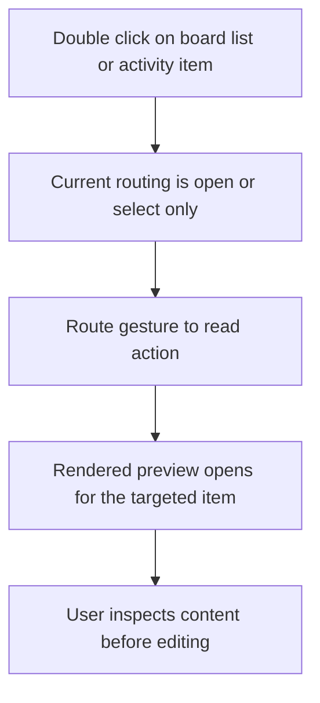

## req_058_double_click_should_read_items_from_list_board_and_activity - Double click should read items from list board and activity
> From version: 1.10.5
> Status: Done
> Understanding: 99%
> Confidence: 98%
> Complexity: Medium
> Theme: UX workflow
> Reminder: Update status/understanding/confidence and references when you edit this doc.

# Needs
- Align the primary double-click gesture on Logics items with the `Read` action instead of `Open/Edit`.
- Apply the same behavior across `board`, `list`, and `activity` surfaces so navigation semantics stay predictable.
- Preserve simple selection on single click while reserving double-click for quick rendered inspection.

# Context
The plugin already exposes both `Open/Edit` and `Read`, but the current double-click behavior is inconsistent with the desired inspection-first workflow:
- board and list item surfaces still route double-click to `Open/Edit`;
- the recent activity panel only supports selection on click, with no matching double-click shortcut;
- users who scan Logics docs visually often want a fast rendered read pass before deciding to edit.

The request is to make double-click mean `Read` everywhere an item is presented as a primary clickable surface, while keeping explicit `Open/Edit` available as a separate action.

# Acceptance criteria
- AC1: Double-click on an item card in `board` mode triggers the same item target as the explicit `Read` action.
- AC2: Double-click on an item row/card in `list` mode triggers the same `Read` behavior.
- AC3: Double-click on an entry in the `Recent activity` panel triggers `Read` for that item.
- AC4: Single click still only updates selection/details without triggering `Read`.
- AC5: Regression tests cover at least board/list card double-click and activity double-click behavior.

# Scope
- In:
  - Webview interaction changes for board/list cards and recent activity entries.
  - Regression coverage for the `read` interaction path.
- Out:
  - Changing keyboard shortcuts or toolbar button semantics.
  - Redesigning the `Open/Edit` action or removing it from the UI.

# Risks
- Existing users may have learned double-click as `Open/Edit`; the change must stay explicit in tests and release notes.
- Activity entries must not trigger duplicate side effects from click plus double-click sequencing.

# Definition of Ready (DoR)
- [x] Problem statement is explicit and user impact is clear.
- [x] Scope boundaries (in/out) are explicit.
- [x] Acceptance criteria are testable.
- [x] Dependencies and known risks are listed.

# Companion docs
- Product brief(s): (none yet)
- Architecture decision(s): (none yet)

# Backlog
- `logics/backlog/item_070_double_click_should_read_items_from_list_board_and_activity.md`
