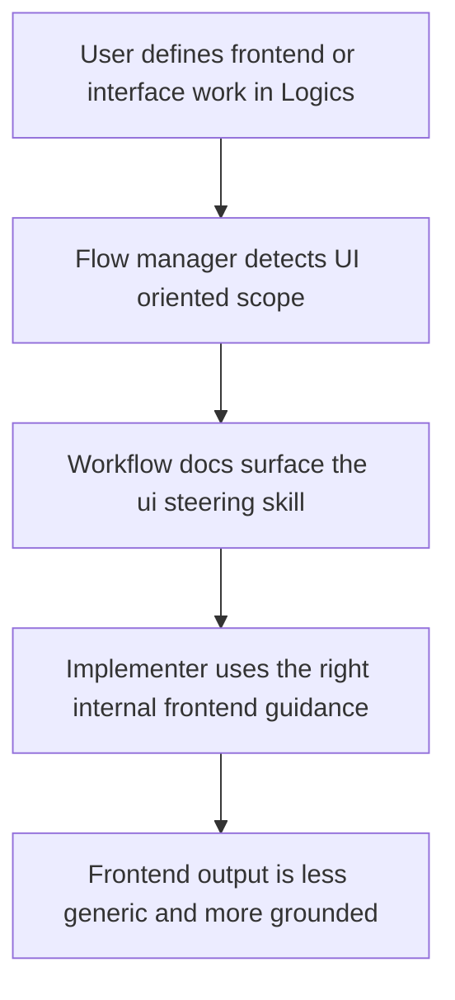

## req_059_guide_frontend_work_toward_the_ui_steering_skill_in_the_logics_kit - Guide frontend work toward the UI steering skill in the Logics kit
> From version: 1.10.5
> Status: Done
> Understanding: 96%
> Confidence: 94%
> Complexity: Medium
> Theme: Logics kit skill orchestration and frontend guidance
> Reminder: Update status/understanding/confidence and references when you edit this doc.

# Needs
- Make the Logics kit steer frontend and graphical-interface work toward the dedicated `ui steering` skill instead of relying on generic manual reminders.
- Ensure this guidance is visible when the flow manager is used to write or promote docs that clearly target UI, frontend, webview, React, or interface implementation work.
- Keep the behavior generic and advisory enough that non-frontend requests do not get polluted by irrelevant UI guidance.

# Context
The kit already contains a dedicated internal skill for grounded interface generation, but the flow is still too implicit. In practice, when a user asks for frontend work through the Logics workflow, the resulting request/backlog/task docs may describe UI scope without clearly steering the future implementer toward the specialized skill that already exists for that problem space.

This creates a quality gap:
- the repository contains stronger frontend guidance than the generated workflow docs tend to surface;
- UI work can still be handled with generic prompting even when a specialized skill is available;
- the reminder to use the UI steering skill currently depends too much on memory rather than on the Logics kit itself.

The request is to improve the Logics kit so that frontend-oriented workflow writing naturally points toward the `ui steering` skill when relevant:
- in flow-manager guidance;
- in generated or promoted docs when the scope is visibly UI-heavy;
- and in any decision framing or references that should help an implementer choose the right internal capability.

The preferred direction is a real kit behavior, not a documentation-only reminder:
- start from explicit trigger signals such as `frontend`, `ui`, `interface`, `webview`, `react`, `design system`, `layout`, `screen`, or `component`;
- allow a small amount of contextual interpretation from surrounding scope, but avoid free-form over-classification;
- surface the recommendation explicitly as `logics-ui-steering` so the resulting guidance is directly actionable.

This should stay a guidance and orchestration improvement, not an overreach into hard-wiring every frontend task to a single skill. When product framing, architecture framing, or another specialized skill is also relevant, the kit should allow multiple coherent recommendations instead of forcing a single winner.

# Acceptance criteria
- AC1: The request defines a kit-level improvement so frontend-oriented Logics workflows explicitly surface the internal `logics-ui-steering` skill when relevant.
- AC2: The request defines the trigger perimeter clearly enough that the guidance applies to at least:
  - interface graphique work;
  - frontend or webview implementation;
  - React or equivalent UI coding tasks;
  - other doc scopes that are visibly about user-facing interface construction.
- AC3: The request makes clear that the preferred insertion points may include one or more of:
  - `logics-flow-manager` documentation and usage guidance;
  - request or promotion output from the flow manager;
  - decision-framing or reference sections in generated docs;
  - other kit-level workflow prompts that steer skill choice.
- AC3b: The request prefers an actual orchestration behavior in generated or promoted docs rather than a documentation-only reminder.
- AC4: The request explicitly keeps the behavior advisory and context-sensitive:
  - it should not force the UI steering skill into non-frontend work;
  - it should not replace broader product or architecture framing when those are the real need.
- AC4b: The request prefers explicit trigger keywords plus a small amount of contextual interpretation rather than unconstrained semantic guessing.
- AC5: The request explicitly positions this improvement as complementary to the existing `ui steering` skill itself rather than a replacement or duplicate skill.
- AC6: The request is implementation-ready enough that a future backlog item can decide whether the best solution is:
  - stronger flow-manager instructions;
  - smarter generation or promotion hints;
  - or both.
- AC6b: The request prefers the recommendation to appear as early as the request stage when UI scope is already clear, and then remain available downstream in backlog and task docs.
- AC6c: The request allows multiple concurrent recommendations when a doc clearly spans frontend, product, or architecture concerns.
- AC7: The request remains generic for the shared Logics kit and does not depend on this repository's VS Code plugin alone.

# Scope
- In:
  - Define when frontend-oriented Logics work should point toward the internal `ui steering` skill.
  - Define the expected orchestration behavior in flow-manager writing and promotion flows.
  - Clarify the advisory, non-forcing role of this skill guidance.
- Out:
  - Rewriting the `ui steering` skill corpus itself in this request.
  - Forcing every user-facing request to include UI guidance.
  - Building a new frontend skill family beyond the existing internal skill.

# Dependencies and risks
- Dependency: the internal `ui steering` skill remains the repository-native capability for grounded frontend implementation guidance.
- Dependency: the flow manager continues to be the main Logics entry point for request/backlog/task writing and promotion.
- Risk: if the trigger language is too broad, non-frontend docs may accumulate noisy or irrelevant references.
- Risk: if the guidance remains too vague, the skill will still be forgotten during real frontend work.
- Risk: if the guidance is too narrow, clear UI tasks may still fail to surface the specialized skill.

# Clarifications
- This request is about improving kit orchestration, not about redesigning the UI steering skill itself.
- The desired result is stronger default steering during workflow writing, not mandatory skill locking.
- The preferred outcome is that future Logics docs make the specialized frontend capability easier to notice and invoke at the right time.
- The preferred first implementation is keyword-led and deterministic enough to be auditable.
- The skill should be named explicitly in the resulting guidance so an implementer can invoke it without interpretation.

# References
- Related request(s): `logics/request/req_057_add_an_internal_ui_steering_skill_and_agent_for_grounded_interface_generation.md`
- Reference: `logics/skills/logics-flow-manager/SKILL.md`
- Reference: `logics/skills/logics-ui-steering/SKILL.md`

# Definition of Ready (DoR)
- [x] Problem statement is explicit and user impact is clear.
- [x] Scope boundaries (in/out) are explicit.
- [x] Acceptance criteria are testable.
- [x] Dependencies and known risks are listed.

# Companion docs
- Product brief(s): (none yet)
- Architecture decision(s): (none yet)

# Backlog
- `logics/backlog/item_071_guide_frontend_work_toward_the_ui_steering_skill_in_the_logics_kit.md`
