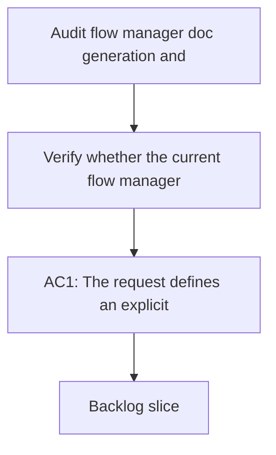

## req_060_audit_flow_manager_doc_generation_and_adjust_doc_linter_strictness - Audit flow manager doc generation and adjust doc linter strictness
> From version: 1.10.5
> Status: Done
> Understanding: 97%
> Confidence: 94%
> Complexity: Medium
> Theme: Logics kit generation quality and governance calibration
> Reminder: Update status/understanding/confidence and references when you edit this doc.

# Needs
- Verify whether the current flow manager generates Logics docs that are naturally consistent with the doc linter expectations.
- Identify why the doc linter still frequently reports incoherences after normal generation or promotion flows.
- Adjust the right layer:
  - the flow manager output;
  - the doc linter rules or severity;
  - or both.

# Context
The kit already has generation and promotion workflows on one side, and a doc linter on the other. In theory they should reinforce each other. In practice, there is recurring friction: generated or recently edited docs still often trip lint checks, which suggests at least one of these problems:
- the flow manager still emits docs that are too generic or structurally incomplete;
- the linter is enforcing rules that are not aligned with what the generation pipeline can reliably produce;
- the linter may be correct on the substance but too blocking in its current severity model for normal day-to-day authoring.

The need is not to weaken governance blindly. The need is to understand where the mismatch really sits and then calibrate the kit so that:
- freshly generated docs are more coherent by default;
- lint failures highlight true quality gaps rather than normal generator residue;
- severity remains strict where it catches real workflow damage and more proportional where the rule is advisory.

This request should let a future implementation investigate both sides instead of assuming up front that the linter is wrong or that generation is wrong. The preferred approach is:
- audit first, then change behavior;
- fix generation before relaxing lint whenever the generator can reasonably satisfy the contract;
- keep strict blocking behavior for structural failures and critical placeholders;
- introduce softer severity for issues that are real but not workflow-breaking.

# Acceptance criteria
- AC1: The request defines an explicit audit of the mismatch between flow-manager generation and doc-linter enforcement.
- AC2: The request requires the future implementation to identify and categorize at least these outcomes:
  - generator defects or missing structure;
  - lint rules that are correct but too severe for the current workflow;
  - lint rules that are misaligned with real authoring intent;
  - cases where both generation and linting need adjustment.
- AC3: The request makes clear that the preferred outcome is not a blanket relaxation of governance, but a calibrated improvement that preserves useful quality pressure.
- AC3b: The request prefers an audit and evidence-gathering phase before generator or linter behavior is changed.
- AC4: The request allows the future solution to change one or more of:
  - generation templates;
  - promotion output;
  - placeholder handling;
  - lint rule wording;
  - lint severity or blocking behavior;
  - lint explanations or remediation guidance.
- AC5: The request explicitly requires that freshly generated or promoted docs from normal supported workflows should no longer fail lint for predictable, recurring reasons unless those failures point to a real unresolved issue.
- AC6: The request explicitly allows the conclusion that some current lint checks should remain strict if they protect core workflow integrity.
- AC6b: The request prefers generator-side fixes over linter relaxation whenever the generator can reliably emit the required structure.
- AC6c: The request prefers a severity model with at least:
  - blocking errors for structural failures and critical placeholders such as `X.X.X`, `??%`, or clearly empty required sections;
  - non-blocking warnings for weaker editorial or proportionality issues.
- AC7: The request is generic for the shared Logics kit and not framed as a repository-local exception.
- AC8: The request is implementation-ready enough that a backlog item can split the work into:
  - audit and evidence gathering;
  - generator-side fixes;
  - linter-side calibration;
  - or phased rollout if needed.
- AC8b: The request prefers the first calibration scope to focus on `request`, `backlog`, and `task` docs before broader extension to other doc families.
- AC8c: The request allows stricter enforcement on newly generated workflow docs before demanding the same cleanliness from the full historical corpus.

# Scope
- In:
  - Audit the contract between flow-manager output and doc-linter expectations.
  - Calibrate generator behavior, lint rules, severity, or messaging where justified.
  - Reduce avoidable friction on normal doc generation and promotion paths.
- Out:
  - Removing doc governance from the kit.
  - Turning every lint issue into a warning by default.
  - Solving every historical document inconsistency in one pass.

# Dependencies and risks
- Dependency: `logics-flow-manager` remains the supported generation and promotion path.
- Dependency: `logics-doc-linter` remains the main governance tool for structural quality checks.
- Risk: weakening the linter too much would hide real workflow drift.
- Risk: fixing only templates without revisiting lint severity could leave the perceived friction unchanged.
- Risk: fixing only lint severity without improving generation could normalize poor defaults.
- Risk: repo-specific symptoms could bias a kit-level calibration if the audit is not kept generic.

# Clarifications
- This request intentionally does not pre-decide whether the linter is too blocking.
- The preferred decision should come from comparing generated output against the intended contract of the kit.
- The strongest success condition is not fewer lint messages alone, but better alignment between what the kit generates and what the kit expects.
- The preferred rollout is:
  - audit and classify failures first;
  - fix generator defaults where feasible;
  - then rebalance lint severity where rules are still too blunt.
- The preferred governance model is strict on workflow integrity and proportional on editorial polish.

# References
- Related request(s): `logics/request/req_025_harden_logics_kit_workflow_generation_and_governance_from_real_usage.md`
- Reference: `logics/skills/logics-flow-manager/SKILL.md`
- Reference: `logics/skills/logics-doc-linter/SKILL.md`
- Reference: `logics/skills/logics-doc-linter/scripts/logics_lint.py`

# Definition of Ready (DoR)
- [x] Problem statement is explicit and user impact is clear.
- [x] Scope boundaries (in/out) are explicit.
- [x] Acceptance criteria are testable.
- [x] Dependencies and known risks are listed.

# Companion docs
- Product brief(s): (none yet)
- Architecture decision(s): (none yet)

# Backlog
- `logics/backlog/item_072_audit_flow_manager_doc_generation_and_adjust_doc_linter_strictness.md`
