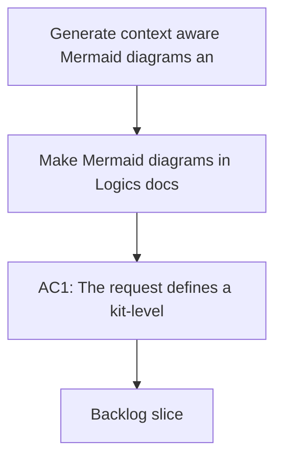

## req_061_generate_context_aware_mermaid_diagrams_and_keep_them_updated_in_logics_docs - Generate context aware Mermaid diagrams and keep them updated in Logics docs
> From version: 1.10.5
> Status: Done
> Understanding: 97%
> Confidence: 94%
> Complexity: Medium
> Theme: Logics doc quality and Mermaid relevance
> Reminder: Update status/understanding/confidence and references when you edit this doc.

# Needs
- Make Mermaid diagrams in Logics docs reflect the actual business or delivery need instead of staying generic template filler.
- Ensure Mermaid diagrams are regenerated or updated when the surrounding doc changes materially.
- Keep Mermaid output both context-aware and safe for the current Logics rendering and linting constraints.

# Context
The Logics workflow already requires Mermaid diagrams in request, backlog, and task docs, but the quality of those diagrams still depends too heavily on manual care. A doc can become stronger in prose while its Mermaid block remains generic, stale, or loosely related to the current scope.

That causes several problems:
- the diagram stops helping the reader understand the real need or delivery path;
- the doc can drift internally, with prose, acceptance criteria, and Mermaid telling slightly different stories;
- later edits improve the document body without updating the visual summary that should have changed with it.

The need is to make Mermaid in Logics docs more intentional:
- generation should use the actual context of the doc;
- diagrams should reflect the real problem, scope, or execution flow rather than placeholder shapes;
- and the workflow should treat Mermaid as a maintained part of the document, not as a one-time scaffold that can go stale.

This request is still constrained by current Mermaid safety rules:
- ASCII labels only;
- no markdown formatting in node labels;
- compact business-readable text;
- compatibility with current previewers and linter expectations.

The preferred direction is to improve automatic generation at creation and promotion time, then add maintenance support so Mermaid stays aligned when the doc evolves. Mermaid should summarize the main flow of the current need, not try to encode every edge case.

# Acceptance criteria
- AC1: The request defines a kit-level improvement so Mermaid generation uses the actual context of the current Logics doc instead of leaving generic scaffold diagrams behind.
- AC2: The request explicitly covers at least:
  - request-context diagrams for the business or product need;
  - backlog diagrams for delivery slice and acceptance flow;
  - task diagrams for execution path and validation flow.
- AC3: The request defines that Mermaid should be updated when the doc changes materially in ways that affect the visual summary, such as:
  - changed problem framing;
  - changed scope;
  - changed acceptance criteria;
  - changed execution steps.
- AC3b: The request prefers automatic Mermaid generation improvements at creation and promotion time rather than relying only on stronger static templates.
- AC3c: The request defines the expected update triggers to include at least problem, scope, acceptance-criteria, plan, or execution-path changes.
- AC4: The request keeps Mermaid safety rules explicit so higher-context diagrams still remain render-safe under the current Logics constraints.
- AC5: The request allows the future implementation to improve one or more of:
  - templates;
  - promotion output;
  - workflow guidance;
  - lint or audit checks for stale or generic Mermaid.
- AC6: The request makes clear that Mermaid relevance is part of document quality, not optional decoration.
- AC6b: The request allows stale or generic Mermaid detection in lint or audit flows, with an initial preference for warning-level feedback before hard blocking.
- AC7: The request is implementation-ready enough that a future backlog item can choose whether the best enforcement path is:
  - stronger generation;
  - stronger maintenance guidance;
  - stale-diagram detection;
  - or a combination.
- AC7b: The request prefers diagrams to stay compact and business-readable by default, expanding only when the document genuinely requires more detail.
- AC7c: The request prefers Mermaid to summarize the dominant need or execution path rather than exhaustively model every case in complex docs.

# Scope
- In:
  - Improve the contextual relevance of Mermaid in Logics docs.
  - Define expectations for keeping Mermaid synchronized with doc evolution.
  - Preserve current safety and rendering constraints while improving usefulness.
- Out:
  - Replacing Mermaid with another diagram system.
  - Demanding visually complex diagrams over readable business diagrams.
  - Rewriting every historical Mermaid block in the repository as part of this single request.

# Dependencies and risks
- Dependency: the Logics workflow continues to require Mermaid in request, backlog, and task docs.
- Dependency: current safety rules remain necessary for reliable rendering.
- Risk: overly ambitious context generation could create verbose or fragile diagrams.
- Risk: stale-diagram checks could become noisy if they are too heuristic.
- Risk: keeping Mermaid generic enough to be safe but specific enough to be useful requires explicit balancing.

# Clarifications
- This request is not asking for prettier diagrams; it is asking for truer diagrams.
- The preferred outcome is that Mermaid becomes a maintained summary of the current document state.
- The diagram should evolve with the doc when the underlying need or execution path changes in a meaningful way.
- The preferred first enforcement model is:
  - better automatic generation;
  - warning-level stale Mermaid detection;
  - stronger blocking only if a diagram is clearly contradictory or structurally invalid.
- The preferred diagram style is compact, business-readable, and centered on the main flow.

# References
- Related request(s): `logics/request/req_025_harden_logics_kit_workflow_generation_and_governance_from_real_usage.md`
- Reference: `logics/skills/logics-flow-manager/SKILL.md`
- Reference: `logics/instructions.md`

# Definition of Ready (DoR)
- [x] Problem statement is explicit and user impact is clear.
- [x] Scope boundaries (in/out) are explicit.
- [x] Acceptance criteria are testable.
- [x] Dependencies and known risks are listed.

# Companion docs
- Product brief(s): (none yet)
- Architecture decision(s): (none yet)

# Backlog
- `logics/backlog/item_073_generate_context_aware_mermaid_diagrams_and_keep_them_updated_in_logics_docs.md`
