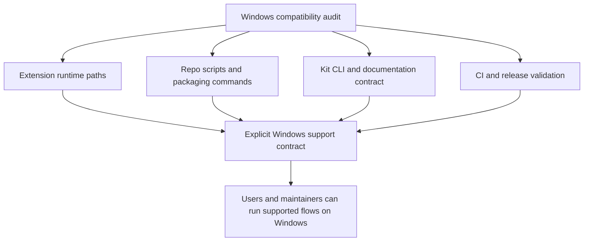

## req_062_harden_windows_compatibility_across_the_vs_code_plugin_and_logics_kit - Harden Windows compatibility across the VS Code plugin and Logics kit
> From version: 1.10.7
> Status: Done
> Understanding: 96%
> Confidence: 93%
> Complexity: High
> Theme: Cross-platform runtime, tooling, and release reliability
> Reminder: Update status/understanding/confidence and references when you edit this doc.

# Needs
- Make the VS Code extension genuinely usable on Windows across the full supported workflow, not only in the narrow happy path where the UI can already find a Python interpreter.
- Remove Unix-only assumptions from the main project scripts that users and maintainers are expected to run locally for build, package, install, lint, audit, and release validation.
- Align the shared Logics kit documentation and CLI guidance with a cross-platform contract so Windows users are not told to use commands that fail by default.
- Add explicit Windows-oriented validation so cross-platform regressions are detected before release instead of after user reports.
- Keep Linux and macOS behavior stable while tightening the Windows contract.

# Context
The recent `1.10.7` work improved one important part of Windows support:
- the extension runtime no longer assumes `python3` only;
- it now falls back across `python3`, `python`, `py -3`, and `py` when invoking Logics scripts from the extension UI.

That change is necessary, but it is not sufficient to claim that the project or the bundled Logics kit are Windows-compatible as a whole.

The broader audit still shows several structural gaps:
- repo-level npm scripts still assume Unix shell behavior or Unix paths;
- packaged and release-oriented commands still reference `/tmp` or shell substitution patterns that do not work under the default Windows npm shell;
- some CLI flows and examples rely on quoting patterns that are shell-friendly in POSIX environments but not reliably copy-pasteable in `cmd` or PowerShell;
- the shared kit README, skills, and repository instructions still overwhelmingly document `python3` as the expected operator interface;
- repository-level line-ending behavior is not yet governed explicitly through a documented cross-platform policy such as `.gitattributes`, which leaves Windows `CRLF` handling implicit;
- CI and release workflows only validate Ubuntu, so Windows regressions can ship unnoticed;
- current tests cover Python command candidate selection and message wording, but not end-to-end Windows execution paths.

There are already a few partial cross-platform guardrails in place:
- the extension smoke check uses `os.tmpdir()` and resolves `npx.cmd` on Windows;
- the kit CLI smoke checks fall back from symlink creation to `copytree` when the environment does not allow directory symlinks;
- the extension runtime compares paths case-insensitively on Windows.

Those are good signals, but they do not yet amount to a project-level Windows support contract because:
- they are not backed by an actual Windows CI lane;
- they do not cover the full supported operator surface;
- and they do not protect the Unix-oriented npm scripts and documentation paths that users and maintainers still hit directly.

Concretely, the project is in an inconsistent state:
- the extension UI is becoming more defensive on Windows;
- the repository automation surface is still mostly Unix-oriented;
- the kit documentation teaches Unix-first usage;
- and the validation pipeline does not enforce a cross-platform contract.

This request should close that gap deliberately rather than through one-off fixes.
The goal is not to make every single helper script identical across platforms at any cost.
The goal is to define and enforce a realistic Windows support boundary for the plugin and the reusable kit:
- supported extension workflows should work on Windows;
- supported repo automation commands should not fail because of avoidable shell assumptions;
- supported command examples and helper flows should survive common Windows shell differences such as quoting and path semantics;
- kit entrypoints should have a documented Windows-compatible way to run;
- release confidence should come from actual Windows validation rather than inference.

# Acceptance criteria
- AC1: The request explicitly covers both scopes:
  - the VS Code extension repository;
  - the bundled or imported Logics kit workflows that users are expected to run directly.
- AC2: The supported Windows contract is clarified for extension-driven Logics actions such as create, promote, bootstrap, fix, and related script-backed flows.
- AC3: Main project npm scripts that are part of normal development, smoke, packaging, installation, or release validation no longer rely on avoidable Unix-only constructs such as:
  - hardcoded `python3` where a Windows-compatible launcher path is required;
  - `/tmp` output paths;
  - shell command substitution patterns such as `$(...)`.
- AC4: The repository documentation is updated so Windows users are not told to run commands that fail under the default Windows environment when an officially supported alternative exists.
- AC5: The Logics kit documentation and skill examples are calibrated so the documented operator path is Windows-compatible, or clearly marked as Unix-specific when a script is intentionally platform-scoped.
- AC5b: Windows-oriented hardening explicitly covers command-surface issues that are common in this repository, including:
  - quoting differences between POSIX shells, `cmd`, and PowerShell for supported CLI examples;
  - line-ending normalization expectations for text assets edited on Windows;
  - path-handling assumptions that can break under Windows path semantics.
- AC6: Windows support is validated through at least one meaningful automated path beyond unit-level string or candidate-list assertions.
- AC7: CI gains an explicit Windows validation lane for the supported workflow surface, or an equivalent automated Windows check with comparable confidence.
- AC8: Release preparation no longer depends solely on Ubuntu-only validation for workflows that are claimed to support Windows users or maintainers.
- AC9: The implementation distinguishes between:
  - intentional platform-specific helpers;
  - and unintended cross-platform breakpoints in supported workflows.
- AC10: Linux and macOS behavior remain supported, with changes designed as cross-platform hardening rather than Windows-only special cases where a generic solution is possible.
- AC11: The resulting guidance is concrete enough that a backlog item can split the work into:
  - extension runtime and command surface hardening;
  - npm script and packaging normalization;
  - kit README and skill documentation cleanup;
  - Windows CI or smoke validation;
  - release-process alignment.
- AC12: Windows validation explicitly exercises or accounts for edge cases already known to be relevant in this repository, including:
  - VSIX smoke packaging paths and Windows command resolution;
  - environments where directory symlinks are unavailable and copy fallbacks are required;
  - case-insensitive path handling expectations in the extension runtime;
  - shell quoting behavior for supported CLI install or MCP-registration flows;
  - line-ending behavior for generated or maintained text artifacts.

# Scope
- In:
  - Extension runtime compatibility for Python-backed Logics actions.
  - Main repository npm scripts and developer commands that are part of the supported workflow.
  - VSIX packaging and install helper flows where Windows users or maintainers are expected to operate them.
  - Shared kit README, `SKILL.md` examples, and repo instructions that define the supported CLI/operator contract.
  - CI and release validation strategy for Windows-relevant flows.
- Out:
  - Rewriting every historical task or request document that merely mentions Unix commands as archival evidence.
  - Forcing intentionally platform-specific helper assets to become cross-platform when their scope is explicitly OS-bound.
  - General feature work unrelated to Windows or cross-platform execution reliability.

# Dependencies and risks
- Dependency: the extension continues to use the Logics kit under `logics/skills/` as the script provider for workflow actions.
- Dependency: Git, Node.js, Python 3, and the VS Code CLI remain the baseline external tools for supported flows.
- Dependency: the project must decide which commands are officially supported on Windows versus maintainer-only or platform-scoped helpers.
- Risk: patching only the extension runtime will leave the project-level operator experience misleading and incomplete.
- Risk: patching only docs without changing scripts or validation will create a false sense of support.
- Risk: adding Windows-specific branches in too many places can fragment the maintenance model if generic cross-platform solutions are available.
- Risk: changing packaging or install flows can unintentionally regress the current Linux and macOS release path if not covered by tests.
- Risk: a Windows CI lane that is too broad or too slow can become noisy unless the supported surface is defined carefully first.
- Risk: validating only the happy path on Windows could still miss permission-related behaviors such as symlink restrictions that appear on common developer machines.
- Risk: leaving line endings and shell quoting implicit can preserve a class of Windows-only failures even after the main runtime commands appear fixed.

# Clarifications
- This request is broader than the already-shipped Python launcher fallback in the extension runtime.
- The central problem is consistency across runtime, scripts, docs, and validation.
- The preferred approach is:
  - define the supported Windows contract explicitly;
  - fix real supported breakpoints first;
  - update docs to match reality;
  - add automation that prevents regression.
- The preferred outcome is not to replace every `python3` string in every file blindly.
- Where a direct CLI path is intended for normal user or maintainer workflows, it should either:
  - work on Windows;
  - or be documented with an explicit supported Windows alternative.
- When one quoting form is not realistically portable across POSIX, `cmd`, and PowerShell, the supported Windows variant should be documented explicitly instead of pretending one command fits all shells.
- Cross-platform hardening should include the repository text-file contract where it affects real usage, such as `.gitattributes` or equivalent guidance for generated and maintained text artifacts.
- Platform-specific helpers are acceptable when they are clearly labeled and not misrepresented as generic operator workflows.
- The best first validation targets are the flows most likely to affect real usage:
  - extension create and promote actions;
  - package and install helper commands;
  - key kit CLI smoke paths;
  - release or pre-release checks that are expected to be repeatable by maintainers.
- Existing partial Windows-aware helpers should be treated as evidence of intended support, not as a substitute for explicit Windows validation.

# References
- Related request(s): `logics/request/req_025_harden_logics_kit_workflow_generation_and_governance_from_real_usage.md`
- Related request(s): `logics/request/req_027_harden_extension_packaging_agent_loading_and_workspace_runtime_behavior.md`
- Reference: `package.json`
- Reference: `README.md`
- Reference: `logics/instructions.md`
- Reference: `logics/skills/README.md`
- Reference: `src/pythonRuntime.ts`
- Reference: `src/logicsProviderUtils.ts`
- Reference: `tests/run_extension_smoke_checks.mjs`
- Reference: `logics/skills/tests/run_cli_smoke_checks.py`
- Reference: `.github/workflows/ci.yml`
- Reference: `.github/workflows/release.yml`

# Definition of Ready (DoR)
- [x] Problem statement is explicit and user impact is clear.
- [x] Scope boundaries (in/out) are explicit.
- [x] Acceptance criteria are testable.
- [x] Dependencies and known risks are listed.

# Companion docs
- Product brief(s): (none yet)
- Architecture decision(s): (none yet)

# Backlog
- `item_074_harden_windows_support_for_extension_workflow_actions_and_runtime_detection`
- `item_075_normalize_npm_scripts_vsix_flows_and_repository_text_file_handling_for_windows`
- `item_076_make_supported_logics_kit_command_entrypoints_cross_platform`
- `item_077_add_automated_windows_ci_and_release_gating_for_supported_workflows`
