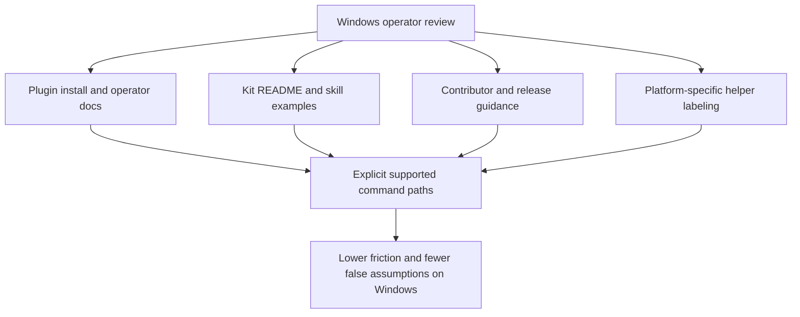

## req_063_clarify_windows_operator_guidance_and_platform_specific_helper_boundaries_in_the_logics_docs - Clarify Windows operator guidance and platform-specific helper boundaries in the Logics docs
> From version: 1.10.7
> Status: Done
> Understanding: 95%
> Confidence: 92%
> Complexity: Medium
> Theme: Documentation quality, operator ergonomics, and platform clarity
> Reminder: Update status/understanding/confidence and references when you edit this doc.

# Needs
- Clarify the documented Windows operator path for the VS Code plugin and the Logics kit so users are not left guessing which commands are actually supported on Windows.
- Remove copy-paste-hostile command examples that are syntactically valid only in POSIX shells when the surrounding documentation is meant to describe general usage.
- Make the maintainer and release guidance less Unix-assumptive where cross-platform equivalents are expected.
- Mark platform-specific helpers explicitly so OS-bound scripts are not mistaken for general-purpose workflow entrypoints.

# Context
The broader Windows compatibility review identified a second class of issues beyond runtime execution bugs.

These issues are not always hard failures in application code.
Many of them are operator-experience failures:
- documentation that presents a generic command but really assumes macOS or Linux;
- examples that are valid only in a POSIX shell because they use `mkdir -p`, trailing `\` line continuations, or Unix-oriented installation guidance;
- command snippets whose quoting works in a POSIX shell but is not copy-paste-safe in `cmd` or PowerShell;
- maintainer documentation that hardcodes Unix temp paths such as `/tmp`;
- repository guidance that leaves line-ending expectations implicit even though Windows contributors commonly hit `CRLF` versus `LF` friction;
- OS-specific helper scripts that exist legitimately, but are not always framed clearly enough as platform-scoped tooling rather than generic Logics entrypoints.

Concrete examples in the current tree include:
- plugin installation guidance that assumes the `code` CLI is already available with wording that is not Windows-specific enough;
- kit bootstrap and usage examples that rely on `mkdir -p` or multiline shell continuations;
- MCP or CLI examples whose JSON or argument quoting is written for POSIX shells rather than documented separately for Windows shells;
- contributor guidance that still uses `/tmp` as if it were a generic cross-platform temp location;
- submodule installation guidance where SSH-based examples can create avoidable Windows friction when HTTPS would be the simpler default path for many users;
- shell helper scripts that are valid and useful, but should be labeled clearly as OS-bound utilities.

This matters because support quality is experienced through documentation as much as through code.
Even if the extension runtime or the Python scripts are becoming more cross-platform, users and maintainers still lose time when:
- install instructions point them toward the wrong CLI expectations on Windows;
- a copied command fails due to shell syntax rather than due to the underlying tool;
- a skill appears general but secretly assumes one operating system;
- the release or contributor workflow teaches Unix-only habits as if they were universal.

This request is intentionally narrower than the broader Windows hardening request.
It focuses on operator guidance, examples, and explicit platform boundaries.
The preferred outcome is a documentation layer that tells the truth:
- what is supported on Windows;
- what requires a Windows-specific variant;
- and what is intentionally platform-specific.

# Acceptance criteria
- AC1: The request explicitly covers documentation and examples for both:
  - the main VS Code plugin repository;
  - the imported or bundled Logics kit documentation surface.
- AC2: Installation and operator guidance for Windows users is explicit where the current wording is macOS/Linux-centric or ambiguous.
- AC3: General-purpose command examples that are meant to be copy-pasteable by users or maintainers are rewritten to avoid avoidable POSIX-only syntax, or are paired with a Windows-compatible variant.
- AC4: Maintainer and release guidance no longer presents Unix-only temp paths or shell idioms as the default generic workflow when a cross-platform alternative is expected.
- AC4b: Documentation cleanup explicitly covers Windows friction points that are easy to miss in code review, including:
  - shell quoting differences for `code` CLI or MCP-related commands;
  - `CRLF` versus `LF` expectations where contributors edit repo-managed text files on Windows;
  - submodule installation guidance that should prefer the least-friction Windows-compatible operator path when no SSH-specific requirement exists.
- AC5: Platform-specific helper scripts remain allowed, but their documentation clearly labels them as platform-scoped instead of implying that they are general workflow entrypoints.
- AC6: The resulting docs distinguish clearly between:
  - supported cross-platform workflows;
  - supported Windows alternatives;
  - and intentionally OS-specific helpers.
- AC7: The documentation cleanup remains aligned with the actual code and script behavior rather than promising unsupported execution paths.
- AC8: The request is specific enough that a future backlog item can split the work into:
  - plugin install and usage docs;
  - kit README and `SKILL.md` example cleanup;
  - contributor and release guidance cleanup;
  - helper labeling and platform notes.
- AC9: The highest-traffic Windows friction points are addressed explicitly, including:
  - `code` CLI expectations for plugin install and dev workflows;
  - POSIX-only shell examples such as `mkdir -p` and trailing `\` continuations;
  - Unix temp-path examples such as `/tmp` in maintainer flows.

# Scope
- In:
  - Plugin README installation and usage wording where Windows guidance is unclear or misleading.
  - Kit README and `SKILL.md` examples that are intended as general operator workflows.
  - Contributor and release instructions that currently assume Unix shell/path behavior.
  - Explicit labeling for intentionally platform-specific helpers.
- Out:
  - Reworking runtime code paths that belong in broader Windows execution hardening.
  - Converting every historical archival command mention in closed planning docs.
  - Replacing legitimate OS-specific helper scripts with cross-platform implementations by default.

# Dependencies and risks
- Dependency: the actual supported Windows behavior of the extension and kit must be known well enough for docs to state it accurately.
- Dependency: broader runtime fixes may need to land first for some command examples to become honestly cross-platform.
- Risk: rewriting docs too aggressively before runtime support is settled can over-promise.
- Risk: keeping docs generic while leaving OS-specific assumptions implicit will preserve current confusion.
- Risk: trying to make every example shell-neutral can reduce readability if the supported alternatives are not presented pragmatically.

# Clarifications
- This request is documentation and operator-guidance focused, not a substitute for runtime hardening.
- The main problem here is misleading or incomplete operator communication.
- The preferred documentation style is:
  - truthful about platform scope;
  - copy-paste-safe where examples are meant to be operational;
  - explicit when a helper is intentionally macOS-only, Linux-only, or otherwise OS-scoped.
- It is acceptable to present separate Windows and POSIX examples when that is clearer than forcing one unnatural generic command form.
- When command quoting differs materially between POSIX, `cmd`, and PowerShell, separate examples are preferable to ambiguous pseudo-portable snippets.
- If the repo needs a line-ending policy for Windows contributors, the docs should state it plainly rather than relying on unstated Git defaults.
- The best first targets are the highest-traffic documents and examples:
  - main `README.md`;
  - `logics/skills/README.md`;
  - contributor and release instructions;
  - any `SKILL.md` that reads as a generic workflow entrypoint but uses platform-specific syntax.
- The preferred documentation cleanup should preserve good examples, but it should stop treating POSIX shell syntax as the invisible default for Windows readers.

# References
- Related request(s): `logics/request/req_062_harden_windows_compatibility_across_the_vs_code_plugin_and_logics_kit.md`
- Reference: `README.md`
- Reference: `logics/skills/README.md`
- Reference: `logics/skills/CONTRIBUTING.md`
- Reference: `logics/instructions.md`
- Reference: `logics/skills/logics-ollama-specialist/scripts/ollama_check.sh`
- Reference: `logics/skills/logics-ollama-specialist/scripts/ollama_install_macos.sh`

# Definition of Ready (DoR)
- [x] Problem statement is explicit and user impact is clear.
- [x] Scope boundaries (in/out) are explicit.
- [x] Acceptance criteria are testable.
- [x] Dependencies and known risks are listed.

# Companion docs
- Product brief(s): (none yet)
- Architecture decision(s): (none yet)

# Backlog
- `item_078_clarify_windows_install_and_cli_guidance_in_the_main_plugin_readme`
- `item_079_rewrite_logics_kit_readme_and_skill_examples_for_windows_safe_operator_paths`
- `item_080_clean_contributor_and_release_guidance_for_windows_friendly_shell_and_temp_path_usage`
- `item_081_label_platform_specific_helpers_and_shell_specific_command_variants_explicitly`
