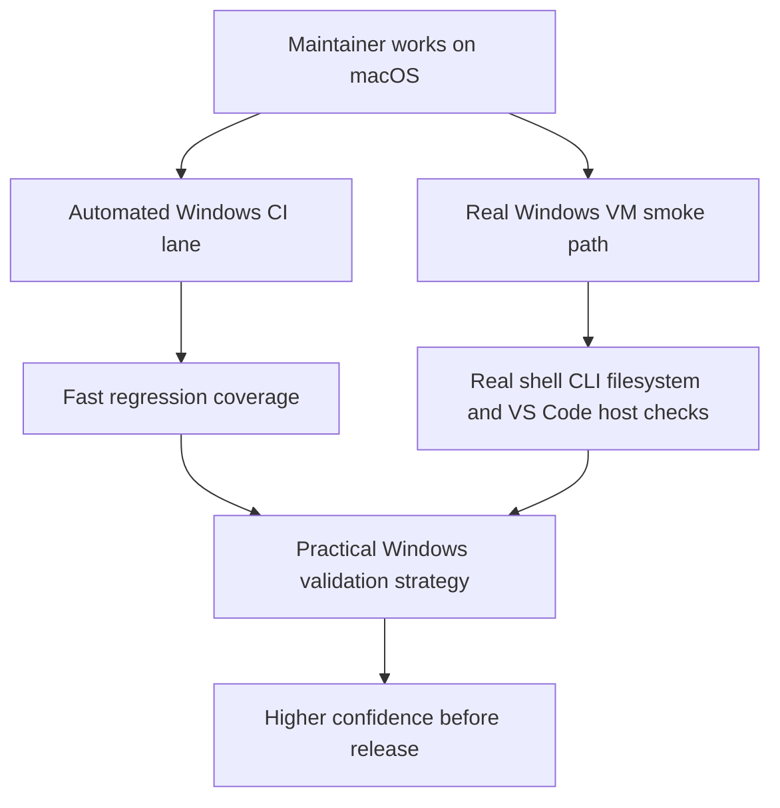

## req_064_add_a_practical_windows_validation_strategy_from_macos_for_the_vs_code_plugin_and_logics_kit - Add a practical Windows validation strategy from macOS for the VS Code plugin and Logics kit
> From version: 1.10.7
> Status: Done
> Understanding: 97%
> Confidence: 95%
> Complexity: Medium
> Theme: Cross-platform validation strategy and test environment realism
> Reminder: Update status/understanding/confidence and references when you edit this doc.

# Needs
- Define a practical way for a maintainer working on macOS to validate Windows behavior for the VS Code plugin and the Logics kit without relying on false confidence from incomplete local simulation.
- Separate what can be validated reliably through automation from what needs a real Windows runtime.
- Add a repeatable Windows validation path that is realistic enough to catch shell, CLI, filesystem, and extension-host issues before release.
- Keep the validation strategy lightweight enough to use regularly during development and release preparation.

# Context
The current project already has a growing Windows compatibility surface:
- extension runtime fallback for Python launcher resolution;
- partial Windows-aware smoke helpers such as `npx.cmd`, `os.tmpdir()`, and symlink fallbacks.

However, the repository is still primarily developed from macOS and validated in Ubuntu CI.
That creates a practical problem for maintainers:
- some Windows issues can be reasoned about statically;
- some can be approximated by targeted tests from macOS;
- but the most important operator-path failures still depend on a real Windows environment.

In particular, a simple local “simulation” from macOS is not enough to validate:
- PowerShell or `cmd` shell behavior;
- `code` CLI behavior on Windows;
- `py` launcher behavior;
- VS Code extension-host behavior in a Windows runtime;
- symlink restrictions or permission edge cases common on Windows machines;
- case-insensitive path assumptions as they appear in actual tooling flows.

That means the project needs an explicit validation model rather than an implicit hope that cross-platform bugs will be obvious.

The most pragmatic model is a two-layer strategy:
- automated Windows validation in CI for fast and repeatable regression coverage;
- a real Windows environment, most likely a VM on macOS, for manual smoke checks of the flows that cannot be trusted through indirect simulation alone.

This request is not asking for a fake Windows emulator inside the plugin.
It is asking for a maintainable validation strategy from a macOS maintainer perspective:
- what to automate;
- what to validate manually in real Windows;
- how to keep that workflow light enough to actually be used.

# Acceptance criteria
- AC1: The request defines a two-layer Windows validation strategy that explicitly distinguishes:
  - automated validation suitable for CI;
  - and manual or semi-manual smoke validation that requires a real Windows environment.
- AC2: The request makes clear that macOS-only local simulation is insufficient for certain Windows-specific behaviors and must not be treated as a complete validation substitute.
- AC3: The strategy includes an automated Windows lane capable of exercising the supported workflow surface that is most likely to regress, such as build, tests, packaging, and selected script-backed flows.
- AC4: The strategy includes a real-Windows smoke path, such as a VM-based workflow, for operator paths that cannot be trusted through indirect simulation alone.
- AC5: The request identifies which classes of problems should be validated only in real Windows, including at least:
  - shell and CLI behavior;
  - Python launcher behavior;
  - VS Code extension-host runtime behavior;
  - filesystem permission or symlink restrictions;
  - case-insensitive path assumptions where relevant.
- AC6: The resulting workflow is pragmatic enough for a maintainer using macOS to run regularly during release preparation and targeted debugging.
- AC7: The request is specific enough that future backlog work can split the implementation into:
  - Windows CI setup;
  - Windows smoke-check definition;
  - VM or local real-Windows workflow guidance;
  - release-process integration.
- AC8: The validation strategy is aligned with the broader Windows hardening work and does not pretend to solve compatibility through documentation alone.

# Scope
- In:
  - Defining the right Windows validation model from a macOS maintainer perspective.
  - Choosing which checks belong in Windows CI.
  - Choosing which checks require a real Windows runtime such as a VM.
  - Documenting a repeatable smoke strategy for release confidence.
- Out:
  - Implementing every underlying Windows compatibility fix tracked elsewhere.
  - Building a fake Windows emulator inside the plugin or test harness.
  - Replacing real Windows validation with only theoretical or mocked behavior.

# Dependencies and risks
- Dependency: the project must decide which workflows are officially supported on Windows before validation scope can be finalized.
- Dependency: some Windows fixes may need to land before smoke tests become stable and meaningful.
- Dependency: maintainers need access to either Windows CI capacity or a practical local Windows runtime such as a VM.
- Risk: relying only on CI could still miss operator-path issues that appear only in an actual interactive Windows environment.
- Risk: relying only on a manual VM path would make regressions too easy to skip in day-to-day development.
- Risk: trying to validate too much in the first Windows lane could create a slow or flaky pipeline that maintainers stop trusting.

# Clarifications
- This request is about validation strategy, not about pretending macOS can perfectly emulate Windows behavior.
- The preferred model is:
  - automate what is cheap, repeatable, and high-signal;
  - use a real Windows environment for the behaviors that need one.
- Docker, jsdom, or generic local harnesses are useful supporting tools, but they are not substitutes for real Windows shell and VS Code host validation.
- A VM-based workflow is acceptable and likely preferable to ad hoc remote access or manual machine hopping when the maintainer primarily works on macOS.
- The strongest success condition is not simply “a Windows job exists,” but “maintainers have a believable and repeatable path to catch Windows regressions before release.”

# References
- Related request(s): `logics/request/req_062_harden_windows_compatibility_across_the_vs_code_plugin_and_logics_kit.md`
- Related request(s): `logics/request/req_063_clarify_windows_operator_guidance_and_platform_specific_helper_boundaries_in_the_logics_docs.md`
- Reference: `tests/run_extension_smoke_checks.mjs`
- Reference: `logics/skills/tests/run_cli_smoke_checks.py`
- Reference: `.github/workflows/ci.yml`
- Reference: `.github/workflows/release.yml`
- Reference: `README.md`

# Definition of Ready (DoR)
- [x] Problem statement is explicit and user impact is clear.
- [x] Scope boundaries (in/out) are explicit.
- [x] Acceptance criteria are testable.
- [x] Dependencies and known risks are listed.

# Companion docs
- Product brief(s): (none yet)
- Architecture decision(s): (none yet)

# Backlog
- `item_082_add_a_windows_ci_lane_for_the_supported_plugin_and_kit_smoke_surface`
- `item_083_define_a_real_windows_vm_smoke_checklist_for_macos_maintainers`
- `item_084_integrate_windows_validation_strategy_into_release_preparation_and_debugging_workflows`
