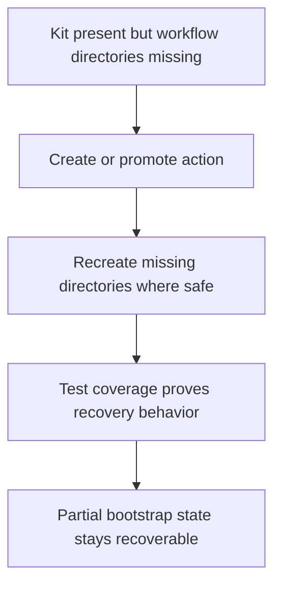

## req_065_harden_partial_logics_bootstrap_recovery_when_workflow_directories_are_missing - Harden partial Logics bootstrap recovery when workflow directories are missing
> From version: 1.10.7
> Status: Draft
> Understanding: 96%
> Confidence: 94%
> Complexity: Medium
> Theme: Bootstrap resilience and workflow directory recovery
> Reminder: Update status/understanding/confidence and references when you edit this doc.

# Needs
- Guarantee that Logics workflow creation remains recoverable when the kit is present but one or more workflow directories such as `logics/request`, `logics/backlog`, or `logics/tasks` are missing.
- Make the expected behavior for partially bootstrapped repositories explicit instead of leaving it as an accidental side effect of current script behavior.
- Add regression coverage for missing-directory cases so future refactors do not break this recovery path.
- Clarify which partial-bootstrap states are expected to self-heal and which should still surface actionable errors.

# Context
The current system already behaves reasonably well in one important partial-bootstrap case:
- when the Logics kit and flow manager are present;
- but the stage directories are missing;
- the flow manager recreates the target directory during document reservation before writing the new file.

That means the common “`logics/` exists, `logics/skills/` exists, but `request` or `backlog` or `tasks` is missing” case is currently more resilient than the UI alone would suggest.

However, this recovery behavior is not yet treated as an explicit contract.
It is mostly implicit in the Python flow-manager implementation.
As a result:
- it can be overlooked during future refactors;
- it is not clearly documented as a supported recovery case;
- and it is not covered as directly as it should be by targeted regression tests.

This request is not about fully broken kit states such as missing scripts, incompatible versions, or absent `logics/skills`.
Those cases belong to broader bootstrap and Windows hardening work.
This request is specifically about the narrower but common partial-bootstrap scenario where:
- the kit is available;
- the repo root is valid;
- but one or more workflow directories were never created, were deleted manually, or were only partially restored.

The preferred outcome is to make this case deliberately supported:
- create actions should recreate missing workflow directories where safe;
- tests should prove that behavior explicitly;
- and the project should not regress into requiring a full re-bootstrap just because a stage directory is missing.

# Acceptance criteria
- AC1: The request explicitly covers partial-bootstrap states where the Logics kit is present but one or more workflow directories are missing.
- AC2: The request makes clear that missing `logics/request`, `logics/backlog`, and `logics/tasks` directories are expected recovery cases for the supported create flows.
- AC3: The request allows the implementation to treat these missing-directory cases as self-healing by recreating the target directory automatically before document generation.
- AC4: Targeted regression tests are added for at least:
  - missing request directory then `new request`;
  - missing backlog directory then `new backlog`;
  - missing task directory then `new task`.
- AC5: The request distinguishes missing workflow directories from broader broken-kit states such as:
  - missing `logics/skills`;
  - missing flow-manager scripts;
  - incompatible or incomplete kit installations.
- AC6: The resulting behavior is documented or otherwise made explicit enough that maintainers understand this recovery path is intentional rather than accidental.
- AC7: The request is specific enough that a backlog item can split the work into:
  - contract clarification;
  - flow-manager regression tests;
  - optional extension-level messaging or smoke coverage if needed.

# Scope
- In:
  - Recovery behavior when workflow stage directories are missing but the kit is otherwise present.
  - Flow-manager and test coverage for create flows in partial-bootstrap states.
  - Clarifying the intended contract around self-healing directory creation.
- Out:
  - Full-kit recovery when `logics/skills` or required scripts are missing.
  - Windows-specific validation strategy covered elsewhere.
  - Broad bootstrap redesign for unrelated failure modes.

# Dependencies and risks
- Dependency: the flow manager remains the source of truth for workflow document creation behavior.
- Dependency: extension-side recovery should not fight the flow manager’s native self-healing behavior.
- Risk: if this behavior stays implicit, later refactors may remove directory auto-creation without anyone noticing.
- Risk: overextending “self-healing” semantics to truly broken kit states could hide problems that should surface as actionable errors.
- Risk: extension messaging could become misleading if it treats missing workflow directories the same as missing kit scripts.

# Clarifications
- This request is about partial-bootstrap recovery, not about every possible broken bootstrap state.
- The key distinction is:
  - missing stage directories should usually self-heal;
  - missing kit scripts or missing `logics/skills` should still surface recovery or bootstrap prompts.
- The preferred first implementation focus is the flow manager and its tests, because that is where directory creation behavior actually lives.
- Extension-level coverage is useful only insofar as it preserves the intended end-to-end user experience built on top of that script behavior.

# References
- Related request(s): `logics/request/req_062_harden_windows_compatibility_across_the_vs_code_plugin_and_logics_kit.md`
- Reference: `src/logicsViewDocumentController.ts`
- Reference: `src/logicsViewProvider.ts`
- Reference: `logics/skills/logics-flow-manager/scripts/logics_flow.py`
- Reference: `logics/skills/logics-flow-manager/scripts/logics_flow_support.py`
- Reference: `logics/skills/tests/test_logics_flow.py`

# Definition of Ready (DoR)
- [x] Problem statement is explicit and user impact is clear.
- [x] Scope boundaries (in/out) are explicit.
- [x] Acceptance criteria are testable.
- [x] Dependencies and known risks are listed.

# Companion docs
- Product brief(s): (none yet)
- Architecture decision(s): (none yet)

# Backlog
- `item_085_make_missing_workflow_directories_an_explicit_self_healing_logics_contract`
- `item_086_add_regression_coverage_for_create_flows_when_workflow_directories_are_missing`
