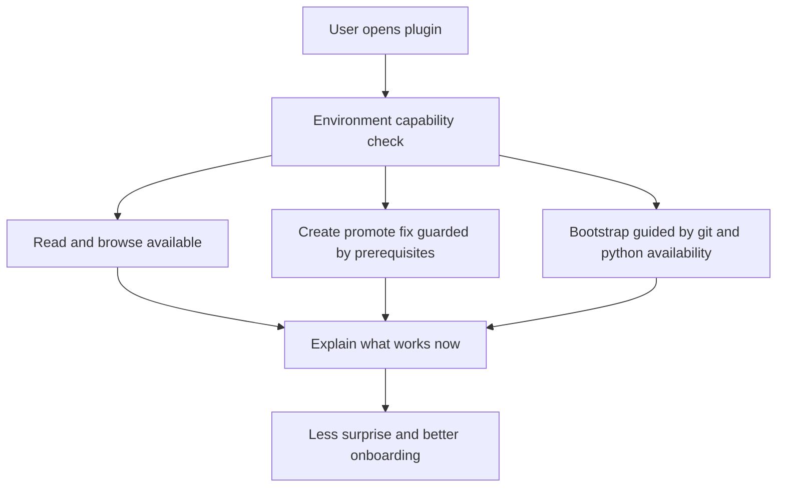

## req_066_add_guarded_environment_preflight_and_onboarding_for_logics_bootstrap_and_workflow_actions - Add guarded environment preflight and onboarding for Logics bootstrap and workflow actions
> From version: 1.10.7
> Status: Draft
> Understanding: 97%
> Confidence: 95%
> Complexity: Medium
> Theme: Environment detection, onboarding, and guarded recovery UX
> Reminder: Update status/understanding/confidence and references when you edit this doc.

# Needs
- Add an explicit environment preflight so users can understand which prerequisites are needed for read-only usage, workflow actions, and bootstrap before they hit opaque failures.
- Detect missing machine prerequisites such as `git` and `python` early enough to guide the user toward the right next step.
- Keep the plugin usable in read-only mode even when workflow prerequisites are missing.
- Provide a guided onboarding and recovery path for missing prerequisites, missing kit state, and partially configured repositories without pretending the extension can install system tools automatically.

# Context
The current plugin already has several useful recovery behaviors:
- it can offer `Bootstrap Logics` when Logics is missing;
- it can initialize `git` for the repository if the folder is not already a git repo;
- it can retry create flows after attempting to recover a missing flow-manager script path;
- it reports missing Python interpreters with clearer error text than before.

But from an end-user perspective, the onboarding contract is still too implicit.
Today, users can reasonably ask:
- do I need `git` just to use the plugin?
- do I need Python only for bootstrap, or also for `New Request` and `Promote`?
- what still works if I only want to browse existing Logics docs?
- when the environment is incomplete, why does one action work and another fail?

The real contract is more nuanced:
- reading and browsing existing Logics docs should require less than workflow mutation flows;
- create, promote, and fix flows require Python-backed scripts;
- bootstrap requires both repository-level git support and the ability to run the bootstrap script;
- the extension can install or recover repository state, but it cannot realistically install machine-level tools like `git` or `python` itself.

That means the plugin needs a guarded preflight and onboarding model:
- classify capabilities by prerequisite level;
- detect missing tools before the user commits to an action;
- explain what still works;
- guide recovery without overpromising system-level installation.

The preferred outcome is a user experience where:
- read-only use remains available when possible;
- mutation flows are blocked early with actionable explanations when prerequisites are missing;
- bootstrap and repair flows are guided, not surprising;
- and users can ask the plugin to check environment readiness explicitly rather than discovering problems one button at a time.

# Acceptance criteria
- AC1: The request defines an explicit environment capability model that distinguishes at least:
  - read-only browsing capabilities;
  - workflow mutation capabilities such as create, promote, and fix;
  - bootstrap or repair capabilities.
- AC2: Missing prerequisites for supported flows are detected before or at action entry with actionable feedback rather than only after deep execution failure.
- AC3: The request explicitly covers machine prerequisites relevant to the current plugin behavior, including:
  - `git` for bootstrap and submodule-related flows;
  - `python` for script-backed workflow actions;
  - optional tooling such as the `code` CLI only where relevant to install or developer workflows.
- AC4: The plugin remains usable in read-only mode when repository mutation prerequisites are missing, instead of treating the entire environment as unusable.
- AC5: The onboarding and recovery UX makes clear that the extension can recover repository state but does not promise to install system-level tools automatically.
- AC6: The request allows a dedicated environment check or diagnostic entrypoint, such as a command or panel action, that summarizes prerequisite status and explains impact.
- AC7: The resulting UX distinguishes clearly between:
  - missing kit state;
  - missing scripts;
  - missing machine prerequisites;
  - and partial repository bootstrap states.
- AC8: The request is specific enough that a backlog item can split the work into:
  - capability model and prerequisite detection;
  - guarded action gating;
  - onboarding and recovery messaging;
  - optional diagnostic command or status surface.

# Scope
- In:
  - Environment preflight and capability detection for normal plugin usage.
  - Guarded onboarding and recovery messaging for bootstrap and workflow actions.
  - Clear separation between read-only and mutation-capable plugin modes.
  - Explicit user-facing diagnosis of missing prerequisites.
- Out:
  - Auto-installing `git`, `python`, or other machine-level tools.
  - Implementing every broader Windows compatibility fix tracked in separate requests.
  - Replacing repository-level bootstrap logic already handled elsewhere.

# Dependencies and risks
- Dependency: the plugin’s supported capability contract must be defined clearly enough to map each action to its prerequisite set.
- Dependency: environment detection should reuse or align with existing bootstrap and script-recovery logic where possible.
- Risk: adding too many prompts could make the UX noisy if the capability model is not staged carefully.
- Risk: treating every missing dependency as blocking could unnecessarily degrade useful read-only scenarios.
- Risk: overpromising recovery could frustrate users if the plugin implies it can install system tooling when it cannot.
- Risk: environment checks that are too hidden will not materially improve onboarding.

# Clarifications
- This request is not about auto-installing operating-system dependencies.
- The main goal is clarity and guarded execution, not magical setup.
- The preferred model is:
  - detect;
  - classify impact;
  - explain what still works;
  - guide the next step.
- A user who only wants to read existing Logics docs should face fewer environmental requirements than a user who wants to bootstrap or mutate workflow state.
- The best first experience would let users answer, in one place:
  - Is my environment ready?
  - What can I do right now?
  - What is missing for the actions that are blocked?

# References
- Related request(s): `logics/request/req_062_harden_windows_compatibility_across_the_vs_code_plugin_and_logics_kit.md`
- Related request(s): `logics/request/req_065_harden_partial_logics_bootstrap_recovery_when_workflow_directories_are_missing.md`
- Reference: `README.md`
- Reference: `src/logicsViewProvider.ts`
- Reference: `src/logicsViewDocumentController.ts`
- Reference: `src/pythonRuntime.ts`
- Reference: `src/logicsProviderUtils.ts`

# Definition of Ready (DoR)
- [x] Problem statement is explicit and user impact is clear.
- [x] Scope boundaries (in/out) are explicit.
- [x] Acceptance criteria are testable.
- [x] Dependencies and known risks are listed.

# Companion docs
- Product brief(s): (none yet)
- Architecture decision(s): (none yet)

# Backlog
- `item_087_add_environment_capability_detection_for_read_only_workflow_and_bootstrap_modes`
- `item_088_guard_bootstrap_and_workflow_actions_with_prerequisite_aware_recovery_messaging`
- `item_089_add_a_logics_environment_diagnostic_command_and_onboarding_surface`
