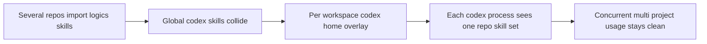

## req_067_add_multi_project_codex_workspace_overlays_for_logics_skills - Add multi-project Codex workspace overlays for Logics skills
> From version: 1.10.8
> Status: Draft
> Understanding: 95%
> Confidence: 93%
> Complexity: High
> Theme: Agent orchestration and Codex workspace isolation
> Reminder: Update status/understanding/confidence and references when you edit this doc.

# Needs
- Make Logics skills usable from Codex without moving or duplicating the canonical skill sources out of `logics/skills/`.
- Support several repositories that each import the Logics kit while keeping their repo-local skill versions isolated from one another.
- Allow several Codex sessions for different projects to stay active at the same time without collisions in `~/.codex/skills`.

# Context
The current Codex skill installation model is global:
- skills are installed under `~/.codex/skills`;
- the default installer treats that directory as a shared global pool;
- installed skills are identified only by destination directory name, not by active project or workspace.

That model does not fit the Logics kit well when the same user works across several repositories:
- each repository can import `logics/skills/` as its own source of truth, often via submodule;
- a global bridge in `~/.codex/skills` would create name collisions when several repos expose the same skill names;
- a global bridge would also blur version boundaries because repo A and repo B may intentionally be on different kit revisions;
- several Codex sessions can be active concurrently, so "switch the global active project" is not enough.

The desired direction is therefore workspace overlays, not global installation:
- `logics/skills/` remains canonical inside each repository;
- Codex should run against a per-workspace `CODEX_HOME` overlay such as `~/.codex-workspaces/<repo-id>/`;
- each overlay can expose that repository's Logics skills as links or platform-appropriate equivalents without copying the source tree by default;
- shared global assets such as authentication, stable config, and preinstalled system skills can remain referenced from the user's primary `~/.codex/`;
- each Codex process should see only the overlay for its own repository, so multiple projects can stay active concurrently without leaking skills across repos.

The implementation should explicitly account for platform differences:
- Unix-like environments can usually rely on symlinks;
- Windows environments may require junctions or a copy fallback when link creation is restricted;
- the supported contract should still keep `logics/skills/` as the repo-local source of truth.

# Acceptance criteria
- AC1: The solution defines a per-workspace Codex overlay model in which each repository can materialize its own `CODEX_HOME` workspace root instead of publishing all Logics skills into the single global `~/.codex/skills` pool.
- AC2: The design keeps `logics/skills/` as the canonical source of truth inside each repository and does not require moving the Logics kit into `~/.codex`.
- AC3: The design supports multiple active projects concurrently, with separate Codex processes able to run against separate workspace overlays at the same time.
- AC4: The overlay model explicitly prevents cross-project collisions for same-named skills and avoids silently mixing different kit versions from different repositories.
- AC5: The solution defines how shared user-level Codex assets are handled, including which parts stay global and can be referenced from overlays, such as authentication, stable config, and preinstalled system skills.
- AC6: The solution defines a synchronization contract for repo-local skills into the overlay, including add, update, and remove behavior when `logics/skills/*` changes.
- AC7: The supported platform contract is explicit for link materialization:
  - symlink where available;
  - Windows-friendly junction or equivalent where required;
  - copy fallback only when link-based publication is unavailable.
- AC8: The design is concrete enough that a follow-up backlog item can implement a small operator-facing command surface such as register, sync, run, status, or equivalent commands without re-deciding the underlying architecture.
- AC9: The resulting approach preserves the thin-adapter principle already used for Claude integration:
  - adapter state may exist outside `logics/`;
  - the detailed workflow and skill logic remain owned by `logics/skills/`.

# Scope
- In:
  - Define the per-workspace overlay architecture for Codex skill visibility.
  - Define the ownership split between global `~/.codex` assets and workspace overlay assets.
  - Define how repository-local Logics skills are discovered and published into overlays.
  - Define the minimum operator workflow for creating, syncing, and launching a Codex session against a workspace overlay.
  - Cover concurrent multi-project usage as a first-class requirement.
- Out:
  - Reworking the existing VS Code extension bootstrap flow in the same milestone.
  - Immediate support for publishing every possible non-Logics skill source into the same overlay mechanism.
  - Replacing the current global Codex installer behavior for all users and all skills.
  - Turning `~/.codex` into a second source of truth for Logics workflow content.

# Dependencies and risks
- Dependency: Codex can be launched with a process-specific `CODEX_HOME`, or an equivalent wrapper approach can provide that isolation contract.
- Dependency: The existing global Codex home remains usable as the source for shared non-project state such as authentication and system skills.
- Dependency: Logics repositories continue to keep skill packages under `logics/skills/*/SKILL.md`.
- Risk: if overlays are only partially isolated, the system may still leak global or foreign project skills into the wrong Codex session.
- Risk: if shared assets are copied instead of referenced carefully, workspace overlays may drift from the primary global Codex state.
- Risk: Windows link restrictions may force fallback behavior that needs explicit validation and operator guidance.
- Risk: if the operator workflow is too implicit, teams may accidentally launch Codex against the wrong home and get confusing skill resolution.

# Clarifications
- This request is about repository-level Codex compatibility for Logics skills, not about replacing the global Codex skill installer for every use case.
- The preferred solution is a per-workspace overlay rooted outside the repo, not a permanent global bridge that merges every repository into one shared `~/.codex/skills` directory.
- The preferred publication model is link-based where possible so the canonical repo-local skill sources remain untouched.
- Multiple active repositories are a hard requirement, not a future nice-to-have.

# References
- Related request(s): `logics/request/req_055_add_a_minimal_claude_code_bridge_for_logics_agents.md`
- Reference: `.claude/agents/logics-flow-manager.md`
- Reference: `.claude/commands/logics-flow.md`
- Reference: `logics/skills/README.md`
- Reference: `logics/instructions.md`
- Reference: `logics/backlog/item_076_make_supported_logics_kit_command_entrypoints_cross_platform.md`

# Definition of Ready (DoR)
- [x] Problem statement is explicit and user impact is clear.
- [x] Scope boundaries (in/out) are explicit.
- [x] Acceptance criteria are testable.
- [x] Dependencies and known risks are listed.

# Companion docs
- Product brief(s): (none yet)
- Architecture decision(s): `adr_008_keep_codex_workspace_overlays_repo_local_isolated_and_composable`

# Backlog
- `item_090_add_multi_project_codex_workspace_overlays_for_logics_skills`
