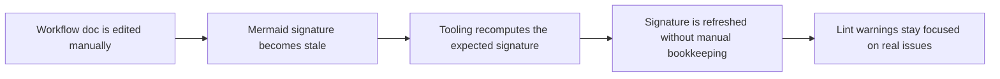

## req_068_auto_refresh_stale_mermaid_signatures_in_logics_workflow_docs - Auto-refresh stale Mermaid signatures in Logics workflow docs
> From version: 1.10.8
> Status: Done
> Understanding: 96%
> Confidence: 94%
> Complexity: Medium
> Theme: Logics doc maintenance and Mermaid signature integrity
> Reminder: Update status/understanding/confidence and references when you edit this doc.

# Needs
- Reduce friction when workflow docs are edited manually after generation and only the Mermaid signature becomes stale.
- Keep `%% logics-signature` comments synchronized with the current document context so lint output reflects real issues instead of avoidable bookkeeping drift.
- Preserve the current Mermaid metadata contract while making normal document editing less brittle for operators and maintainers.

# Context
The Logics kit already generates context-aware Mermaid signatures when request, backlog, and task docs are created. The linter also checks whether the `%% logics-signature` inside the Mermaid block still matches the current document context.

That behavior is useful, but there is still an operator gap:
- a workflow doc is often created from a scaffold and then rewritten manually;
- the prose, acceptance criteria, and overall scope may improve immediately;
- the Mermaid block can stay structurally fine while only the signature comment becomes stale;
- the linter then reports a warning that is technically correct but operationally noisy because the mismatch is bookkeeping rather than a meaningful product or delivery issue.

This creates a recurring maintenance tax:
- every substantial manual edit can require a manual signature refresh;
- contributors can be told repeatedly that the signature is stale even when the diagram itself is not broken;
- document hygiene depends on remembering an implementation detail that the tooling already knows how to recompute.

There is already adjacent coverage for better Mermaid relevance in Logics docs, but this request is narrower:
- it is not asking for richer or prettier diagrams;
- it is not asking to redesign Mermaid generation logic from scratch;
- it is asking for signature resynchronization support so valid doc edits do not routinely leave stale `%% logics-signature` comments behind.

The preferred direction is to keep the current signature mechanism, but add a supported refresh path such as:
- automatic refresh during creation, promotion, or managed update flows;
- an explicit fixer command that rewrites stale signatures;
- lint or audit assistance that can offer or apply safe signature-only fixes;
- or a combination, as long as the operator does not need to hand-edit the signature in normal usage.

# Acceptance criteria
- AC1: The request defines a supported maintenance path for stale Mermaid signatures so operators do not need to hand-edit `%% logics-signature` comments during normal Logics doc maintenance.
- AC2: The request explicitly covers request, backlog, and task workflow docs that use the current generated Mermaid metadata contract.
- AC3: The request preserves the existing signature mechanism and validation intent:
  - stale signatures should still be detectable;
  - the solution should improve refresh behavior rather than removing the signature check.
- AC4: The request allows the future implementation to choose one or more safe remediation paths, such as:
  - auto-refresh during managed flow operations;
  - a dedicated fixer command;
  - lint or audit autofix support for signature-only drift.
- AC5: The request distinguishes signature-only drift from broader Mermaid quality issues:
  - this work targets stale metadata synchronization;
  - broader diagram relevance or redesign concerns may stay in separate backlog slices.
- AC6: The request defines that signature refresh must be derived from the current document content using the same or equivalent logic already used by generation or lint validation, so the system has one canonical way to compute the expected signature.
- AC7: The request is concrete enough that a follow-up backlog item can decide where the refresh belongs operationally:
  - flow manager generation/update path;
  - doc fixer or linter autofix path;
  - audit or maintenance command path.
- AC8: The request keeps operator expectations explicit:
  - manual content edits are normal;
  - the tooling should absorb safe signature maintenance where possible;
  - lint output should stay focused on meaningful document problems.

# Scope
- In:
  - Define the need for automatic or tooling-assisted Mermaid signature refresh.
  - Cover request, backlog, and task workflow docs.
  - Define acceptable remediation surfaces for signature-only drift.
  - Preserve the current signature validation contract while reducing manual bookkeeping.
- Out:
  - Replacing the Mermaid signature mechanism entirely.
  - Rewriting the full Mermaid generation strategy for all docs in the same milestone.
  - Treating every Mermaid content issue as auto-fixable.

# Dependencies and risks
- Dependency: the current Logics workflow continues to embed `%% logics-signature` comments inside managed Mermaid blocks.
- Dependency: the expected signature can already be derived from document content through existing generation or lint logic.
- Risk: if refresh logic is implemented in several places without a single canonical computation path, generation, linting, and fixing can drift apart.
- Risk: over-aggressive autofix behavior could rewrite Mermaid blocks in cases where only warning-level visibility was intended.
- Risk: if the scope expands into full Mermaid rewriting, the implementation could become much larger than the narrow maintenance problem being solved.

# Clarifications
- This request is about stale Mermaid signature maintenance, not about diagram aesthetics.
- This request is also narrower than the earlier "keep Mermaid updated" work: the specific pain point here is metadata drift after normal manual editing.
- The preferred outcome is that stale signature warnings become uncommon because the tooling can refresh them safely.
- It is acceptable if the first implementation only fixes signature-only drift and leaves broader Mermaid-content drift as warning-level feedback.

# References
- Related request(s): `logics/request/req_061_generate_context_aware_mermaid_diagrams_and_keep_them_updated_in_logics_docs.md`
- Reference: `logics/skills/logics-flow-manager/scripts/logics_flow_support.py`
- Reference: `logics/skills/logics-doc-linter/scripts/logics_lint.py`
- Reference: `logics/skills/logics-flow-manager/SKILL.md`

# Definition of Ready (DoR)
- [x] Problem statement is explicit and user impact is clear.
- [x] Scope boundaries (in/out) are explicit.
- [x] Acceptance criteria are testable.
- [x] Dependencies and known risks are listed.

# Companion docs
- Product brief(s): (none yet)
- Architecture decision(s): (none yet)

# Backlog
- `item_091_auto_refresh_stale_mermaid_signatures_in_logics_workflow_docs`
