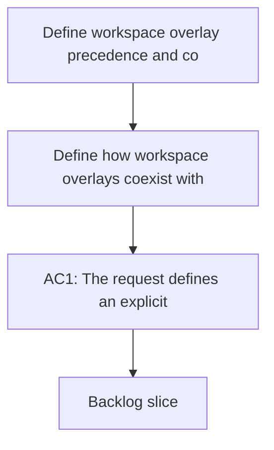

## req_070_define_workspace_overlay_precedence_and_coexistence_with_global_codex_skills - Define workspace overlay precedence and coexistence with global Codex skills
> From version: 1.10.8
> Status: Done
> Understanding: 98%
> Confidence: 95%
> Complexity: Medium
> Theme: Skill resolution policy and overlay coexistence
> Reminder: Update status/understanding/confidence and references when you edit this doc.

# Needs
- Define how workspace overlays coexist with global Codex state so skill resolution is deterministic instead of accidental.
- Clarify which skill sources are visible inside a workspace overlay and what happens when names overlap across repo-local, user-global, and system-provided skills.
- Prevent ambiguous behavior before implementation work begins.

# Context
`req_067` defines that repository-local Logics skills should be projected into a per-workspace overlay instead of being merged permanently into the single global `~/.codex/skills` pool.

That still leaves an important open question: once a workspace overlay exists, what exactly should Codex see inside it?

There are at least three possible sources of skills:
- repo-local Logics skills under `logics/skills/`;
- user-global skills already installed under the main `~/.codex/skills/`;
- system-provided skills such as `.system`.

Without an explicit precedence contract, several bad outcomes are possible:
- same-named repo and global skills can shadow each other unpredictably;
- workspace overlays may accidentally omit global skills users still expect to keep;
- support docs may tell operators to "just link everything" without defining who wins on collision;
- later diagnostics will not be able to distinguish a broken overlay from a policy choice.

The request is therefore about policy, not mechanics:
- which categories of skills must always remain visible;
- which categories are optional;
- which source wins when names collide;
- whether some categories should be namespaced, filtered, or excluded from workspace overlays.

# Acceptance criteria
- AC1: The request defines an explicit precedence model for at least these skill categories:
  - repo-local Logics skills;
  - user-global skills;
  - system-provided skills.
- AC2: The request defines how overlays should behave when same-named skills exist in more than one source.
- AC3: The request makes visible-vs-hidden behavior explicit for user-global skills inside workspace overlays rather than leaving it to implementation accident.
- AC4: The request is concrete enough that a future implementation can build overlay contents and diagnostics against a single deterministic resolution policy.
- AC5: The request keeps this policy work separate from cross-platform publication mechanics and from operator CLI design, even if those later features depend on the result.
- AC6: The request preserves the `logics/skills` source-of-truth contract from `req_067` while still defining how non-Logics skills coexist beside it.

# Scope
- In:
  - Define precedence across repo, global, and system skills.
  - Define collision behavior.
  - Define visibility expectations for each category inside overlays.
- Out:
  - Implementing the overlay manager CLI.
  - Validating link mechanics on each platform.
  - Replacing the existing global installer for unrelated skill ecosystems.

# Dependencies and risks
- Dependency: workspace overlays remain the chosen architecture from `req_067`.
- Dependency: Codex continues to load skills from the effective `CODEX_HOME`.
- Risk: if precedence is not fixed early, later CLI and diagnostics work will encode inconsistent assumptions.
- Risk: if the policy over-exposes global skills, overlays may stop feeling isolated.
- Risk: if the policy hides too much global state, users may perceive overlays as broken rather than intentionally scoped.

# Clarifications
- This request is about resolution policy, not about filesystem linking strategy.
- It is acceptable for the outcome to prefer isolation over convenience, as long as the rule is explicit and consistent.
- The goal is predictable coexistence, not maximum visibility of every possible skill source.

# References
- Related request(s): `logics/request/req_067_add_multi_project_codex_workspace_overlays_for_logics_skills.md`
- Reference: `/Users/alexandreagostini/.codex/skills/.system/skill-installer/SKILL.md`

# Definition of Ready (DoR)
- [x] Problem statement is explicit and user impact is clear.
- [x] Scope boundaries (in/out) are explicit.
- [x] Acceptance criteria are testable.
- [x] Dependencies and known risks are listed.

# Companion docs
- Product brief(s): (none yet)
- Architecture decision(s): `adr_008_keep_codex_workspace_overlays_repo_local_isolated_and_composable`

# Backlog
- `item_093_define_workspace_overlay_precedence_and_coexistence_with_global_codex_skills`
- `logics/backlog/item_093_define_workspace_overlay_precedence_and_coexistence_with_global_codex_skills.md`
