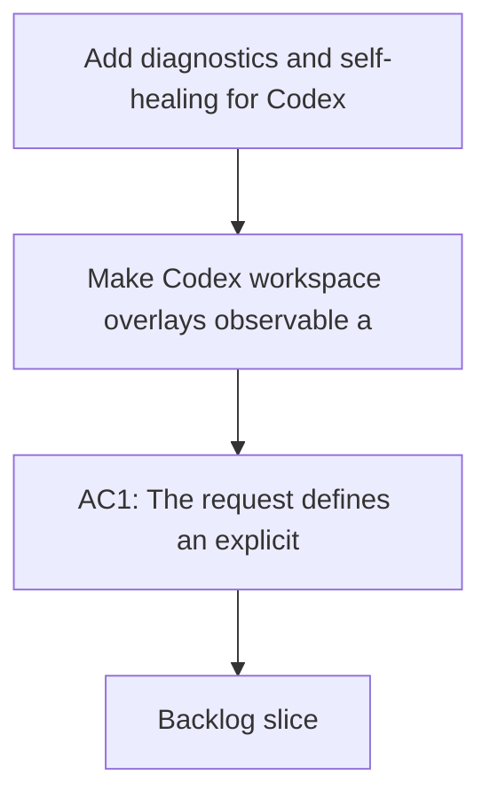

## req_071_add_diagnostics_and_self_healing_for_codex_workspace_overlays - Add diagnostics and self-healing for Codex workspace overlays
> From version: 1.10.8
> Status: Done
> Understanding: 98%
> Confidence: 95%
> Complexity: Medium
> Theme: Overlay diagnostics and recovery workflow
> Reminder: Update status/understanding/confidence and references when you edit this doc.

# Needs
- Make Codex workspace overlays observable and supportable when they drift, break, or become outdated.
- Give operators a supported path to detect and repair common overlay problems instead of deleting directories blindly.
- Ensure the overlay model from `req_067` can be operated safely over time, not only created once.

# Context
Per-workspace overlays introduce a useful isolation boundary, but they also introduce a new class of runtime state outside the repository:
- overlay directories can be missing or partially created;
- links can go stale if repo paths move or source skills disappear;
- shared references to global config or auth can break;
- fallback copy mode can leave overlays outdated relative to repo-local skills;
- users can launch Codex against the wrong `CODEX_HOME` and experience confusing skill visibility.

If the system has no diagnostic surface, the support story becomes weak:
- users will report "Codex does not see my skills" without actionable state;
- maintainers will have no standard checklist for broken links, missing shared assets, or stale overlay content;
- the only recovery path will be destructive cleanup instead of targeted repair.

The request therefore asks for an explicit diagnostics and self-healing contract around workspace overlays. That contract should be able to answer questions such as:
- Is the overlay present and structurally complete?
- Which repo is it bound to?
- Are source skill paths still valid?
- Are shared global references still valid?
- Is the overlay current relative to the repo skill set?
- Can the issue be repaired automatically or with a guided command?

# Acceptance criteria
- AC1: The request defines an explicit diagnostic surface for workspace overlays that can report overlay health, source binding, and common failure states.
- AC2: The request explicitly covers recovery for at least these failure categories:
  - missing overlay structure;
  - stale or broken skill links;
  - missing shared global references;
  - overlay content drift after repo changes.
- AC3: The request allows safe self-healing or guided repair for issues that can be fixed deterministically without redefining overlay policy.
- AC4: The request is concrete enough that future CLI or extension integrations can surface the same diagnostic model instead of inventing separate checks.
- AC5: The request distinguishes diagnosis from precedence policy and from cross-platform publication mechanics, even if it depends on both.
- AC6: The request keeps operator output actionable by requiring problem descriptions to map to a clear remediation path where possible.

# Scope
- In:
  - Define health signals for workspace overlays.
  - Define a recovery model for common deterministic failures.
  - Make the diagnostics reusable by CLI or higher-level integrations.
- Out:
  - Full policy definition for skill precedence.
  - Every possible Codex runtime failure unrelated to overlays.
  - Replacing manual debugging for arbitrary user-local customization.

# Dependencies and risks
- Dependency: workspace overlays are adopted as a supported runtime surface.
- Dependency: a stable overlay layout exists that diagnostics can inspect.
- Risk: if diagnostics are too shallow, users will still resort to deleting state blindly.
- Risk: if diagnostics become too coupled to one implementation detail, future overlay evolution will be harder.
- Risk: self-healing can become destructive if the repair boundary is not defined conservatively.

# Clarifications
- This request is about overlay observability and repair, not about which skills should win on precedence.
- It is acceptable for some cases to remain diagnostic-only if automatic repair would be risky.
- The goal is to make common failures legible and recoverable, not to hide all complexity.

# References
- Related request(s): `logics/request/req_067_add_multi_project_codex_workspace_overlays_for_logics_skills.md`
- Related request(s): `logics/request/req_069_add_an_operator_facing_logics_codex_workspace_manager_cli.md`

# Definition of Ready (DoR)
- [x] Problem statement is explicit and user impact is clear.
- [x] Scope boundaries (in/out) are explicit.
- [x] Acceptance criteria are testable.
- [x] Dependencies and known risks are listed.

# Companion docs
- Product brief(s): (none yet)
- Architecture decision(s): `adr_008_keep_codex_workspace_overlays_repo_local_isolated_and_composable`

# Backlog
- `item_094_add_diagnostics_and_self_healing_for_codex_workspace_overlays`
- `logics/backlog/item_094_add_diagnostics_and_self_healing_for_codex_workspace_overlays.md`
