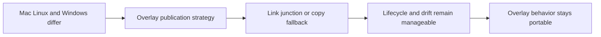

## req_072_harden_cross_platform_overlay_publication_for_symlink_junction_and_copy_fallback - Harden cross-platform overlay publication for symlink junction and copy fallback
> From version: 1.10.8
> Status: Done
> Understanding: 96%
> Confidence: 93%
> Complexity: Medium
> Theme: Cross-platform overlay publication and filesystem compatibility
> Reminder: Update status/understanding/confidence and references when you edit this doc.

# Needs
- Define a supported cross-platform publication strategy for workspace overlays that works across Unix-like systems and Windows.
- Prevent the overlay architecture from implicitly depending on symlink behavior that is unavailable or restricted in some environments.
- Make fallback behavior explicit so operators and tests know when the system is linking, when it is using junctions, and when it is copying.

# Context
`req_067` already calls out a high-level publication contract:
- prefer links where possible;
- support Windows-friendly equivalents;
- allow copy fallback only when necessary.

That direction still needs a dedicated cross-platform request because filesystem behavior is one of the main practical risks in this design:
- symlink creation differs across macOS, Linux, PowerShell, `cmd`, and restricted Windows environments;
- directory junction behavior is not identical to symlink behavior;
- copy fallback can keep a system working, but it introduces drift risk and different cleanup semantics;
- operators and automated tests need to know which mode was selected and why.

This request is intentionally narrower than the broader overlay architecture:
- it is not about skill precedence;
- it is not about overlay identity;
- it is not about CLI verbs;
- it is about making publication mechanics explicit, supported, and testable on all relevant platforms.

# Acceptance criteria
- AC1: The request defines an explicit publication contract for at least these modes:
  - symlink when supported;
  - Windows-friendly junction or equivalent when required;
  - copy fallback when link-based publication is unavailable.
- AC2: The request defines how the chosen publication mode is surfaced to operators or diagnostics rather than remaining implicit.
- AC3: The request explicitly covers cleanup and refresh semantics for each publication mode, especially the higher drift risk of copy fallback.
- AC4: The request is concrete enough that a future implementation can validate behavior on Windows without treating symlink support as guaranteed.
- AC5: The request keeps publication mechanics separate from precedence policy and overlay identity policy, even if they interact operationally.
- AC6: The request preserves the repo-local `logics/skills` source-of-truth model regardless of publication mode.

# Scope
- In:
  - Define the cross-platform publication modes.
  - Define mode selection and visibility expectations.
  - Define refresh and cleanup implications for each mode.
- Out:
  - Full overlay diagnostics design.
  - Full workspace lifecycle policy.
  - Replacing platform-specific filesystem constraints with unsupported hacks.

# Dependencies and risks
- Dependency: per-workspace overlays remain the chosen architecture.
- Dependency: Windows support is a real requirement for the supported operator path.
- Risk: if copy fallback is under-specified, overlays will silently drift and become hard to debug.
- Risk: if link mode assumptions are too Unix-centric, Windows support will regress quickly.
- Risk: if publication behavior is hidden, operator expectations and automated validation will diverge.

# Clarifications
- This request is about supported publication mechanics, not about whether overlays should exist.
- It is acceptable for some platforms to prefer different mechanics, as long as the contract is explicit and validated.
- The fallback path must remain a projection of repo-local skills, not a new source of truth.

# References
- Related request(s): `logics/request/req_067_add_multi_project_codex_workspace_overlays_for_logics_skills.md`
- Related request(s): `logics/request/req_071_add_diagnostics_and_self_healing_for_codex_workspace_overlays.md`

# Definition of Ready (DoR)
- [x] Problem statement is explicit and user impact is clear.
- [x] Scope boundaries (in/out) are explicit.
- [x] Acceptance criteria are testable.
- [x] Dependencies and known risks are listed.

# Companion docs
- Product brief(s): (none yet)
- Architecture decision(s): `adr_008_keep_codex_workspace_overlays_repo_local_isolated_and_composable`

# Backlog
- `item_095_harden_cross_platform_overlay_publication_for_symlink_junction_and_copy_fallback`
