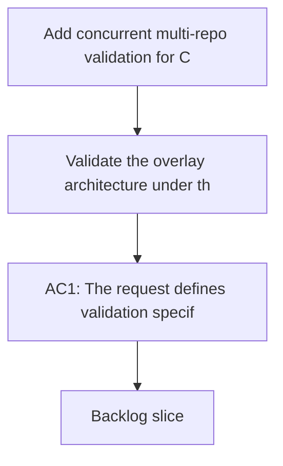

## req_073_add_concurrent_multi_repo_validation_for_codex_workspace_overlays - Add concurrent multi-repo validation for Codex workspace overlays
> From version: 1.10.8
> Status: Done
> Understanding: 98%
> Confidence: 95%
> Complexity: Medium
> Theme: Overlay validation and concurrent repository isolation
> Reminder: Update status/understanding/confidence and references when you edit this doc.

# Needs
- Validate the overlay architecture under the actual concurrency condition it is meant to solve: several repositories active at the same time.
- Prove that same-named skills from different repositories do not leak across active Codex sessions.
- Prevent the multi-project promise in `req_067` from remaining only an architectural assumption.

# Context
The central promise of the workspace overlay design is concurrent isolation:
- repo A should be able to run Codex with its own projected skill set;
- repo B should be able to do the same at the same time;
- the two sessions should not see each other's repo-local skills even when names overlap.

This is a stronger requirement than "switch active project and try again later". It requires real validation of simultaneous or effectively concurrent usage.

Without dedicated validation, several subtle regressions can slip through:
- two overlays may accidentally share mutable state;
- same-named skills may resolve from the wrong workspace or fall back to the global pool unexpectedly;
- wrapper commands may launch against the wrong `CODEX_HOME`;
- tests may verify only a single-project happy path and miss the core isolation claim.

This request therefore asks for validation shaped around the real problem statement, not just generic smoke coverage.

# Acceptance criteria
- AC1: The request defines validation specifically for concurrent or effectively parallel multi-repo usage, not just single-workspace smoke checks.
- AC2: The validation scope explicitly covers same-named skills coming from different repositories with different projected content or versions.
- AC3: The request defines success in terms of isolation outcomes:
  - each workspace sees its own repo-local skills;
  - foreign repo-local skills do not leak across sessions;
  - the global Codex home is not corrupted by concurrent workspace usage.
- AC4: The request is concrete enough that a future implementation can choose automated, fixture-based, or wrapper-level tests while still validating the real isolation claim.
- AC5: The request keeps validation separate from the underlying overlay architecture and precedence policy, while still depending on both.
- AC6: The request makes clear that multi-project support is not considered complete without this validation surface.

# Scope
- In:
  - Define the concurrent validation problem.
  - Cover overlapping skill names and separate active sessions.
  - Define the isolation outcomes that must be verified.
- Out:
  - Full CLI design.
  - Full diagnostics design.
  - Treating serial single-project checks as sufficient evidence.

# Dependencies and risks
- Dependency: the workspace overlay architecture exists or is planned from `req_067`.
- Dependency: there is a supported way to launch Codex against distinct workspace homes.
- Risk: if concurrent validation is skipped, the most important architectural promise will remain unproven.
- Risk: if tests only inspect directory layout without exercising launch behavior, they may miss real isolation failures.
- Risk: fixture design can become fragile if it depends too heavily on one concrete repo layout.

# Clarifications
- This request is about validating concurrent isolation, not about introducing more overlay features.
- It is acceptable if the first validation layer is synthetic or fixture-based, as long as it actually checks separate workspace homes and overlapping skill names.
- The core requirement is evidence that multi-repo active usage works, not just a claim in documentation.

# References
- Related request(s): `logics/request/req_067_add_multi_project_codex_workspace_overlays_for_logics_skills.md`
- Related request(s): `logics/request/req_070_define_workspace_overlay_precedence_and_coexistence_with_global_codex_skills.md`

# Definition of Ready (DoR)
- [x] Problem statement is explicit and user impact is clear.
- [x] Scope boundaries (in/out) are explicit.
- [x] Acceptance criteria are testable.
- [x] Dependencies and known risks are listed.

# Companion docs
- Product brief(s): (none yet)
- Architecture decision(s): `adr_008_keep_codex_workspace_overlays_repo_local_isolated_and_composable`

# Backlog
- `item_096_add_concurrent_multi_repo_validation_for_codex_workspace_overlays`
- `logics/backlog/item_096_add_concurrent_multi_repo_validation_for_codex_workspace_overlays.md`
