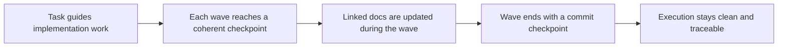

## req_075_strengthen_logics_task_waves_with_commit_and_documentation_update_checkpoints - Strengthen Logics task waves with commit and documentation update checkpoints
> From version: 1.10.8
> Status: Done
> Understanding: 96%
> Confidence: 94%
> Complexity: Medium
> Theme: Task execution hygiene and delivery checkpoints
> Reminder: Update status/understanding/confidence and references when you edit this doc.

# Needs
- Make Logics tasks encourage coherent implementation waves that leave the repository in a checkpointed and documented state as work progresses.
- Clarify that task execution should include documentation updates as part of the delivery flow, not only as a final cleanup activity.
- Encourage commit hygiene at meaningful wave boundaries without forcing a commit after every micro-step.

# Context
The current task model already pushes part of this behavior:
- generated task plans end with "Validate the result and update the linked Logics docs";
- the task template `Definition of Done` already requires linked docs to be updated;
- some tasks in practice already treat validation and doc updates as part of a delivery checkpoint.

What is still missing is an explicit wave/checkpoint contract for task execution.
Today a task can still be interpreted too loosely:
- implementation can continue across several partial edits without a clear checkpoint;
- documentation updates can drift to the very end instead of tracking the current implementation wave;
- commit hygiene depends on contributor habit rather than on the Logics task structure itself.

That matters because tasks are supposed to be execution-ready delivery plans, not just rough intent:
- each meaningful wave should leave the repo in a coherent state;
- each meaningful wave should update the Logics docs impacted by that wave;
- each meaningful wave should ideally map to a commit checkpoint or equivalent clean git state.

This request intentionally prefers wave-level checkpoints over per-step commits:
- committing after every tiny plan bullet can be too rigid and noisy;
- but leaving commits and doc updates entirely implicit makes execution drift more likely;
- the better middle ground is to formalize commit and documentation expectations at coherent delivery waves or checkpoints.

The expected implementation may touch more than one layer:
- task template wording;
- default generated task plan wording;
- `Definition of Done` guidance;
- warning-level lint or audit support if the team wants stronger enforcement later.

# Acceptance criteria
- AC1: The request defines wave-level expectations for task execution so meaningful implementation checkpoints include both code state and documentation state.
- AC2: The request explicitly requires documentation updates to be part of the normal task delivery flow and not only a deferred final cleanup step.
- AC3: The request defines that meaningful task waves should ideally end in a commit checkpoint or equivalent clean git checkpoint, while avoiding a rigid requirement to commit after every tiny plan bullet.
- AC4: The request allows the final implementation to express this guidance through one or more of:
  - task template wording;
  - generated plan wording;
  - `Definition of Done` updates;
  - warning-level lint or audit checks.
- AC5: The request is concrete enough that a follow-up backlog item can choose whether to encode waves explicitly in task structure, or to strengthen checkpoint guidance within the current task structure.
- AC6: The request keeps the policy generic for the shared Logics kit rather than binding it to one repository's local branching or commit-message conventions.
- AC7: The request keeps commit guidance safe by framing it as a meaningful checkpoint habit and not as permission to auto-commit arbitrary changes without operator review.

# Scope
- In:
  - Define commit and documentation update expectations for task waves.
  - Clarify how tasks should leave coherent checkpoints during execution.
  - Allow template, generation, and warning-level governance improvements.
- Out:
  - Enforcing a specific branch model.
  - Forcing commits after every micro-step.
  - Auto-committing user changes without explicit review or acceptance.

# Dependencies and risks
- Dependency: tasks continue to be generated and maintained through the Logics flow manager and task template system.
- Dependency: documentation updates remain a supported and expected part of task delivery.
- Risk: over-prescriptive commit rules could make small tasks feel bureaucratic.
- Risk: under-specified wave guidance could leave the change as a wording tweak without real behavioral effect.
- Risk: lint or audit enforcement could become noisy if it tries to infer too much from free-form task plans.

# Clarifications
- This request is not asking for a commit after every single checklist bullet.
- The preferred unit is a coherent delivery wave or checkpoint.
- Documentation updates should happen as part of the wave that changes the relevant behavior, not only at final closure.
- A first implementation can be guidance-first, with warning-level enforcement later if needed.

# References
- Related request(s): `logics/request/req_021_propose_commit_after_bootstrap_with_generated_message.md`
- Reference: `logics/skills/logics-flow-manager/assets/templates/task.md`
- Reference: `logics/skills/logics-flow-manager/scripts/logics_flow_support.py`
- Reference: `logics/skills/logics-flow-manager/scripts/workflow_audit.py`
- Reference: `logics/skills/logics-doc-linter/scripts/logics_lint.py`

# Definition of Ready (DoR)
- [x] Problem statement is explicit and user impact is clear.
- [x] Scope boundaries (in/out) are explicit.
- [x] Acceptance criteria are testable.
- [x] Dependencies and known risks are listed.

# Companion docs
- Product brief(s): (none yet)
- Architecture decision(s): `adr_009_treat_logics_task_waves_as_coherent_documented_commit_checkpoints`

# Backlog
- `item_098_strengthen_logics_task_waves_with_commit_and_documentation_update_checkpoints`
