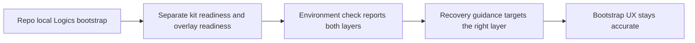

## req_077_adapt_logics_bootstrap_and_environment_checks_to_codex_workspace_overlays - Adapt Logics bootstrap and environment checks to Codex workspace overlays
> From version: 1.10.8
> Status: Done
> Understanding: 95%
> Confidence: 93%
> Complexity: Medium
> Theme: VS Code bootstrap and environment diagnostics
> Reminder: Update status/understanding/confidence and references when you edit this doc.

# Needs
- Adapt the plugin bootstrap and environment-check model so it stays accurate once Codex workspace overlays become part of the supported runtime path.
- Preserve the current repo-local `logics/skills` bootstrap responsibilities while separating them from overlay-specific Codex runtime readiness.
- Prevent the plugin from reporting "ready" based only on repository-local state when the future overlay-backed Codex runtime is still missing, stale, or broken.

# Context
The current bootstrap and diagnostics flows are intentionally repo-local:
- the plugin offers to bootstrap Logics by creating `logics/`, adding the `cdx-logics-kit` submodule under `logics/skills/`, and running the bootstrap Python script;
- the plugin can then propose a follow-up git commit for the bootstrap changes;
- `Check Environment` evaluates repository state, Git, Python, flow-manager availability, and script-backed workflow capabilities from repo-local paths.

That model remains valid for the Logics kit itself, but it becomes incomplete once Codex workspace overlays are introduced:
- a repository can be fully healthy from the plugin's current point of view while the workspace-specific `CODEX_HOME` overlay is still missing or outdated;
- users may be told that bootstrap is complete even though a future overlay-backed Codex launch would still fail;
- recovery wording can drift if repo-local repair and overlay repair are not distinguished clearly.

The plugin should therefore keep its repo-local bootstrap role while becoming explicit about the second layer:
- repo-local Logics kit readiness;
- overlay-backed Codex runtime readiness.

This request is narrower than the broader plugin-adaptation work covered by `req_076`.
Its focus is specifically:
- bootstrap prompts and completion messaging;
- environment-check reporting;
- recovery guidance when one or both layers are unhealthy.

# Acceptance criteria
- AC1: The request distinguishes between repo-local Logics kit readiness and overlay-backed Codex runtime readiness as separate states that the plugin must represent.
- AC2: The request explicitly preserves the current repo-local bootstrap responsibilities, including creating or repairing `logics/skills` and running the Logics bootstrap script where applicable.
- AC3: The request defines that `Check Environment` must be able to surface overlay state separately from repository-local kit state once overlays are supported.
- AC4: The request defines recovery guidance for at least these cases:
  - repo-local kit missing or broken;
  - overlay missing or stale while repo-local kit is healthy;
  - both layers unhealthy.
- AC5: The request leaves implementation room for the first overlay-aware bootstrap pass to either:
  - report the missing overlay follow-up explicitly;
  - or optionally offer an overlay init or sync handoff after repo-local bootstrap completes.
- AC6: The request remains backward-aware for repositories still using only the current repo-local Logics workflow before overlay support is adopted.
- AC7: The request makes clear that a successful repo-local bootstrap must not automatically imply full Codex readiness once workspace overlays are part of the supported model.

# Scope
- In:
  - Define bootstrap and environment-check expectations once overlays exist.
  - Define how plugin messaging should separate repo-local kit health from overlay runtime health.
  - Define the recovery and readiness model exposed to users.
- Out:
  - Moving all overlay management into the plugin.
  - Replacing the dedicated overlay CLI or manager with bootstrap-only logic.
  - Reworking unrelated workflow creation, promotion, or document-rendering flows.

# Dependencies and risks
- Dependency: the overlay runtime model remains defined by `req_067` and the related Codex overlay request set.
- Dependency: the broader plugin adaptation surface remains covered by `req_076`; this request focuses on bootstrap and diagnostics semantics.
- Risk: if the plugin keeps reporting only repo-local readiness, users may receive false confidence about Codex availability.
- Risk: if bootstrap tries to blend repo-local and overlay flows without a clear split, failure handling can become confusing.
- Risk: if diagnostics become overlay-aware without backward-compatible wording, repositories not yet using overlays may receive noisy or misleading status messages.

# Clarifications
- This request does not require the plugin to become the owner of overlay lifecycle management.
- A first implementation can be diagnostic-first and still satisfy the intent if bootstrap messaging and environment checks become accurate.
- The goal is to keep bootstrap and recovery semantics honest when the runtime model expands beyond the repository-local kit.

# References
- Related request(s): `logics/request/req_067_add_multi_project_codex_workspace_overlays_for_logics_skills.md`
- Related request(s): `logics/request/req_076_adapt_the_vs_code_logics_plugin_to_codex_workspace_overlays.md`
- Reference: `src/logicsViewProvider.ts`
- Reference: `src/logicsEnvironment.ts`
- Reference: `README.md`

# Definition of Ready (DoR)
- [x] Problem statement is explicit and user impact is clear.
- [x] Scope boundaries (in/out) are explicit.
- [x] Acceptance criteria are testable.
- [x] Dependencies and known risks are listed.

# Companion docs
- Product brief(s): (none yet)
- Architecture decision(s): `adr_008_keep_codex_workspace_overlays_repo_local_isolated_and_composable`
# Backlog
- `item_100_adapt_logics_bootstrap_and_environment_checks_to_codex_workspace_overlays`
