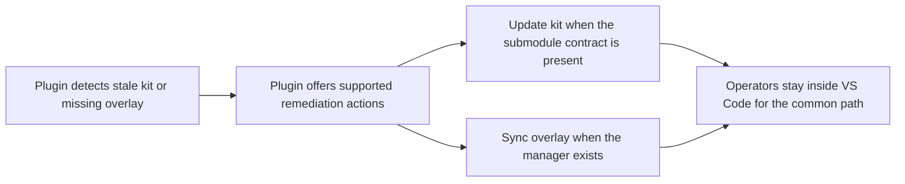

## req_078_add_plugin_actions_to_update_the_logics_kit_and_sync_codex_overlays - Add plugin actions to update the Logics kit and sync Codex overlays
> From version: 1.10.8
> Status: Done
> Understanding: 97%
> Confidence: 95%
> Complexity: Medium
> Theme: VS Code operator remediation and kit lifecycle
> Reminder: Update status/understanding/confidence and references when you edit this doc.

# Needs
- Add explicit plugin actions to remediate the most common overlay rollout gaps without forcing the operator to leave VS Code and manually reconstruct the right shell commands.
- Let the plugin help when the repository has a usable `logics/skills` installation but the kit is too old for the overlay manager, or when the kit is current but the workspace overlay still needs to be materialized.
- Keep the plugin additive and safe: it should orchestrate supported Git or Python actions against the existing kit workflows, not become a separate package manager or a second overlay implementation.

# Context
The first overlay-aware plugin pass now detects the right states, but it still stops at diagnostics and clipboard handoff:
- if the Logics kit in a project is older than the overlay manager introduction, `Check Environment` correctly reports that `logics_codex_workspace.py` is missing;
- if the kit is current but the workspace overlay is missing or stale, the plugin can copy the right `sync` or `run` command;
- `Bootstrap Logics` still focuses on repo-local kit installation or repair, not on updating an existing kit or materializing an overlay runtime after install.

That means a common operator path is still unnecessarily manual:
- open `Check Environment`;
- understand that the kit is too old or the overlay is missing;
- leave the plugin or copy commands manually;
- update the submodule or run overlay sync in the terminal;
- then re-check the environment.

The plugin should own a cleaner remediation path for the supported happy cases:
- update the existing `logics/skills` submodule when the repo uses the canonical kit-submodule model;
- offer an explicit `Sync Codex Overlay` action when the overlay manager exists;
- keep fallbacks honest when the repository is not using a supported submodule layout or when Git state makes automated updates unsafe.

The goal is not to hide every Git detail.
The goal is to close the gap between "the plugin knows what is wrong" and "the plugin can execute the standard fix path" for the supported configuration.

# Acceptance criteria
- AC1: The request defines a plugin-owned remediation path for at least these supported cases:
  - kit submodule present but older than the overlay-manager baseline;
  - overlay manager present but workspace overlay missing or stale.
- AC2: The request preserves the current architecture where the plugin consumes the Logics kit and overlay manager instead of re-implementing them internally.
- AC3: The request defines an explicit plugin action to update the Logics kit when the repository uses the canonical `logics/skills` Git submodule contract.
- AC4: The request defines an explicit plugin action to sync or repair the Codex workspace overlay when `logics_codex_workspace.py` is available in the current kit.
- AC5: The request makes clear that automated kit update behavior must remain safe around Git state, including at least:
  - missing Git on PATH;
  - dirty working tree or conflicting local changes;
  - repositories that do not use the canonical kit submodule layout.
- AC6: The request defines fallback guidance for unsupported or ambiguous cases where the plugin should surface the right manual command instead of pretending it can remediate automatically.
- AC7: The request remains backward-aware for repositories that can browse Logics docs but are not yet ready for overlay-backed Codex sessions.
- AC8: The request is implementation-ready enough that a follow-up backlog item can decide whether the first pass should include:
  - tools-menu actions;
  - diagnostic quick-pick actions;
  - or both.

# Scope
- In:
  - Define the plugin-level update path for the supported kit submodule model.
  - Define the plugin-level overlay sync or repair action once the manager script exists.
  - Define the safety and fallback rules for Git state and unsupported repository layouts.
- Out:
  - Replacing Git submodules with a plugin-managed kit installation format.
  - Re-implementing overlay materialization logic directly in TypeScript.
  - Hiding all terminal or Git details from advanced operators who still want manual control.

# Dependencies and risks
- Dependency: the canonical kit repository and submodule contract remain `https://github.com/AlexAgo83/cdx-logics-kit` under `logics/skills/`.
- Dependency: overlay lifecycle and runtime behavior remain owned by the kit-side manager introduced by the overlay portfolio.
- Dependency: the existing plugin overlay-awareness work from `req_076` and bootstrap diagnostics work from `req_077` remain the base layer for this next step.
- Risk: if the plugin auto-updates the kit without clear Git safety checks, it can create confusing repository state or trample local kit edits.
- Risk: if the plugin only supports the canonical submodule path but does not say so clearly, repositories with copied or forked kit layouts may get misleading actions.
- Risk: if overlay sync is added without version checks, the plugin can offer actions that still fail on stale kits and degrade trust in diagnostics.

# Clarifications
- This request is about plugin actions for supported remediation flows, not about turning the plugin into a package manager.
- The plugin can still expose manual commands for unsupported cases or for operators who prefer explicit shell control.
- The supported auto-update path should target the canonical `logics/skills` submodule model first; non-canonical kit layouts can remain guided-manual in the first pass.

# AC Traceability
- AC8 -> Backlog: `item_101_add_plugin_actions_to_update_the_logics_kit_and_sync_codex_overlays`. Proof: the backlog scope keeps both tools-menu and diagnostic quick-pick surfacing open for the first implementation pass.
- AC8 -> Task: `task_090_add_plugin_actions_to_update_the_logics_kit_and_sync_codex_overlays`. Proof: the execution task covers user-facing remediation surfaces plus the validation and documentation work needed to close the first pass.

# References
- Related request(s): `logics/request/req_067_add_multi_project_codex_workspace_overlays_for_logics_skills.md`
- Related request(s): `logics/request/req_076_adapt_the_vs_code_logics_plugin_to_codex_workspace_overlays.md`
- Related request(s): `logics/request/req_077_adapt_logics_bootstrap_and_environment_checks_to_codex_workspace_overlays.md`
- Reference: `src/logicsViewProvider.ts`
- Reference: `src/logicsViewDocumentController.ts`
- Reference: `src/logicsEnvironment.ts`
- Reference: `src/logicsProviderUtils.ts`
- Reference: `README.md`

# Definition of Ready (DoR)
- [x] Problem statement is explicit and user impact is clear.
- [x] Scope boundaries (in/out) are explicit.
- [x] Acceptance criteria are testable.
- [x] Dependencies and known risks are listed.

# Companion docs
- Product brief(s): (none yet)
- Architecture decision(s): `adr_008_keep_codex_workspace_overlays_repo_local_isolated_and_composable`

# Backlog
- `item_101_add_plugin_actions_to_update_the_logics_kit_and_sync_codex_overlays`
