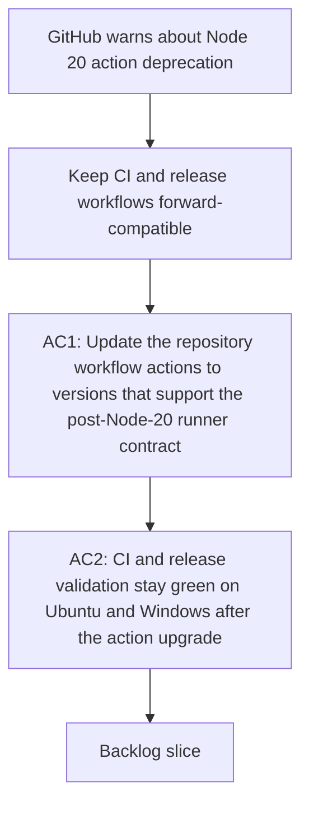

## req_079_migrate_github_actions_off_node_20_before_runner_deprecation - Migrate GitHub Actions off Node 20 before runner deprecation
> From version: 1.11.1
> Status: Draft
> Understanding: 96%
> Confidence: 95%
> Complexity: Medium
> Theme: CI and release maintenance
> Reminder: Update status/understanding/confidence and references when you edit this doc.

# Needs
- Remove the current GitHub Actions dependency on Node 20 based JavaScript actions before runner defaults switch to Node 24.
- Keep CI and release workflows green on Ubuntu and Windows while upgrading the workflow action stack.

# Context
- Recent GitHub Actions runs now emit a platform warning that `actions/checkout@v4`, `actions/setup-node@v4`, and `actions/setup-python@v5` still run on Node 20.
- GitHub indicates those actions will be forced onto Node 24 by default starting on June 2, 2026.
- The current repository is functionally green again after the Windows overlay cleanup fix, so this request is about forward-compatibility and release safety rather than an active production outage.
- The workflow surface that needs review spans at least [ci.yml](/Users/alexandreagostini/Documents/cdx-logics-vscode/.github/workflows/ci.yml) and [release.yml](/Users/alexandreagostini/Documents/cdx-logics-vscode/.github/workflows/release.yml).

# Acceptance criteria
- AC1: `ci.yml`, `release.yml`, and any other repository workflow files that currently rely on Node 20 based GitHub-hosted JavaScript actions are updated to maintained versions that are compatible with the post-Node-20 runner contract.
- AC2: Repository validation confirms that CI and release workflows still pass on Ubuntu and Windows after the action upgrade, without regressing the existing Logics kit, VSIX packaging, or release-changelog gates.
- AC3: Workflow documentation or maintainer guidance is updated if the migration changes version expectations, action pinning, or release maintenance steps.

# Definition of Ready (DoR)
- [x] Problem statement is explicit and user impact is clear.
- [x] Scope boundaries (in/out) are explicit.
- [x] Acceptance criteria are testable.
- [x] Dependencies and known risks are listed.

# Companion docs
- Product brief(s): (none yet)
- Architecture decision(s): `adr_010_pin_github_actions_to_a_node_24_compatible_baseline`

# Backlog
- `item_102_migrate_github_actions_off_node_20_before_runner_deprecation`
