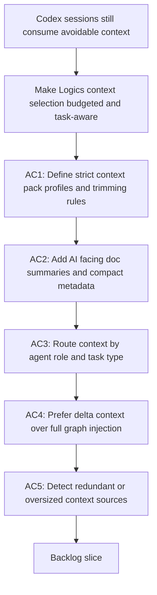

## req_080_reduce_codex_token_consumption_with_budgeted_context_packs_and_agent_aware_prompt_shaping - Reduce Codex token consumption with budgeted context packs and agent-aware prompt shaping
> From version: 1.11.1
> Status: Draft
> Understanding: 97%
> Confidence: 96%
> Complexity: High
> Theme: AI workflow and token efficiency
> Reminder: Update status/understanding/confidence and references when you edit this doc.

# Needs
- Reduce unnecessary Codex token consumption caused by broad prompt injection, redundant Logics context, and agent handoffs that do not enforce a strict context budget.
- Turn the existing Logics memory model into a deliberately budgeted context system that loads only the smallest useful subset of repo knowledge for the active task.

# Context
- The repository already treats `logics/*` as persistent AI project memory and explicitly positions the Logics kit as a way to reduce repeated prompt re-explanation.
- The plugin already supports a `Context pack for Codex`, guided agent handoff, and per-repository Codex workspace overlays, but the current contract still focuses more on gathering relevant context than on enforcing aggressive size limits.
- Current surfaces such as [`logics/instructions.md`](/Users/alexandreagostini/Documents/cdx-logics-vscode/logics/instructions.md), [`README.md`](/Users/alexandreagostini/Documents/cdx-logics-vscode/README.md), [`src/agentRegistry.ts`](/Users/alexandreagostini/Documents/cdx-logics-vscode/src/agentRegistry.ts), and [`src/logicsCodexWorkspace.ts`](/Users/alexandreagostini/Documents/cdx-logics-vscode/src/logicsCodexWorkspace.ts) show that the kit already has the right primitives: structured workflow docs, agent manifests, overlays, and Codex handoff commands.
- The missing capability is a `Context Pack v2` style contract that defines strict token-aware budgets, prefers compact document summaries over raw document bodies, routes context differently by agent type, and favors delta-based context over full-history context.
- This request is intentionally broader than a single plugin tweak. It should cover the Logics kit, its generated docs, and the plugin-facing handoff rules so token reduction becomes a first-class workflow outcome instead of a side effect.

# Acceptance criteria
- AC1: The Logics kit defines a token-efficiency contract for Codex context packs with explicit size-limited profiles such as `tiny`, `normal`, and `deep`, including deterministic inclusion and trimming rules.
- AC2: Managed Logics docs can expose compact AI-facing summaries or equivalent structured metadata so Codex handoff flows can inject high-signal summaries before falling back to larger document bodies.
- AC3: Agent-facing manifests or handoff rules can declare which Logics doc families they should load by default, which ones they should avoid, and which context profile they should prefer for common tasks.
- AC4: The Codex context-pack workflow can build a delta-oriented pack from the selected item, its direct dependencies, and recent repository or workflow changes, instead of defaulting to the full related-document graph.
- AC5: The kit or plugin can detect and report token-wasting context patterns such as duplicated prose, oversized stale docs, or obsolete linked context, with operator guidance on how to keep the Logics corpus lean.
- AC6: README or operator guidance explains how these token-efficiency controls should be used so the reduced-token behavior becomes part of the standard Logics workflow instead of hidden internal logic.

# AC Traceability
- AC1 -> Backlog: `item_103_define_budgeted_context_pack_profiles_and_deterministic_trimming_for_codex`. Proof: the backlog scope defines explicit profiles, deterministic ordering, and trimming rules.
- AC1 -> Task: `task_092_orchestration_delivery_for_req_080_token_efficient_codex_context_shaping`. Proof: Wave 1 starts with the shared context-budget and trimming contract before downstream slices.
- AC2 -> Backlog: `item_104_add_ai_facing_summaries_and_compact_metadata_to_managed_logics_docs`. Proof: the backlog item scopes compact AI-facing summaries and summary-first context assembly.
- AC2 -> Task: `task_092_orchestration_delivery_for_req_080_token_efficient_codex_context_shaping`. Proof: Wave 1 includes the summary-first document building blocks required for smaller context packs.
- AC3 -> Backlog: `item_105_make_agent_manifests_declare_context_budgets_and_allowed_doc_families`. Proof: the backlog item scopes manifest-level routing and preferred context-profile declarations.
- AC3 -> Task: `task_092_orchestration_delivery_for_req_080_token_efficient_codex_context_shaping`. Proof: Wave 2 routes the shared budget contract through agent manifests and handoff behavior.
- AC4 -> Backlog: `item_106_build_delta_oriented_codex_context_packs_from_direct_dependencies_and_recent_changes`. Proof: the backlog item scopes delta-based context selection from direct dependencies and recent changes.
- AC4 -> Task: `task_092_orchestration_delivery_for_req_080_token_efficient_codex_context_shaping`. Proof: Wave 2 includes the delta-pack behavior alongside agent-aware routing.
- AC5 -> Backlog: `item_107_detect_redundant_or_oversized_logics_context_and_guide_token_hygiene`. Proof: the backlog item scopes token-hygiene detection and remediation guidance for redundant or oversized context.
- AC5 -> Task: `task_092_orchestration_delivery_for_req_080_token_efficient_codex_context_shaping`. Proof: Wave 3 closes the portfolio with hygiene detection and final alignment.
- AC6 -> Backlog: `item_103_define_budgeted_context_pack_profiles_and_deterministic_trimming_for_codex`, `item_104_add_ai_facing_summaries_and_compact_metadata_to_managed_logics_docs`, `item_105_make_agent_manifests_declare_context_budgets_and_allowed_doc_families`, `item_106_build_delta_oriented_codex_context_packs_from_direct_dependencies_and_recent_changes`, `item_107_detect_redundant_or_oversized_logics_context_and_guide_token_hygiene`. Proof: each split item carries operator-facing guidance or documentation work for its slice.
- AC6 -> Task: `task_092_orchestration_delivery_for_req_080_token_efficient_codex_context_shaping`. Proof: the orchestration plan explicitly includes documentation, operator-facing surfaces, and final portfolio alignment.

# Definition of Ready (DoR)
- [x] Problem statement is explicit and user impact is clear.
- [x] Scope boundaries (in/out) are explicit.
- [x] Acceptance criteria are testable.
- [x] Dependencies and known risks are listed.

# Companion docs
- Product brief(s): (none yet)
- Architecture decision(s): (none yet)

# References
- `README.md`
- `logics/instructions.md`
- `src/agentRegistry.ts`
- `src/logicsCodexWorkspace.ts`

# Backlog
- `item_103_define_budgeted_context_pack_profiles_and_deterministic_trimming_for_codex`
- `item_104_add_ai_facing_summaries_and_compact_metadata_to_managed_logics_docs`
- `item_105_make_agent_manifests_declare_context_budgets_and_allowed_doc_families`
- `item_106_build_delta_oriented_codex_context_packs_from_direct_dependencies_and_recent_changes`
- `item_107_detect_redundant_or_oversized_logics_context_and_guide_token_hygiene`
