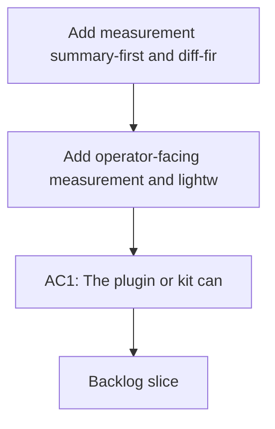

## req_081_add_measurement_summary_first_and_diff_first_controls_to_reduce_codex_token_consumption - Add measurement, summary-first, and diff-first controls to reduce Codex token consumption
> From version: 1.11.1
> Status: Done
> Understanding: 97%
> Confidence: 96%
> Complexity: Medium
> Theme: AI workflow observability and prompt efficiency
> Reminder: Update status/understanding/confidence and references when you edit this doc.

# Needs
- Add operator-facing measurement and lightweight-default handoff controls so Codex sessions start from the smallest useful context instead of from broad packs or long-running chat history.
- Complement the `Context Pack v2` and routing work tracked in `req_080` with additional safeguards that make token cost visible, encourage summary-first and diff-first flows, and reduce silent context accumulation over time.

# Context
- The current token-efficiency portfolio in `req_080` focuses on the structure of context packs themselves: budgets, summaries, agent routing, delta selection, and token-hygiene checks.
- There is still a separate class of waste that comes from how operators launch Codex sessions and how the plugin frames the handoff moment:
  - users cannot see the estimated size of a context pack before injection;
  - implementation or review tasks often need diffs and touched files more than large prose context;
  - a summary-only first pass is not yet the default posture for many flows;
  - stale or completed context can continue to appear in packs long after it stops being useful;
  - session history can grow across unrelated tasks because the workflow does not yet steer users toward starting fresh chats when the topic changes.
- These controls should be treated as a second token-efficiency portfolio adjacent to, but separate from, `req_080`.
- The goal is not only to shrink what the system can send, but to steer operators and handoff surfaces toward sending less by default.

# Acceptance criteria
- AC1: The plugin or kit can show a lightweight size estimate before injecting or launching a Codex context pack, using at least deterministic counts such as selected docs, lines, characters, or estimated tokens.
- AC2: At least one supported Codex handoff flow can start in a `summary-only` or equivalent ultra-compact mode before escalating to larger context.
- AC3: Implementation and review-oriented flows can prefer a `diff-first` context mode built from changed files, touched paths, or recent diffs before falling back to broader narrative context.
- AC4: The token-efficiency workflow defines how stale, completed, or no-longer-linked context is excluded or deprioritized by default so old context stops inflating new sessions silently.
- AC5: Operator guidance or workflow behavior can encourage opening a fresh Codex session when the active topic, root, or delivery slice changes materially.
- AC6: Task-type guidance or equivalent routing rules explain that different task classes such as review, bugfix, implementation, or spec authoring should not consume the same default context budget.
- AC7: Agent or handoff prompts can favor concise response contracts by default so output verbosity does not recreate token waste that smaller input packs just removed.

# Scope
- In:
  - Measurement before injection or launch.
  - `summary-only` first-pass behavior.
  - `diff-first` handoff behavior for code-centric work.
  - Default exclusion or deprioritization of stale, completed, or weakly linked context.
  - Session-hygiene guidance when the active topic changes.
  - Task-type guidance and concise response defaults that keep both input and output small.
- Out:
  - Replacing the context-pack contract work from `req_080`; this request complements it.
  - Full redesign of the Logics workflow model.
  - Generic chat-product features unrelated to Logics or Codex handoff.

# Dependencies and risks
- Dependency: `req_080_reduce_codex_token_consumption_with_budgeted_context_packs_and_agent_aware_prompt_shaping` remains the base portfolio for pack structure, summaries, routing, delta logic, and token-hygiene contracts.
- Dependency: plugin and kit handoff surfaces remain the primary place where operators inspect or launch Codex context.
- Risk: token estimates can create false precision if they are presented as exact rather than directional.
- Risk: `summary-only` or `diff-first` defaults can under-contextualize some tasks if escalation paths are not obvious and fast.
- Risk: aggressive aging-out of completed context can hide important historical decisions if the default exclusion rules are not transparent.
- Risk: session-hygiene nudges can feel noisy if they trigger too often or on weak signals.

# AC Traceability
- AC1 -> Backlog: `item_108_add_pre_injection_context_size_estimation_and_budget_visibility_for_codex_handoffs`. Proof: the backlog item scopes pre-injection measurement, estimate interpretation, and operator-facing visibility.
- AC1 -> Task: `task_093_orchestration_delivery_for_req_081_observable_and_lightweight_codex_handoffs`. Proof: Wave 1 establishes the observable measurement contract before the rest of the lightweight-default portfolio.
- AC2 -> Backlog: `item_109_add_a_summary_only_first_pass_mode_for_codex_context_injection`. Proof: the backlog item scopes the summary-only payload, default usage, and escalation path.
- AC2 -> Task: `task_093_orchestration_delivery_for_req_081_observable_and_lightweight_codex_handoffs`. Proof: Wave 1 pairs summary-only behavior with the new measurement surface.
- AC3 -> Backlog: `item_110_add_diff_first_codex_context_flows_for_implementation_and_review_work`. Proof: the backlog item scopes diff-first seeding, fallback behavior, and operator guidance for code work.
- AC3 -> Task: `task_093_orchestration_delivery_for_req_081_observable_and_lightweight_codex_handoffs`. Proof: Wave 2 adds diff-first code-centric handoffs after the initial lightweight foundation is in place.
- AC4 -> Backlog: `item_111_exclude_or_deprioritize_stale_completed_and_weakly_linked_context_by_default`. Proof: the backlog item scopes stale-context default exclusion, signals, and override behavior.
- AC4 -> Task: `task_093_orchestration_delivery_for_req_081_observable_and_lightweight_codex_handoffs`. Proof: Wave 2 adds the stale-context defaults alongside diff-first behavior.
- AC5 -> Backlog: `item_112_add_session_hygiene_guidance_when_topic_or_root_changes_materially`. Proof: the backlog item scopes the triggers, surfacing, and override path for fresh-session guidance.
- AC5 -> Task: `task_093_orchestration_delivery_for_req_081_observable_and_lightweight_codex_handoffs`. Proof: Wave 3 closes the portfolio with operator session-hygiene guidance.
- AC6 -> Backlog: `item_113_define_task_type_default_budgets_and_concise_response_contracts_for_codex_handoffs`. Proof: the backlog item scopes task-type-specific default budgets and override behavior.
- AC6 -> Task: `task_093_orchestration_delivery_for_req_081_observable_and_lightweight_codex_handoffs`. Proof: Wave 3 defines task-aware defaults after the measurement and lightweight modes are in place.
- AC7 -> Backlog: `item_113_define_task_type_default_budgets_and_concise_response_contracts_for_codex_handoffs`. Proof: the backlog item also scopes concise response contracts so smaller inputs are not offset by verbose outputs.
- AC7 -> Task: `task_093_orchestration_delivery_for_req_081_observable_and_lightweight_codex_handoffs`. Proof: Wave 3 closes with concise response defaults as part of the task-type policy slice.

# Definition of Ready (DoR)
- [x] Problem statement is explicit and user impact is clear.
- [x] Scope boundaries (in/out) are explicit.
- [x] Acceptance criteria are testable.
- [x] Dependencies and known risks are listed.

# Companion docs
- Product brief(s): (none yet)
- Architecture decision(s): (none yet)

# References
- `README.md`
- `logics/instructions.md`
- `src/agentRegistry.ts`
- `src/logicsCodexWorkspace.ts`
- `src/logicsViewProvider.ts`
- `logics/request/req_080_reduce_codex_token_consumption_with_budgeted_context_packs_and_agent_aware_prompt_shaping.md`

# Backlog
- `item_108_add_pre_injection_context_size_estimation_and_budget_visibility_for_codex_handoffs`
- `item_109_add_a_summary_only_first_pass_mode_for_codex_context_injection`
- `item_110_add_diff_first_codex_context_flows_for_implementation_and_review_work`
- `item_111_exclude_or_deprioritize_stale_completed_and_weakly_linked_context_by_default`
- `item_112_add_session_hygiene_guidance_when_topic_or_root_changes_materially`
- `item_113_define_task_type_default_budgets_and_concise_response_contracts_for_codex_handoffs`
