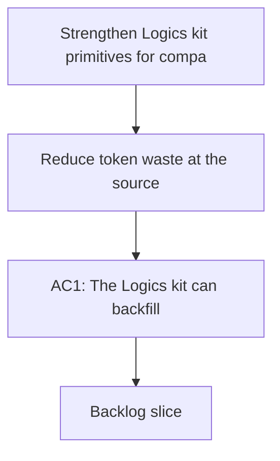

## req_082_strengthen_logics_kit_primitives_for_compact_ai_context_and_reusable_handoff_generation - Strengthen Logics kit primitives for compact AI context and reusable handoff generation
> From version: 1.11.1
> Status: Done
> Understanding: 97%
> Confidence: 95%
> Complexity: High
> Theme: AI workflow and kit maintenance
> Reminder: Update status/understanding/confidence and references when you edit this doc.

# Needs
- Reduce token waste at the source by making the Logics kit itself produce compact, reusable AI-facing context instead of relying mainly on plugin-side filtering.
- Turn the recent token-efficiency work into kit-native primitives: older docs should be backfillable, connectors should reuse shared compact-context builders, and the kit should be able to emit stable handoff artifacts directly.

# Context
- `req_080` and `req_081` improved the plugin-facing handoff flow with context budgets, summary-only and diff-first modes, stale-context filtering, and session-hygiene signals.
- The kit now generates a compact `# AI Context` section for new or promoted request/backlog/task docs, and `workflow_audit.py` can optionally check token hygiene.
- The remaining gap is structural:
  - older workflow docs do not yet get `# AI Context` backfilled automatically;
  - several connector scripts still duplicate template-field assembly instead of sharing a kit-level helper;
  - the plugin still reconstructs most handoff assembly instead of consuming a kit-native `context-pack` artifact;
  - the corpus still lacks a compaction flow for stale or verbose done docs;
  - generated assets outside the main workflow templates, such as the React Render bootstrapper CI template, can still lag behind the repository’s current GitHub Actions baseline;
  - skills do not yet expose consistent capability metadata about what they read, write, and how much context they should consume.
- This request focuses on the Logics kit itself: flow-manager primitives, shared helpers, generated assets, and maintenance commands. It is not a redesign of the VS Code plugin UI.

# Acceptance criteria
- AC1: The Logics kit can backfill, repair, or refresh `# AI Context` sections for existing managed workflow docs so compact handoff metadata is not limited to newly generated files.
- AC2: Connector or importer scripts that generate Logics workflow docs can rely on shared flow-manager helpers for compact AI context fields and template-value assembly instead of duplicating that logic per connector.
- AC3: The kit can generate a reusable `context-pack` or equivalent serialized compact handoff artifact for a selected request/backlog/task using modes such as `summary-only`, `diff-first`, or profile-driven output, so plugin or agent surfaces can consume a kit-native primitive.
- AC4: The kit provides at least one maintenance flow for compacting or flagging stale, redundant, or oversized workflow docs, with token-hygiene guidance that operators can run outside the plugin.
- AC5: Generated assets and skill-level metadata are audited or normalized so outdated workflow templates and missing capability descriptors do not silently reintroduce token-heavy or stale behavior.

# Scope
- In:
  - Backfill or refresh of `# AI Context` for existing request/backlog/task docs.
  - Shared helper APIs for connector-generated workflow docs.
  - Kit-native generation of reusable compact handoff artifacts.
  - Corpus compaction or maintenance flows for verbose or stale workflow docs.
  - Audit or normalization of generated assets and skill capability metadata where they affect compact AI handoff quality.
- Out:
  - Full redesign of the VS Code plugin UI.
  - Replacing the existing plugin-side `Context pack for Codex` immediately.
  - Rewriting every skill in the kit in one pass; this request should define reusable primitives and targeted first adopters.

# Dependencies and risks
- Dependency: the `# AI Context` structure and token-hygiene checks recently added in the flow manager remain the base contract for compact doc metadata.
- Dependency: existing token-efficiency behavior from `req_080` and `req_081` remains the reference for supported handoff modes and profile vocabulary.
- Risk: aggressive backfill or compaction commands can create noisy diffs across large corpora if they are not deterministic and scoped.
- Risk: a kit-native `context-pack` artifact can diverge from the plugin implementation if the contract is not centralized and tested.
- Risk: over-standardizing connector outputs can erase useful source-specific context if helper APIs become too rigid.

# AC Traceability
- AC1 -> Flow manager. Proof: introduce a sync or maintenance command that can backfill or refresh `# AI Context` sections for existing workflow docs.
- AC2 -> Connectors. Proof: move duplicated template-field assembly into shared flow-manager helpers and adopt them in at least the current connector set that writes request/backlog docs.
- AC3 -> Handoff generation. Proof: expose a kit-native `context-pack` command or equivalent artifact builder with explicit mode or profile inputs.
- AC4 -> Maintenance. Proof: add a compaction or token-hygiene maintenance flow that can be run from the kit without going through the plugin.
- AC5 -> Assets and skill metadata. Proof: audit or normalize generated CI/templates and add skill-level capability metadata where it improves handoff routing and context budgeting.

# Definition of Ready (DoR)
- [x] Problem statement is explicit and user impact is clear.
- [x] Scope boundaries (in/out) are explicit.
- [x] Acceptance criteria are testable.
- [x] Dependencies and known risks are listed.

# Companion docs
- Product brief(s): (none yet)
- Architecture decision(s): (none yet)

# AI Context
- Summary: Extend the Logics kit with backfillable AI Context, shared connector helpers, kit-native handoff artifacts, and corpus compaction flows.
- Keywords: logics, kit, ai-context, handoff, compaction, connectors, context-pack
- Use when: Use when defining the next kit-side wave of token-efficiency work after the plugin-side context-pack improvements.
- Skip when: Skip when the work targets another feature, repository, or workflow stage.

# References
- `logics/request/req_080_reduce_codex_token_consumption_with_budgeted_context_packs_and_agent_aware_prompt_shaping.md`
- `logics/request/req_081_add_measurement_summary_first_and_diff_first_controls_to_reduce_codex_token_consumption.md`
- `logics/skills/logics-flow-manager/scripts/logics_flow.py`
- `logics/skills/logics-flow-manager/scripts/logics_flow_support.py`
- `logics/skills/logics-flow-manager/scripts/workflow_audit.py`
- `logics/skills/logics-connector-confluence/scripts/confluence_to_request.py`
- `logics/skills/logics-connector-jira/scripts/jira_to_backlog.py`
- `logics/skills/logics-connector-linear/scripts/linear_to_backlog.py`
- `logics/skills/logics-connector-figma/scripts/figma_to_backlog.py`
- `logics/skills/logics-connector-render/scripts/render_to_backlog.py`
- `logics/skills/logics-react-render-pwa-bootstrapper/scripts/bootstrap_react_render_base_assets.py`

# Backlog
- `item_114_backfill_and_refresh_ai_context_for_existing_workflow_docs`
- `item_115_extract_shared_connector_helpers_for_compact_ai_context_and_template_assembly`
- `item_117_generate_kit_native_compact_context_pack_artifacts_from_workflow_docs`
- `item_119_add_corpus_compaction_and_token_hygiene_maintenance_flows_for_workflow_docs`
- `item_121_audit_generated_assets_and_add_skill_capability_metadata_for_compact_ai_handoffs`
