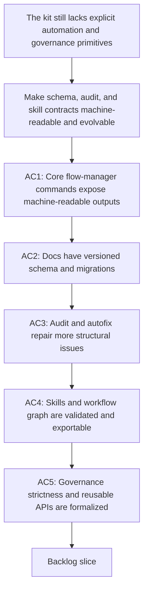

## req_083_add_internal_logics_kit_governance_migration_and_machine_readable_tooling_primitives - Add internal Logics kit governance, migration, and machine-readable tooling primitives
> From version: 1.11.1
> Status: Done
> Understanding: 97%
> Confidence: 95%
> Complexity: High
> Theme: Kit governance and automation
> Reminder: Update status/understanding/confidence and references when you edit this doc.

# Needs
- Give the Logics kit stronger internal automation contracts so maintainers and downstream tooling can evolve docs, skills, and workflow state predictably without relying on fragile text parsing.
- Add machine-readable outputs, schema and migration primitives, stronger governance modes, and skill-level validation so the kit is easier to automate, upgrade, and audit over time.

# Context
- The recent token-efficiency work improved compact handoff behavior and added kit-side `# AI Context` and token-hygiene checks, but several foundational kit concerns remain outside that scope.
- The current flow manager is still mostly optimized for human-readable terminal output and heuristic evolution:
  - commands such as `new`, `promote`, `finish`, and `sync` do not yet expose a stable JSON contract for downstream tooling;
  - doc evolution relies more on linting and opportunistic sync behavior than on explicit schema versions and named migrations;
  - `workflow_audit.py` catches many issues but still has limited autofix depth for structural repair;
  - there is no first-class exported graph representation of the workflow network for secondary tools;
  - skill packages themselves do not yet have a strong validation contract across `SKILL.md`, `agents/openai.yaml`, scripts, assets, and tests;
  - governance strictness is mostly implicit rather than configurable by repo policy;
  - section rendering and workflow-doc assembly are still concentrated in a large support module rather than a deliberately reusable API surface;
  - the kit lacks a consolidated generated index of its own skills, templates, scripts, and dependencies.
- This request is intentionally internal to the kit. It does not cover plugin UX, compact AI context backfill, connector helper factorization, or kit-native handoff artifacts already targeted by `req_082`.

# Acceptance criteria
- AC1: Core flow-manager commands such as `new`, `promote`, `close`, `finish`, or `sync` can expose machine-readable outputs, for example JSON, so downstream tools can consume stable results without scraping terminal prose.
- AC2: Managed workflow docs have an explicit schema-versioning and migration story, including a way to detect older schemas and run named migrations rather than relying only on implicit template drift.
- AC3: The workflow audit and related repair tooling can autofix or guide more structural issues than today, such as missing sections, stale placeholders, inconsistent indicators, or malformed references, while remaining deterministic.
- AC4: The kit can export a reusable machine-readable representation of workflow relationships or graph structure, and skills themselves can be validated against a structured contract that covers metadata, agent config, assets, and scripts.
- AC5: The kit defines stronger internal governance primitives such as configurable strictness modes, a more reusable section-rendering or document-assembly API, and a consolidated generated index of kit capabilities.

# Scope
- In:
  - JSON or equivalent machine-readable output contracts for flow-manager commands.
  - Schema versioning and named migration primitives for managed workflow docs.
  - Stronger autofix or repair coverage in workflow audit and adjacent tooling.
  - Machine-readable workflow graph export.
  - Structured validation for kit skills and their metadata.
  - Configurable strict-governance modes.
  - Reusable API extraction for workflow-doc rendering and assembly.
  - Generated index or catalog of kit capabilities, scripts, templates, and dependencies.
- Out:
  - Plugin UI redesign or VS Code webview changes.
  - Compact AI context backfill, connector helper factorization, or kit-native context-pack generation already targeted by `req_082`.
  - Replacing all existing human-readable CLI output; machine-readable output should complement it.

# Dependencies and risks
- Dependency: existing flow-manager, linter, and workflow-audit commands remain the foundation for any new machine-readable or migration-aware interfaces.
- Dependency: `req_082_strengthen_logics_kit_primitives_for_compact_ai_context_and_reusable_handoff_generation` remains the separate track for compact handoff primitives and corpus-side token work.
- Risk: schema and migration primitives can create maintenance overhead if they are too ambitious relative to actual template churn.
- Risk: strict-governance modes can become noisy or block useful work if they are not configurable and staged.
- Risk: broad skill validation can create false negatives for lightweight or experimental skills unless the minimum contract is carefully designed.
- Risk: exposing JSON contracts too early can freeze unstable semantics if the output shape is not versioned.

# AC Traceability
- AC1 -> Flow manager output contract. Proof: add machine-readable result modes to core commands and document the output schema.
- AC2 -> Schema and migrations. Proof: introduce schema metadata and at least one explicit migration path or migration runner.
- AC3 -> Structural repair. Proof: extend audit or fixer coverage to deterministic structural autofix classes beyond current AC traceability repair.
- AC4 -> Graph and skill validation. Proof: provide a graph export mode and a structured validator for skills or skill manifests.
- AC5 -> Governance and API surface. Proof: define strictness profiles, extract reusable rendering helpers, and generate an index or catalog of kit capabilities.

# Definition of Ready (DoR)
- [x] Problem statement is explicit and user impact is clear.
- [x] Scope boundaries (in/out) are explicit.
- [x] Acceptance criteria are testable.
- [x] Dependencies and known risks are listed.

# Companion docs
- Product brief(s): (none yet)
- Architecture decision(s): (none yet)

# AI Context
- Summary: Add machine-readable outputs, schema migrations, stronger audit autofix, skill validation, and governance primitives to the Logics kit.
- Keywords: logics, kit, governance, migration, json, schema, audit, skills
- Use when: Use when planning the next kit-internal automation and governance wave that is separate from compact context-pack work.
- Skip when: Skip when the work targets another feature, repository, or workflow stage.

# References
- `logics/request/req_082_strengthen_logics_kit_primitives_for_compact_ai_context_and_reusable_handoff_generation.md`
- `logics/skills/logics-flow-manager/scripts/logics_flow.py`
- `logics/skills/logics-flow-manager/scripts/logics_flow_support.py`
- `logics/skills/logics-flow-manager/scripts/workflow_audit.py`
- `logics/skills/logics-doc-linter/scripts/logics_lint.py`
- `logics/skills/tests/test_logics_flow.py`
- `logics/skills/tests/test_workflow_audit.py`
- `logics/skills/CONTRIBUTING.md`

# Backlog
- `item_116_extend_workflow_audit_and_repair_tooling_for_structural_autofix_coverage`
- `item_118_export_workflow_graphs_and_validate_structured_skill_package_contracts`
- `item_120_define_strict_governance_profiles_and_extract_reusable_kit_document_assembly_apis`
- `item_122_add_machine_readable_json_outputs_for_core_flow_manager_commands`
- `item_123_introduce_workflow_doc_schema_versioning_and_named_migration_commands`
