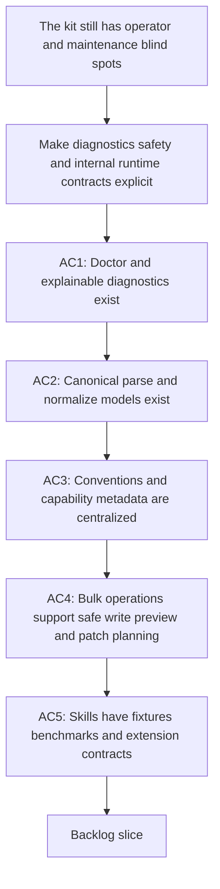

## req_084_improve_logics_kit_diagnostics_safety_and_internal_runtime_contracts - Improve Logics kit diagnostics safety and internal runtime contracts
> From version: 1.11.1
> Status: Draft
> Understanding: 97%
> Confidence: 95%
> Complexity: High
> Theme: Kit runtime and operator tooling
> Reminder: Update status/understanding/confidence and references when you edit this doc.

# Needs
- Make the Logics kit easier to operate, debug, and extend without relying on scattered heuristics or risky bulk writes.
- Add kit-native diagnostics, safe execution controls, canonical internal models, and regression surfaces so maintainers can evolve the kit with less ambiguity and less accidental breakage.

# Context
- `req_082` and `req_083` already cover compact AI context primitives, governance, migrations, machine-readable command outputs, and broader internal automation contracts.
- Several kit-only concerns still remain outside those scopes:
  - there is no single `doctor`-style command that explains environment failures, missing prerequisites, broken workflow state, or likely remediation steps;
  - parsing and normalization logic is still spread across scripts rather than expressed as a stable read-side model for workflow docs and skill metadata;
  - conventions, feature support, and release metadata are not yet centralized as a machine-readable registry that other kit tools can reuse;
  - bulk operations still lean mostly on direct writes or ad hoc dry-runs rather than an explicit safe-write preview or patch-plan contract;
  - the kit lacks a standard set of fixtures, extension expectations, and lightweight performance baselines for skill packages.
- This request stays purely kit-side. It does not target plugin UX, handoff shaping, or flows already captured by `req_082` and `req_083`.

# Acceptance criteria
- AC1: The kit provides a `doctor` or equivalent diagnostics surface that can explain missing prerequisites, broken workflow conditions, or unsupported runtime situations with concrete remediation guidance instead of opaque failures.
- AC2: Workflow docs and skill metadata can be parsed and normalized through canonical internal models so downstream kit code reuses the same read-side contract rather than duplicating ad hoc parsing logic.
- AC3: The kit exposes centralized machine-readable conventions, capability metadata, and release or feature-evolution metadata so scripts and future skills can discover supported behavior explicitly.
- AC4: Bulk or multi-file kit operations can expose a safe-write mode with preview, patch planning, or equivalent reviewable output before mutating many files.
- AC5: Skills can ship reusable fixtures, extension expectations, and lightweight performance or regression baselines so maintainers can validate both correctness and maintainability of kit evolution.

# Scope
- In:
  - A `doctor` command or equivalent operator diagnostics entrypoint.
  - Explainable diagnostics output for failed or degraded kit states.
  - Canonical parse and normalize models for workflow docs and skill metadata.
  - Centralized conventions and capability registries plus machine-readable release metadata.
  - Safe-write preview or patch-plan support for bulk operations.
  - Fixtures, extension contracts, and lightweight benchmarks for skill regression coverage.
- Out:
  - VS Code plugin UX or webview work.
  - Machine-readable JSON command outputs, schema migrations, or governance primitives already scoped by `req_083`.
  - Compact AI context backfill or context-pack generation already scoped by `req_082`.

# Dependencies and risks
- Dependency: `logics_flow.py`, `logics_flow_support.py`, `workflow_audit.py`, and the current skill package layout remain the execution backbone for any new diagnostics or safe-write primitives.
- Dependency: `req_083_add_internal_logics_kit_governance_migration_and_machine_readable_tooling_primitives` should remain the home for command-output contracts and schema-migration policy; this request builds on top of those contracts rather than replacing them.
- Risk: a `doctor` command can become noisy if it tries to diagnose every edge case instead of focusing on common operator failures and actionable remediation.
- Risk: safe-write previews can add maintenance cost if they are not aligned with canonical parse or normalize models.
- Risk: benchmarks can become flaky or ignored if they are too broad instead of lightweight and deterministic.

# AC Traceability
- AC1 -> `item_124_add_a_logics_kit_doctor_command_and_explainable_diagnostics`. Proof: add a kit diagnostics entrypoint and document how it reports failures and remediation.
- AC2 -> `item_125_add_canonical_parse_and_normalize_models_for_workflow_docs_and_skill_metadata`. Proof: introduce shared read-side models used by at least two kit surfaces.
- AC3 -> `item_126_centralize_logics_kit_conventions_capability_registry_and_machine_readable_release_metadata`. Proof: generate or maintain machine-readable conventions, capability metadata, and release-evolution data.
- AC4 -> `item_127_add_safe_write_preview_and_patch_planning_for_bulk_logics_kit_operations`. Proof: expose preview, patch planning, or equivalent inspection support for bulk write operations.
- AC5 -> `item_128_add_skill_fixtures_benchmarks_and_extension_contracts_for_kit_regression_coverage`. Proof: add reusable skill fixtures, extension expectations, and lightweight performance or regression coverage.

# Definition of Ready (DoR)
- [x] Problem statement is explicit and user impact is clear.
- [x] Scope boundaries (in/out) are explicit.
- [x] Acceptance criteria are testable.
- [x] Dependencies and known risks are listed.

# Companion docs
- Product brief(s): (none yet)
- Architecture decision(s): (none yet)

# AI Context
- Summary: Add kit-only diagnostics, safe-write controls, canonical internal models, registries, and regression surfaces that make the Logics kit easier to operate and evolve safely.
- Keywords: logics, kit, doctor, diagnostics, safe-write, parse, normalize, registry, benchmark
- Use when: Use when planning kit-internal operator tooling, safety controls, and runtime contracts that are outside the compact-context and governance requests.
- Skip when: Skip when the work targets another feature, repository, or workflow stage.

# References
- `logics/request/req_082_strengthen_logics_kit_primitives_for_compact_ai_context_and_reusable_handoff_generation.md`
- `logics/request/req_083_add_internal_logics_kit_governance_migration_and_machine_readable_tooling_primitives.md`
- `logics/skills/logics-flow-manager/scripts/logics_flow.py`
- `logics/skills/logics-flow-manager/scripts/logics_flow_support.py`
- `logics/skills/logics-flow-manager/scripts/workflow_audit.py`
- `logics/skills/tests/test_logics_flow.py`
- `logics/skills/tests/test_workflow_audit.py`
- `logics/skills/CONTRIBUTING.md`

# Backlog
- `item_124_add_a_logics_kit_doctor_command_and_explainable_diagnostics`
- `item_125_add_canonical_parse_and_normalize_models_for_workflow_docs_and_skill_metadata`
- `item_126_centralize_logics_kit_conventions_capability_registry_and_machine_readable_release_metadata`
- `item_127_add_safe_write_preview_and_patch_planning_for_bulk_logics_kit_operations`
- `item_128_add_skill_fixtures_benchmarks_and_extension_contracts_for_kit_regression_coverage`
