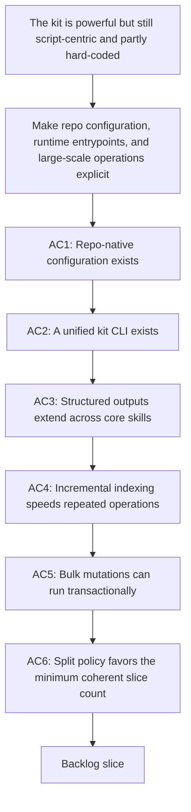

## req_085_add_repo_config_runtime_entrypoints_and_transactional_scaling_primitives_to_the_logics_kit - Add repo config, runtime entrypoints, and transactional scaling primitives to the Logics kit
> From version: 1.12.0
> Status: Draft
> Understanding: 97%
> Confidence: 95%
> Complexity: High
> Theme: Kit runtime ergonomics and scale
> Reminder: Update status/understanding/confidence and references when you edit this doc.

# Needs
- Make the Logics kit easier to adopt, configure, automate, and scale across repositories without relying on hard-coded conventions or script-specific entrypoints.
- Add repo-native configuration, a unified operator CLI, broader machine-readable contracts, incremental corpus indexing, transactional bulk mutations, and explicit split guidance so the kit behaves more like a stable platform than a loose set of scripts.

# Context
- `req_082`, `req_083`, and `req_084` strengthened compact AI context, machine-readable governance primitives, diagnostics, safe-write previews, and internal runtime contracts inside the kit.
- The current kit is much more capable than before, but several structural gaps still remain outside those requests:
  - workflow conventions and governance defaults are still mostly encoded in Python modules instead of a repo-native configuration file that projects can override explicitly;
  - operators still invoke the kit through many `python .../script.py` entrypoints instead of a single stable `logics` command that is easier to teach, document, and automate;
  - the flow manager has machine-readable outputs, but much of the wider skill ecosystem still primarily emits operator text instead of stable structured payloads;
  - large corpora are still reparsed repeatedly instead of benefiting from an incremental index or cache contract for workflow docs and skill metadata;
  - bulk operations have preview support, but not yet a stronger transactional apply-or-fail model for mass mutations;
  - the kit still lacks an explicit workflow rule that backlog splitting should create the minimum number of coherent, executable slices instead of fragmenting work by default.
- This request remains purely kit-side. It does not target plugin UX, webview behavior, or the handoff-surface work already covered by earlier token-efficiency requests.

# Acceptance criteria
- AC1: The kit supports a repo-native configuration surface, for example `logics.yaml`, that can define or override governance defaults, workflow conventions, split policy, connector allowances, or similar repository-level behavior without editing kit source files.
- AC2: The kit exposes a unified CLI entrypoint, for example `logics`, that can route to the main flow-manager and related kit commands with a stable operator-facing contract instead of requiring direct invocation of many individual Python scripts.
- AC3: Core skills that are expected to participate in automation can expose stable machine-readable outputs, for example JSON, so downstream tools do not need to mix structured flow-manager payloads with ad hoc text parsing from adjacent kit skills.
- AC4: The kit can build and reuse an incremental workflow or skill index so repeated audit, doctor, validation, or context-oriented operations do not need to fully reparse the repository every time.
- AC5: Multi-file kit mutations can support a stronger transactional or rollback-aware execution model beyond preview-only flows, so large corpus edits either apply coherently or fail with a clear recovery path.
- AC6: The kit documents and enforces an explicit split policy that prefers the smallest number of independently valuable, executable backlog or task slices rather than splitting by default or over-fragmenting work.

# Scope
- In:
  - Repo-native configuration for kit behavior and policy.
  - A unified `logics` CLI or equivalent stable entrypoint.
  - Structured output contracts for automation-facing kit skills beyond the current flow-manager core.
  - Incremental indexing or cache primitives for workflow docs and skill metadata.
  - Transactional semantics or rollback-aware safeguards for bulk mutations.
  - Explicit split policy and minimal-slice guidance for backlog or task generation.
- Out:
  - VS Code plugin UI or webview changes.
  - Replacing all existing script entrypoints immediately; compatibility shims can remain during migration.
  - Rewriting every skill in the kit in a single pass if a phased adoption model is sufficient.

# Dependencies and risks
- Dependency: `logics_flow.py`, `workflow_audit.py`, and the existing skill package layout remain the backbone for any new CLI, config, indexing, or mutation contracts.
- Dependency: `req_083_add_internal_logics_kit_governance_migration_and_machine_readable_tooling_primitives` remains the baseline for current JSON, schema, and governance primitives; this request extends those capabilities to repo config, broader skill coverage, and runtime ergonomics.
- Dependency: `req_084_improve_logics_kit_diagnostics_safety_and_internal_runtime_contracts` remains the baseline for doctor, registry, and safe-write preview behavior; this request deepens those guarantees with indexing and stronger mutation semantics.
- Risk: a repo config surface can create policy drift if the override model is too flexible or under-validated.
- Risk: a unified CLI can become a thin wrapper with inconsistent semantics if command routing and help surfaces are not standardized.
- Risk: incremental indexes can go stale unless invalidation rules are explicit and testable.
- Risk: transactional bulk-write semantics can increase implementation complexity if the mutation model stays too text-oriented.
- Risk: enforcing a split policy too aggressively can block legitimate decomposition when ownership, dependency, or validation concerns genuinely require several slices.

# AC Traceability
- AC1 -> `item_129_introduce_repo_native_logics_configuration_and_policy_resolution`. Proof: add a repo-native config file or loader and show at least one repository policy being read from it instead of hard-coded defaults.
- AC2 -> `item_130_add_a_unified_logics_cli_entrypoint_with_compatibility_routing`. Proof: add a stable top-level `logics` entrypoint that can run the main workflow flows without requiring direct script paths.
- AC3 -> `item_131_extend_machine_readable_outputs_across_automation_facing_kit_skills`. Proof: extend machine-readable outputs to at least a representative subset of automation-facing skills outside the flow manager.
- AC4 -> `item_132_add_incremental_workflow_and_skill_indexing_for_repeated_kit_operations`. Proof: add an index or cache contract used by at least one repeated corpus operation and validate invalidation behavior.
- AC5 -> `item_133_strengthen_bulk_mutation_safety_with_transactional_apply_or_rollback_semantics`. Proof: provide an apply-or-fail or rollback-aware path for a multi-file mutation flow and document the operator contract.
- AC6 -> `item_134_codify_minimal_slice_split_policy_across_backlog_generation_and_operator_guidance`. Proof: encode or document a minimal-slice split rule in templates, prompts, CLI help, or generation logic so backlog decomposition defaults to the minimum coherent number of items.

# Definition of Ready (DoR)
- [x] Problem statement is explicit and user impact is clear.
- [x] Scope boundaries (in/out) are explicit.
- [x] Acceptance criteria are testable.
- [x] Dependencies and known risks are listed.

# Companion docs
- Product brief(s): (none yet)
- Architecture decision(s): (none yet)

# AI Context
- Summary: Add repo-native kit config, a unified CLI, broader structured outputs, incremental indexing, transactional bulk mutations, and explicit minimal-slice split policy to the Logics kit.
- Keywords: logics, kit, config, cli, json, index, cache, transaction, split policy
- Use when: Use when planning the next kit-side runtime and operator ergonomics wave after the current governance, diagnostics, and context-pack foundations.
- Skip when: Skip when the work targets another feature, repository, or workflow stage.

# References
- `logics/request/req_082_strengthen_logics_kit_primitives_for_compact_ai_context_and_reusable_handoff_generation.md`
- `logics/request/req_083_add_internal_logics_kit_governance_migration_and_machine_readable_tooling_primitives.md`
- `logics/request/req_084_improve_logics_kit_diagnostics_safety_and_internal_runtime_contracts.md`
- `logics/skills/logics-flow-manager/scripts/logics_flow.py`
- `logics/skills/logics-flow-manager/scripts/logics_flow_registry.py`
- `logics/skills/logics-flow-manager/scripts/workflow_audit.py`
- `logics/skills/README.md`
- `logics/skills/CONTRIBUTING.md`

# Backlog
- `item_129_introduce_repo_native_logics_configuration_and_policy_resolution`
- `item_130_add_a_unified_logics_cli_entrypoint_with_compatibility_routing`
- `item_131_extend_machine_readable_outputs_across_automation_facing_kit_skills`
- `item_132_add_incremental_workflow_and_skill_indexing_for_repeated_kit_operations`
- `item_133_strengthen_bulk_mutation_safety_with_transactional_apply_or_rollback_semantics`
- `item_134_codify_minimal_slice_split_policy_across_backlog_generation_and_operator_guidance`
- Task: `task_097_orchestration_delivery_for_req_085_repo_config_runtime_entrypoints_and_transactional_scaling_primitives`
