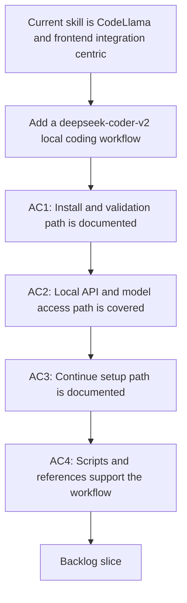

## req_086_upgrade_the_logics_ollama_specialist_for_deepseek_coder_v2_installation_setup_and_access - Upgrade the Logics Ollama specialist for deepseek-coder-v2 installation setup and access
> From version: 1.12.1
> Schema version: 1.0
> Status: Draft
> Understanding: 96%
> Confidence: 93%
> Complexity: Medium
> Theme: Local Ollama coding workflows
> Reminder: Update status/understanding/confidence and references when you edit this doc.

# Needs
- Expand the repository's `logics-ollama-specialist` so it can guide a realistic local coding setup around `deepseek-coder-v2`, not only the older CodeLlama-centric path.
- Cover the full operator path from Ollama installation and daemon validation to model pull, local API access, and VS Code access through Continue.

# Context
- `logics/skills/logics-ollama-specialist/SKILL.md` currently focuses on macOS install helpers, CodeLlama examples, and frontend proxy guidance.
- Recent user work already established a concrete local setup around `ollama`, `deepseek-coder-v2:16b`, and `~/.continue/config.yaml`, but that workflow is not yet represented in the repository skill.
- The gap is procedural rather than architectural: operators need a reliable skill that knows how to install or verify Ollama, pull the preferred DeepSeek Coder tag, validate the local API, and connect VS Code through Continue without replacing unrelated config.
- This request should stay repo-local and documentation-first. It does not require building a new VS Code extension feature or a remote-model abstraction.

# Acceptance criteria
- AC1: The repository skill documents a preferred `deepseek-coder-v2` local setup, including tag guidance for `deepseek-coder-v2:16b`, when to avoid larger tags by default, and how to normalize common model-name variants.
- AC2: The repository skill documents or scripts the install and validation path for Ollama itself, including binary checks, daemon reachability, model pull, and a local CLI or HTTP smoke test.
- AC3: The repository skill includes a concrete Continue workflow for VS Code, including the expected config path, provider, model, and `apiBase` fields, plus guidance to patch existing config rather than overwrite unrelated entries.
- AC4: The repository skill's bundled scripts or references cover the repeatable operator checks needed for the DeepSeek workflow, and version-sensitive guidance points back to official Ollama or Continue docs when necessary.

# Scope
- In:
  - `deepseek-coder-v2` install, setup, validation, and local access guidance in `logics-ollama-specialist`
  - Continue configuration guidance for a local Ollama coding workflow
  - Script or reference updates needed to keep the workflow actionable
- Out:
  - Roo Code integration
  - Dedicated autocomplete model selection and config
  - New plugin features in this repository

# Dependencies and risks
- Dependency: `logics/skills/logics-ollama-specialist/SKILL.md`, its scripts, and its references remain the delivery surface for this request.
- Dependency: local-editor guidance should remain consistent with the repository's existing `logics` operator documentation and avoid teaching destructive config rewrites.
- Risk: hard-coding a floating Ollama tag or stale editor config schema will make the skill age poorly.
- Risk: widening the skill too much in one step will blur the boundary between the foundational DeepSeek workflow and the later Roo or autocomplete work.

# Definition of Ready (DoR)
- [x] Problem statement is explicit and user impact is clear.
- [x] Scope boundaries (in/out) are explicit.
- [x] Acceptance criteria are testable.
- [x] Dependencies and known risks are listed.

# Companion docs
- Product brief(s): (none yet)
- Architecture decision(s): (none yet)

# AI Context
- Summary: Upgrade the repository's Ollama skill so it can install, validate, and expose `deepseek-coder-v2` through Ollama and Continue for local coding workflows.
- Keywords: ollama, deepseek-coder-v2, continue, local model, installation, validation, vscode
- Use when: Use when planning or implementing the foundational DeepSeek Coder workflow inside `logics-ollama-specialist`.
- Skip when: Skip when the work targets another feature, repository, or workflow stage.

# References
- `logics/skills/logics-ollama-specialist/SKILL.md`
- `logics/skills/logics-ollama-specialist/scripts/ollama_check.sh`
- `logics/skills/logics-ollama-specialist/scripts/ollama_install_macos.sh`
- `logics/skills/logics-ollama-specialist/references/ollama-integration.md`
- `logics/instructions.md`

# Backlog
- `item_135_upgrade_the_logics_ollama_specialist_for_deepseek_coder_v2_installation_setup_and_access`
- Task: `task_098_orchestration_delivery_for_req_086_and_req_087_local_ollama_coding_workflows`
