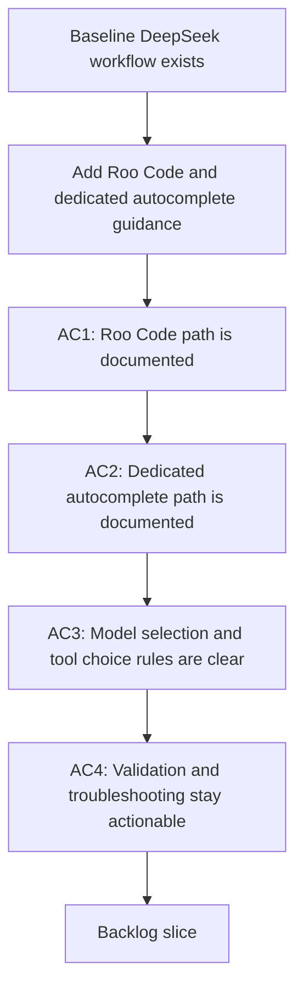

## req_087_extend_the_logics_ollama_specialist_for_roo_code_and_dedicated_local_autocomplete_workflows - Extend the Logics Ollama specialist for Roo Code and dedicated local autocomplete workflows
> From version: 1.12.1
> Schema version: 1.0
> Status: Draft
> Understanding: 95%
> Confidence: 92%
> Complexity: Medium
> Theme: Editor integrations for local coding models
> Reminder: Update status/understanding/confidence and references when you edit this doc.

# Needs
- Extend the repository's `logics-ollama-specialist` beyond the foundational Continue path so it can also guide Roo Code setup and a split-model local coding workflow with dedicated autocomplete.
- Make the skill explicit about when to use `deepseek-coder-v2` for chat or edit tasks and when to pair it with a smaller local model for faster inline completion.

# Context
- `req_086` covers the baseline DeepSeek Coder installation, validation, and Continue access path.
- The next operator request expands the editor surface: some users want agentic coding through Roo Code, while others want a low-latency local autocomplete path instead of forcing `deepseek-coder-v2` to do every job.
- The repository skill should explain these options as additive integrations on top of a healthy Ollama baseline rather than as replacements for the foundational workflow.
- The request should stay constrained to skill content, helper scripts, and reference material. It should not introduce new extension runtime features in this repository.

# Acceptance criteria
- AC1: The repository skill documents how to connect Roo Code to a local Ollama instance, including provider selection, base URL, model id, and a basic validation path.
- AC2: The repository skill documents a dedicated local autocomplete pattern that pairs `deepseek-coder-v2` for chat or edit work with a smaller autocomplete-focused model and explains the expected tradeoff.
- AC3: The repository skill explains when Continue remains the right default, when Roo Code is the better fit, and when a split chat-plus-autocomplete setup should be preferred.
- AC4: References or helper scripts cover the common validation and troubleshooting steps for Roo Code and local autocomplete without regressing the baseline workflow from `req_086`.

# Scope
- In:
  - Roo Code setup guidance for local Ollama
  - Dedicated local autocomplete guidance layered on top of the foundational DeepSeek workflow
  - Decision guidance for model and editor-tool selection
- Out:
  - Replacing the foundational Continue workflow from `req_086`
  - Non-local hosted providers
  - New extension runtime features in this repository

# Dependencies and risks
- Dependency: `req_086` remains the baseline and should be completed or at least framed first so Roo Code and autocomplete guidance do not duplicate install steps.
- Dependency: the same repository skill and helper assets remain the delivery surface.
- Risk: mixing too many editor workflows without decision guidance will make the skill harder to use.
- Risk: autocomplete guidance can become misleading if the skill does not clearly separate fast-completion models from larger chat or edit models.

# Definition of Ready (DoR)
- [x] Problem statement is explicit and user impact is clear.
- [x] Scope boundaries (in/out) are explicit.
- [x] Acceptance criteria are testable.
- [x] Dependencies and known risks are listed.

# Companion docs
- Product brief(s): (none yet)
- Architecture decision(s): (none yet)

# AI Context
- Summary: Extend the repository's Ollama skill so it can guide Roo Code and dedicated local autocomplete workflows on top of the foundational DeepSeek Coder setup.
- Keywords: ollama, roo code, autocomplete, continue, deepseek-coder-v2, local coding
- Use when: Use when planning or implementing editor-integration follow-up work after the foundational DeepSeek workflow is defined.
- Skip when: Skip when the work targets another feature, repository, or workflow stage.

# References
- `logics/request/req_086_upgrade_the_logics_ollama_specialist_for_deepseek_coder_v2_installation_setup_and_access.md`
- `logics/skills/logics-ollama-specialist/SKILL.md`
- `logics/skills/logics-ollama-specialist/scripts/ollama_check.sh`
- `logics/skills/logics-ollama-specialist/references/ollama-integration.md`
- `logics/instructions.md`

# Backlog
- `item_136_extend_the_logics_ollama_specialist_for_roo_code_and_dedicated_local_autocomplete_workflows`
- Task: `task_098_orchestration_delivery_for_req_086_and_req_087_local_ollama_coding_workflows`
