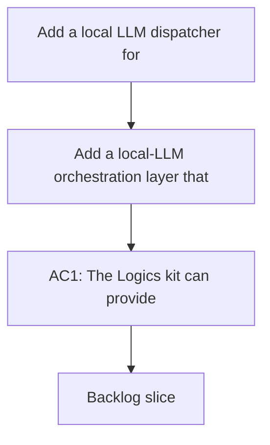

## req_088_add_a_local_llm_dispatcher_for_deterministic_logics_flow_orchestration - Add a local LLM dispatcher for deterministic Logics flow orchestration
> From version: 1.12.1
> Schema version: 1.0
> Status: Done
> Understanding: 99%
> Confidence: 97%
> Complexity: Medium
> Theme: Local agent orchestration for workflow automation
> Reminder: Update status/understanding/confidence and references when you edit this doc.

# Needs
- Add a local-LLM orchestration layer that can help dispatch work across the Logics workflow without letting the model mutate workflow docs directly.
- Make local model usage practical for request, backlog, and task flow decisions by letting the LLM propose actions in a strict machine-readable format while the existing Logics kit executes the resulting workflow mutations deterministically.

# Context
- The Logics kit already exposes most of the deterministic primitives needed for orchestration: `logics_flow.py` supports JSON output across `new`, `promote`, `split`, `finish`, and `sync` flows, while `context-pack`, `export-graph`, `export-registry`, `doctor`, and workflow audit commands can provide structured state to another automation layer.
- A local model served through Ollama is a good fit for low-cost triage and dispatch work, but it should not be trusted to edit workflow docs or invent arbitrary mutations on its own.
- The intended operating model is: the local LLM reads a compact structured view of the workflow state, returns a strict decision payload, and a deterministic runner validates that payload before mapping it onto an allowed `logics_flow.py` command.
- The request should remain guardrail-first:
  - the LLM decides, but the flow manager executes;
  - the orchestration layer should prefer `context-pack` or graph exports over dumping whole repositories into model context;
  - actions should be whitelisted and schema-validated before execution;
  - operator approval or safe modes should remain possible for risky transitions.
- This request is about local automation around the existing workflow model. It is not a request to replace the Logics flow manager, rewrite workflow docs directly with an LLM, or build a hosted orchestration service.



# Acceptance criteria
- AC1: The Logics kit can provide a compact structured state for a local dispatcher, for example by combining `context-pack`, workflow graph export, registry export, or audit payloads, so the LLM can reason over workflow state without relying on raw repository scans.
- AC2: The orchestration contract defines a strict machine-readable response schema for the local LLM, including an action, target reference, rationale, and confidence or similar bounded fields, so the runner can validate responses deterministically.
- AC3: A deterministic dispatcher runner can map validated LLM decisions onto a whitelist of allowed Logics commands, for example `new`, `promote`, `split`, `finish`, or safe sync flows, without granting the model arbitrary file-write authority.
- AC4: The design includes operator-safety and audit requirements, such as suggestion-only mode, semi-automatic mode, explicit failure behavior for invalid payloads, and a trace of decision input, validated output, executed command, and result.
- AC5: The orchestration design is explicitly local-model friendly, for example by using Ollama or another local runtime through an HTTP API, and does not require a hosted dependency for the baseline workflow.

# Scope
- In:
  - A local dispatcher architecture layered on top of the existing Logics flow manager
  - Structured state packaging for the dispatcher using existing machine-readable kit outputs
  - A strict decision schema and deterministic action-mapping contract
  - Safety modes, validation rules, and auditability expectations for local orchestration
- Out:
  - Direct LLM-driven mutation of workflow markdown files
  - Replacing the flow manager with an agent-native workflow engine
  - Hosted orchestration services or cloud-only model dependencies
  - General-purpose code-agent delegation outside the Logics workflow domain

# Dependencies and risks
- Dependency: `logics_flow.py` and its machine-readable sync surfaces remain the canonical execution layer for workflow mutations.
- Dependency: `context-pack`, graph export, registry export, and workflow audit outputs remain compact and stable enough to feed a local decision loop.
- Dependency: local-model infrastructure such as Ollama remains optional but first-class for the design.
- Risk: if the decision schema is too loose, the local model will produce ambiguous payloads that are hard to validate safely.
- Risk: if the dispatcher consumes too much raw repository context instead of compact kit-native artifacts, latency and hallucination rates will rise while determinism drops.
- Risk: if too many commands are whitelisted too early, the dispatcher can become operationally unsafe before the audit trail and review modes are mature.

# AC Traceability
- AC1 -> `item_137_define_a_compact_dispatcher_context_package_and_strict_local_decision_contract`. Proof: the backlog slice defines the baseline compact dispatcher input package around `context-pack` with bounded enrichment paths.
- AC2 -> `item_137_define_a_compact_dispatcher_context_package_and_strict_local_decision_contract`. Proof: the backlog slice defines the canonical machine-readable decision schema, required fields, and strict rejection rules.
- AC3 -> `item_138_build_a_deterministic_dispatcher_runner_with_whitelisted_logics_action_mapping`. Proof: the backlog slice adds the deterministic runner that validates payloads and maps only whitelisted actions onto allowed Logics commands.
- AC4 -> `item_138_build_a_deterministic_dispatcher_runner_with_whitelisted_logics_action_mapping` and `item_139_add_an_ollama_first_local_dispatcher_adapter_audit_trail_and_operator_entrypoints`. Proof: the runner preserves `suggestion-only` and fail-closed behavior while the adapter slice captures audit trails and operator-facing safety modes.
- AC5 -> `item_139_add_an_ollama_first_local_dispatcher_adapter_audit_trail_and_operator_entrypoints`. Proof: the backlog slice makes the orchestration path local-model friendly through an Ollama-first adapter and operator entrypoints without requiring hosted dependencies.

# Open questions and suggested defaults
- Question: Which actions should be whitelisted in V1?
  Suggestion: Start with `new`, `promote`, `split`, `finish`, and a deliberately constrained `sync` surface limited to non-destructive flows.
- Question: Should the dispatcher execute actions automatically from day one?
  Suggestion: Default to `suggestion-only` mode in V1, then add a semi-automatic mode only after schema validation and audit logging are stable.
- Question: What JSON payload becomes the canonical LLM decision contract?
  Suggestion: Standardize on bounded fields such as `action`, `target_ref`, `proposed_args`, `rationale`, and `confidence`, with strict validation and rejection of unknown keys.
- Question: What compact state package should be the baseline model input?
  Suggestion: Use `context-pack` as the default input and allow optional enrichment with `export-graph` and `export-registry` when the runner decides extra structure is necessary.
- Question: What should happen when the payload is invalid, ambiguous, or references a missing target?
  Suggestion: Fail closed, emit a structured error, log the rejected payload, and do not attempt any implicit workflow mutation.
- Question: Where should auditability live for the first delivery?
  Suggestion: Write a local structured audit trail, such as JSONL, that records the input summary, raw model output, validated action, executed command, and result.
- Question: Which local runtime should be treated as the first-class baseline?
  Suggestion: Target Ollama first through a small HTTP adapter boundary so the baseline remains local-first without overcommitting to one runtime forever.
- Question: Which local model class should the baseline target?
  Suggestion: Choose a model that is reliable enough for small JSON dispatch decisions rather than optimizing for full coding ability, since the dispatcher is not supposed to edit docs directly.
- Question: Should the dispatcher be exposed only as a CLI or also as a reusable library?
  Suggestion: Implement the core as a reusable Python module with a thin CLI wrapper so validation logic stays testable and composable.
- Question: How much responsibility should the LLM have for command arguments?
  Suggestion: Let the model propose bounded arguments for allowed commands, but keep final normalization and safety checks inside the deterministic runner.

Suggested canonical payload shape:

```json
{
  "action": "promote",
  "target_ref": "req_088",
  "proposed_args": {},
  "rationale": "Bounded explanation for the proposed flow action.",
  "confidence": 0.84
}
```

# Definition of Ready (DoR)
- [x] Problem statement is explicit and user impact is clear.
- [x] Scope boundaries (in/out) are explicit.
- [x] Acceptance criteria are testable.
- [x] Dependencies and known risks are listed.

# Companion docs
- Product brief(s): (none yet)
- Architecture decision(s): (none yet)

# AI Context
- Summary: Define a local LLM dispatcher that proposes workflow actions from compact Logics state while the flow manager remains the deterministic execution layer.
- Keywords: logics, local llm, ollama, dispatcher, orchestration, context-pack, json, workflow
- Use when: Use when planning local-model orchestration on top of the existing Logics machine-readable workflow primitives.
- Skip when: Skip when the work targets hosted agents, direct markdown mutation, or non-Logics automation.

# References
- `logics/skills/logics-flow-manager/scripts/logics_flow.py`
- `logics/skills/logics-flow-manager/scripts/logics_flow_dispatcher.py`
- `logics/skills/logics-flow-manager/scripts/logics_flow_registry.py`
- `logics/skills/logics-flow-manager/scripts/logics_flow_support.py`
- `logics/skills/logics-flow-manager/SKILL.md`
- `logics/skills/tests/test_logics_flow.py`
- `logics/skills/README.md`
- `logics/request/req_082_strengthen_logics_kit_primitives_for_compact_ai_context_and_reusable_handoff_generation.md`
- `logics/request/req_083_add_internal_logics_kit_governance_migration_and_machine_readable_tooling_primitives.md`
- `logics/request/req_084_improve_logics_kit_diagnostics_safety_and_internal_runtime_contracts.md`
- `logics/request/req_085_add_repo_config_runtime_entrypoints_and_transactional_scaling_primitives_to_the_logics_kit.md`
- `logics/backlog/item_137_define_a_compact_dispatcher_context_package_and_strict_local_decision_contract.md`
- `logics/backlog/item_138_build_a_deterministic_dispatcher_runner_with_whitelisted_logics_action_mapping.md`
- `logics/backlog/item_139_add_an_ollama_first_local_dispatcher_adapter_audit_trail_and_operator_entrypoints.md`
- `logics/tasks/task_099_orchestration_delivery_for_req_088_local_llm_dispatcher_for_deterministic_logics_flow_orchestration.md`

# Backlog
- `item_137_define_a_compact_dispatcher_context_package_and_strict_local_decision_contract`
- `item_138_build_a_deterministic_dispatcher_runner_with_whitelisted_logics_action_mapping`
- `item_139_add_an_ollama_first_local_dispatcher_adapter_audit_trail_and_operator_entrypoints`
- Task: `task_099_orchestration_delivery_for_req_088_local_llm_dispatcher_for_deterministic_logics_flow_orchestration`
