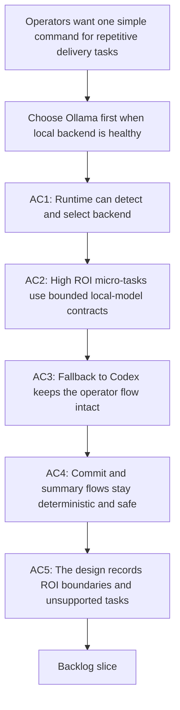

## req_089_add_a_hybrid_ollama_or_codex_local_orchestration_backend_for_repetitive_logics_delivery_tasks - Add a hybrid Ollama or Codex local orchestration backend for repetitive Logics delivery tasks
> From version: 1.12.1
> Schema version: 1.0
> Status: Draft
> Understanding: 99%
> Confidence: 96%
> Complexity: High
> Theme: Hybrid local orchestration and token-efficient delivery automation
> Reminder: Update status/understanding/confidence and references when you edit this doc.

# Needs
- Add a hybrid backend selection layer for repetitive Logics delivery tasks so operators can keep saying simple commands such as `commit all changes` while the kit prefers a local Ollama model when available and falls back to Codex when it is not.
- Focus local-model usage on bounded, high-frequency, high-ROI micro-tasks such as commit-message generation, PR or changelog summaries, workflow next-step dispatch, request or backlog triage, and compact handoff packets for Codex instead of attempting full autonomous code execution.

# Context
- `req_088` already introduced a local dispatcher model where a local LLM can propose bounded workflow actions and a deterministic runner validates and executes only whitelisted commands.
- `req_085` made the kit more suitable for runtime orchestration by adding repo-native config, a unified CLI, structured outputs, incremental indexing, transactional bulk mutations, and explicit split policy controls.
- `req_086` and `req_087` strengthened the Ollama specialist around local installation, configuration, and editor integration, which makes a local-first backend practical on repositories that already run Ollama.
- The current gap is not “can the kit talk to a local model?” but “can the kit choose the best backend automatically for repetitive delivery operations without changing operator habits?”
- For the hybrid backend to be used automatically by Codex, the delivery cannot stop at architecture notes:
  - the kit needs a stable runtime surface, for example dedicated `logics.py flow ...` commands, so Codex has a canonical execution path instead of ad hoc shell logic;
  - a dedicated skill must advertise the natural-language triggers operators already use, such as `commit all changes`, `summarize this PR`, or `what should we do next?`, so Codex knows when to invoke the hybrid runtime path;
  - that skill must be synced into the Codex workspace overlay so repo-local usage is actually discoverable in live Codex sessions;
  - the hybrid runtime must be covered by e2e tests for both `Ollama available` and `Ollama unavailable` paths, otherwise the `auto` backend remains theoretical.
- The intended operating model should stay layered:
  - Codex remains the orchestrator and execution layer for file writes, git actions, validation, and safety checks.
  - Ollama is used opportunistically as a local low-cost reasoning backend for bounded summarization or triage when it is reachable and the expected model is installed.
  - If Ollama is unavailable, unhealthy, or returns an invalid payload, the same flow falls back to Codex without breaking the operator command.
- The request should stay ROI-driven:
  - strong-fit use cases are short structured outputs such as commit messages, PR summaries, dispatcher decisions, and triage labels;
  - medium-fit use cases include draft handoff packets and bounded workflow decomposition suggestions;
  - low-fit use cases such as real code generation, complex refactors, or architecture decisions remain Codex-first and should not be forced through the local backend.
- This request is not about replacing Codex with a local model. It is about making the Logics runtime smart enough to prefer Ollama when it gives a practical local benefit and to degrade cleanly to Codex otherwise.

# Acceptance criteria
- AC1: The kit can detect whether Ollama is reachable and whether the expected local model is installed or runnable, then select `ollama`, `codex`, or `auto` backend modes deterministically for supported repetitive delivery tasks.
- AC2: The design defines strict machine-readable contracts for the initial high-ROI local tasks, for example commit-message generation, PR or changelog summaries, dispatcher next-step suggestions, and request or backlog triage, so the backend can be swapped without changing the surrounding flow.
- AC3: When Ollama is unavailable, unhealthy, or produces an invalid payload, the supported operator flows fall back to Codex without changing the operator-facing command or leaving the workflow in a partial state.
- AC4: The hybrid backend keeps Codex in charge of actual execution for risky actions such as `git add`, `git commit`, validation runs, or workflow mutations, while Ollama remains bounded to proposal, summarization, or triage work unless an explicitly safe deterministic runner exists.
- AC5: The request documents and enforces an ROI policy that distinguishes strong-fit, medium-fit, and low-fit local-model use cases so the system does not overuse Ollama for work better handled by Codex.
- AC6: The hybrid design includes the Codex integration surfaces required for automatic use, namely a stable runtime command surface, a dedicated skill with natural-language trigger coverage, workspace-overlay synchronization, and end-to-end tests for both `Ollama up` and `Ollama down` paths.

# Scope
- In:
  - backend detection and routing rules for `ollama`, `codex`, and `auto`
  - bounded local-model contracts for repetitive Logics delivery tasks
  - graceful fallback behavior and invalid-payload handling
  - at least one concrete hybrid operator flow, such as `commit all changes`
  - explicit ROI guidance for which Logics tasks should or should not use the local backend
  - Codex-facing integration surfaces needed to make those flows automatically discoverable and usable in live sessions
- Out:
  - replacing Codex as the execution engine
  - unbounded local-model code generation or arbitrary repository mutation
  - mandatory Ollama dependency for repositories that do not run it
  - broad autonomous agent behavior outside the bounded Logics delivery surfaces

# Dependencies and risks
- Dependency: `req_085` runtime primitives remain the base layer for config inspection, structured outputs, incremental indexing, and deterministic workflow execution.
- Dependency: `req_088` dispatcher primitives remain the reference model for strict local-model payload validation, bounded decisions, and audit trails.
- Dependency: `logics-ollama-specialist` remains the source of truth for local Ollama installation, health checks, default host, and model-handling conventions.
- Risk: if the backend router is too optimistic, it may spend time probing Ollama on every command and negate the latency or token gains.
- Risk: if the local-model contracts are too loose, Codex will still need to redo most of the reasoning, which reduces the ROI of the hybrid design.
- Risk: if the hybrid flow allows Ollama to perform direct git or file mutations, the safety model will regress sharply.
- Risk: if the system tries to push low-ROI tasks such as code generation or complex refactors through the local backend, operator confidence and overall quality will drop.
- Risk: if the runtime commands, skill metadata, or overlay sync story are left implicit, Codex will not reliably discover or reuse the hybrid path even if the backend logic exists.

# AC Traceability
- AC1 -> `item_140_define_deterministic_hybrid_backend_detection_health_probes_and_auto_routing_for_logics_assist_flows` and `task_100_orchestration_delivery_for_req_089_to_req_095_hybrid_assist_runtime_portfolio_governance_portability_and_plugin_exposure`. Proof: the portfolio starts by defining deterministic Ollama health probes, model readiness checks, and `ollama` / `codex` / `auto` routing before the broader runtime waves land.
- AC2 -> `item_141_add_backend_neutral_hybrid_runtime_invocation_fallback_handling_and_operator_entrypoints`, `item_150_define_a_shared_hybrid_assist_payload_envelope_and_execution_metadata_contract`, and `task_100_orchestration_delivery_for_req_089_to_req_095_hybrid_assist_runtime_portfolio_governance_portability_and_plugin_exposure`. Proof: the backlog splits strict backend-neutral invocation from the shared payload envelope so the first-wave assist contracts stay reusable regardless of backend.
- AC3 -> `item_141_add_backend_neutral_hybrid_runtime_invocation_fallback_handling_and_operator_entrypoints`, `item_151_codify_shared_fallback_safety_class_activation_and_rollout_rules_for_hybrid_assist_flows`, and `task_100_orchestration_delivery_for_req_089_to_req_095_hybrid_assist_runtime_portfolio_governance_portability_and_plugin_exposure`. Proof: explicit fallback behavior is handled as shared runtime policy and then delivered in the cross-request orchestration waves.
- AC4 -> `item_141_add_backend_neutral_hybrid_runtime_invocation_fallback_handling_and_operator_entrypoints`, `item_151_codify_shared_fallback_safety_class_activation_and_rollout_rules_for_hybrid_assist_flows`, and `task_100_orchestration_delivery_for_req_089_to_req_095_hybrid_assist_runtime_portfolio_governance_portability_and_plugin_exposure`. Proof: the shared runtime and safety-class slices preserve bounded proposal behavior and reviewed execution boundaries for risky actions.
- AC5 -> `item_151_codify_shared_fallback_safety_class_activation_and_rollout_rules_for_hybrid_assist_flows`, `item_154_add_hybrid_assist_measurement_review_loops_and_degraded_result_policies`, and `task_100_orchestration_delivery_for_req_089_to_req_095_hybrid_assist_runtime_portfolio_governance_portability_and_plugin_exposure`. Proof: ROI boundaries and keep-or-tighten review loops are captured as shared governance rather than left to each assist flow.
- AC6 -> `item_145_make_hybrid_assist_commands_and_payloads_reusable_from_codex_and_claude_adapters`, `item_146_harden_hybrid_assist_runtime_examples_launchers_and_validation_for_windows_safe_execution`, `item_156_add_plugin_tool_actions_for_high_value_hybrid_assist_flows_through_shared_runtime_commands`, `item_157_add_plugin_audit_visibility_result_panels_and_cross_agent_runtime_messaging_cleanup`, and `task_100_orchestration_delivery_for_req_089_to_req_095_hybrid_assist_runtime_portfolio_governance_portability_and_plugin_exposure`. Proof: automatic use depends on shared runtime commands, adapter portability, and visible activation surfaces delivered across the runtime and plugin waves.

# Definition of Ready (DoR)
- [x] Problem statement is explicit and user impact is clear.
- [x] Scope boundaries (in/out) are explicit.
- [x] Acceptance criteria are testable.
- [x] Dependencies and known risks are listed.

# Companion docs
- Product brief(s): `prod_001_hybrid_assist_operator_experience_for_repetitive_logics_delivery_flows`
- Architecture decision(s): `adr_011_keep_hybrid_assist_runtime_contracts_shared_backend_agnostic_and_safely_bounded`

# AI Context
- Summary: Define a hybrid `ollama when available, codex otherwise` backend for repetitive Logics delivery tasks, starting with high-ROI bounded micro-tasks such as commit messages, summaries, dispatcher suggestions, and workflow triage.
- Keywords: logics, ollama, codex, hybrid backend, auto fallback, commit message, triage, dispatcher, ROI
- Use when: Use when planning hybrid local-model and Codex orchestration for repetitive Logics delivery automation without replacing Codex as the execution engine.
- Skip when: Skip when the work is about pure Codex execution, pure Ollama setup, or unbounded local-model coding autonomy.

# References
- `logics/request/req_085_add_repo_config_runtime_entrypoints_and_transactional_scaling_primitives_to_the_logics_kit.md`
- `logics/request/req_086_upgrade_the_logics_ollama_specialist_for_deepseek_coder_v2_installation_setup_and_access.md`
- `logics/request/req_087_extend_the_logics_ollama_specialist_for_roo_code_and_dedicated_local_autocomplete_workflows.md`
- `logics/request/req_088_add_a_local_llm_dispatcher_for_deterministic_logics_flow_orchestration.md`
- `logics/skills/logics.py`
- `logics/skills/logics-flow-manager/scripts/logics_flow.py`
- `logics/skills/logics-flow-manager/scripts/logics_flow_dispatcher.py`
- `logics/skills/logics-flow-manager/scripts/logics_flow_config.py`
- `logics/skills/logics-flow-manager/scripts/logics_flow_index.py`
- `logics/skills/logics-flow-manager/scripts/logics_codex_workspace.py`
- `logics/skills/logics-flow-manager/SKILL.md`
- `logics/skills/logics-ollama-specialist/SKILL.md`
- `logics/skills/logics-ollama-specialist/scripts/ollama_check.sh`
- `logics/skills/README.md`

# Backlog
- `item_140_define_deterministic_hybrid_backend_detection_health_probes_and_auto_routing_for_logics_assist_flows`
- `item_141_add_backend_neutral_hybrid_runtime_invocation_fallback_handling_and_operator_entrypoints`
- Task: `task_100_orchestration_delivery_for_req_089_to_req_095_hybrid_assist_runtime_portfolio_governance_portability_and_plugin_exposure`
