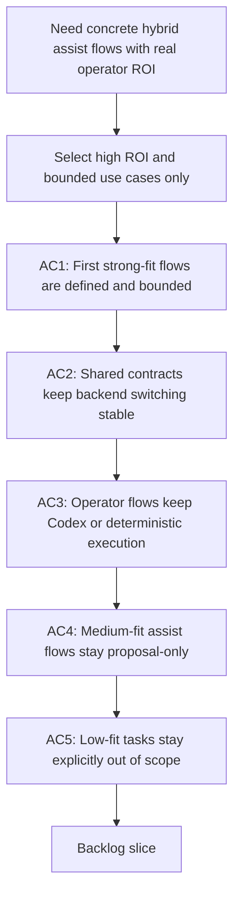

## req_090_add_high_roi_hybrid_ollama_or_codex_assist_flows_for_repetitive_logics_delivery_operations - Add high ROI hybrid Ollama or Codex assist flows for repetitive Logics delivery operations
> From version: 1.12.1
> Schema version: 1.0
> Status: Draft
> Understanding: 99%
> Confidence: 96%
> Complexity: High
> Theme: High-ROI local-assist delivery flows
> Reminder: Update status/understanding/confidence and references when you edit this doc.

# Needs
- Add a first wave of concrete Logics delivery flows that can opportunistically use Ollama when available and fall back to Codex otherwise, focusing only on bounded, repetitive, high-ROI tasks rather than broad autonomous coding.
- Prioritize the strongest and next-best candidates identified for local-model delegation: commit-message generation, PR and changelog summaries, validation summaries, dispatcher next-step suggestions, request or backlog triage, compact Codex handoff packets, and bounded split suggestions.

# Context
- `req_089` defines the platform-level hybrid backend idea: choose Ollama when available, fall back to Codex otherwise, and keep Codex as the execution and safety layer.
- `req_088` already proved that local-model orchestration can work safely when the model returns a strict payload and a deterministic runner validates it before execution.
- The next practical step is not more backend theory but a bounded portfolio of concrete operator-visible flows that justify the complexity of the hybrid runtime.
- For these assist flows to be used automatically by Codex, each selected flow must land as an actual runtime command plus a skill-visible operator pattern:
  - Codex needs canonical commands such as `logics.py flow commit-all`, `summarize-pr`, `summarize-validation`, `triage`, `handoff`, or `suggest-split`;
  - a dedicated hybrid-delivery skill must describe the natural language triggers that should map to those commands;
  - the skill must be published through the existing workspace-overlay mechanism so repo-local Codex sessions actually discover it;
  - the selected flows must be tested through the same user-facing phrasing in both `Ollama available` and `fallback to Codex` modes.
- The ROI analysis from current operator habits suggests three categories:
  - strong-fit tasks: short structured outputs with repeated operator value and little need for deep code reasoning, such as commit messages, PR summaries, changelog notes, validation summaries, next-step dispatch, and workflow triage;
  - medium-fit tasks: bounded planning or packaging tasks such as Codex handoff packets and split suggestions, where the model can propose structure but should not mutate the repository directly;
  - low-fit tasks: real code generation, complex refactors, architecture decisions, and direct freeform workflow doc mutation, which should remain Codex-first and explicitly out of scope for this request.
- The intended operating model for these assist flows should remain consistent:
  - Ollama may summarize, classify, or propose bounded outputs;
  - Codex or a deterministic runner performs actual execution, git actions, validation runs, and risky mutations;
  - each assist flow should use a compact structured input contract and a strict machine-readable output contract to keep backend switching cheap;
  - operator commands should stay simple and stable, for example `commit all changes`, with backend selection remaining internal.

# Acceptance criteria
- AC1: The kit defines and implements a first wave of strong-fit hybrid assist flows, at minimum covering commit-message generation, PR or changelog summary generation, validation summary generation, dispatcher next-step suggestions, and request or backlog triage.
- AC2: Each selected assist flow uses a compact structured input and a strict bounded output contract so the same operator-facing command can use Ollama or Codex without changing the surrounding execution flow.
- AC3: For the selected strong-fit flows, Codex or a deterministic runner remains responsible for risky execution such as `git add`, `git commit`, validation commands, workflow mutations, or file writes, while Ollama stays proposal-only unless the flow is already deterministically bounded.
- AC4: The design includes a second wave of medium-fit assist flows, such as compact Codex handoff packets and bounded split suggestions, with explicit guardrails stating that these remain assistive and not directly mutative.
- AC5: The request explicitly documents the low-fit exclusions, including code generation, complex refactors, architecture decisions, and direct freeform workflow-doc mutation, so the hybrid system does not expand into low-ROI unsafe tasks by default.
- AC6: Each selected assist flow is made automatically usable by Codex through a stable runtime command, skill-trigger coverage for natural operator phrasing, workspace-overlay discoverability, and e2e tests for both local-model and fallback execution paths.

# Scope
- In:
  - commit-message generation as a bounded hybrid assist flow
  - PR, changelog, or release-summary drafting as bounded hybrid assist flows
  - validation summarization for tests, lint, audit, and doctor outputs
  - dispatcher next-step and workflow triage flows
  - medium-fit assist flows such as Codex handoff packets and split suggestions
  - shared input-output contracts and fallback behavior for those flows
  - Codex-facing runtime commands, skill trigger coverage, overlay sync, and e2e test coverage for the selected flows
- Out:
  - direct code generation through Ollama as part of this request
  - complex refactor planning or execution by the local backend
  - architecture or product decision automation
  - direct unbounded edits to workflow docs
  - replacing `req_089`, which remains the backend platform layer

# Dependencies and risks
- Dependency: `req_089` remains the backend-routing foundation for choosing `ollama`, `codex`, or `auto`.
- Dependency: `req_088` remains the reference pattern for strict local-model contracts and deterministic safety wrappers.
- Dependency: `req_085` runtime surfaces remain the foundation for compact state access, structured outputs, config, indexing, and safe execution.
- Risk: if the “high ROI” assist flows are not actually bounded tightly enough, Codex will still need to repeat most of the reasoning and the token savings will be marginal.
- Risk: if operator-facing commands expose backend complexity directly, the flows will become harder to teach than the manual path they are supposed to replace.
- Risk: if medium-fit assist flows are allowed to mutate state directly, the system will blur the line between bounded assistance and unsafe autonomy.
- Risk: if low-fit exclusions are not explicit, the system may gradually accrete poor local-model use cases with weak ROI and weaker quality.
- Risk: if the selected flows are implemented only as internal helpers and not as operator-visible commands plus skill triggers, they will not be used automatically in real Codex sessions.

# AC Traceability
- AC1 -> `item_142_add_hybrid_commit_message_pr_summary_and_changelog_summary_assist_flows`, `item_143_add_hybrid_validation_summary_next_step_dispatch_and_workflow_triage_flows`, `item_144_add_hybrid_handoff_packet_and_bounded_split_suggestion_flows`, and `task_100_orchestration_delivery_for_req_089_to_req_095_hybrid_assist_runtime_portfolio_governance_portability_and_plugin_exposure`. Proof: the first-wave portfolio is split into summary, workflow-triage, and medium-fit planning slices before the orchestration task delivers them in Wave 3.
- AC2 -> `item_142_add_hybrid_commit_message_pr_summary_and_changelog_summary_assist_flows`, `item_143_add_hybrid_validation_summary_next_step_dispatch_and_workflow_triage_flows`, `item_144_add_hybrid_handoff_packet_and_bounded_split_suggestion_flows`, `item_150_define_a_shared_hybrid_assist_payload_envelope_and_execution_metadata_contract`, and `task_100_orchestration_delivery_for_req_089_to_req_095_hybrid_assist_runtime_portfolio_governance_portability_and_plugin_exposure`. Proof: the flow-specific slices reuse the shared envelope so operator commands can switch backends without changing surrounding semantics.
- AC3 -> `item_142_add_hybrid_commit_message_pr_summary_and_changelog_summary_assist_flows`, `item_143_add_hybrid_validation_summary_next_step_dispatch_and_workflow_triage_flows`, `item_144_add_hybrid_handoff_packet_and_bounded_split_suggestion_flows`, `item_151_codify_shared_fallback_safety_class_activation_and_rollout_rules_for_hybrid_assist_flows`, and `task_100_orchestration_delivery_for_req_089_to_req_095_hybrid_assist_runtime_portfolio_governance_portability_and_plugin_exposure`. Proof: the first-wave flows stay under shared safety classes that keep risky execution out of raw model outputs.
- AC4 -> `item_144_add_hybrid_handoff_packet_and_bounded_split_suggestion_flows` and `task_100_orchestration_delivery_for_req_089_to_req_095_hybrid_assist_runtime_portfolio_governance_portability_and_plugin_exposure`. Proof: the medium-fit slice is isolated as explicit proposal-only behavior instead of being folded into stronger automation.
- AC5 -> `item_144_add_hybrid_handoff_packet_and_bounded_split_suggestion_flows`, `item_151_codify_shared_fallback_safety_class_activation_and_rollout_rules_for_hybrid_assist_flows`, and `task_100_orchestration_delivery_for_req_089_to_req_095_hybrid_assist_runtime_portfolio_governance_portability_and_plugin_exposure`. Proof: low-fit exclusions and assistive guardrails are encoded in the planning slice and the shared governance layer.
- AC6 -> `item_145_make_hybrid_assist_commands_and_payloads_reusable_from_codex_and_claude_adapters`, `item_146_harden_hybrid_assist_runtime_examples_launchers_and_validation_for_windows_safe_execution`, `item_156_add_plugin_tool_actions_for_high_value_hybrid_assist_flows_through_shared_runtime_commands`, `item_157_add_plugin_audit_visibility_result_panels_and_cross_agent_runtime_messaging_cleanup`, and `task_100_orchestration_delivery_for_req_089_to_req_095_hybrid_assist_runtime_portfolio_governance_portability_and_plugin_exposure`. Proof: automatic usability is delivered through shared commands, adapter portability, and plugin-visible action surfaces rather than through hidden helpers.

# Definition of Ready (DoR)
- [x] Problem statement is explicit and user impact is clear.
- [x] Scope boundaries (in/out) are explicit.
- [x] Acceptance criteria are testable.
- [x] Dependencies and known risks are listed.

# Companion docs
- Product brief(s): `prod_001_hybrid_assist_operator_experience_for_repetitive_logics_delivery_flows`
- Architecture decision(s): `adr_011_keep_hybrid_assist_runtime_contracts_shared_backend_agnostic_and_safely_bounded`

# AI Context
- Summary: Define the first wave of high-ROI and medium-ROI hybrid Ollama or Codex assist flows for repetitive Logics delivery operations while keeping low-ROI unsafe tasks explicitly out of scope.
- Keywords: logics, ollama, codex, hybrid assist, commit message, pr summary, validation summary, triage, handoff, split suggestion
- Use when: Use when planning which repetitive delivery operations should be delegated to a local model versus kept Codex-first in the hybrid runtime.
- Skip when: Skip when the work is about backend detection only, pure Ollama setup, or direct autonomous coding.

# References
- `logics/request/req_085_add_repo_config_runtime_entrypoints_and_transactional_scaling_primitives_to_the_logics_kit.md`
- `logics/request/req_088_add_a_local_llm_dispatcher_for_deterministic_logics_flow_orchestration.md`
- `logics/request/req_089_add_a_hybrid_ollama_or_codex_local_orchestration_backend_for_repetitive_logics_delivery_tasks.md`
- `logics/skills/logics.py`
- `logics/skills/logics-flow-manager/scripts/logics_flow.py`
- `logics/skills/logics-flow-manager/scripts/logics_flow_dispatcher.py`
- `logics/skills/logics-flow-manager/scripts/logics_flow_config.py`
- `logics/skills/logics-flow-manager/scripts/logics_flow_index.py`
- `logics/skills/logics-flow-manager/scripts/logics_codex_workspace.py`
- `logics/skills/logics-ollama-specialist/SKILL.md`
- `logics/skills/README.md`

# Backlog
- `item_142_add_hybrid_commit_message_pr_summary_and_changelog_summary_assist_flows`
- `item_143_add_hybrid_validation_summary_next_step_dispatch_and_workflow_triage_flows`
- `item_144_add_hybrid_handoff_packet_and_bounded_split_suggestion_flows`
- Task: `task_100_orchestration_delivery_for_req_089_to_req_095_hybrid_assist_runtime_portfolio_governance_portability_and_plugin_exposure`
