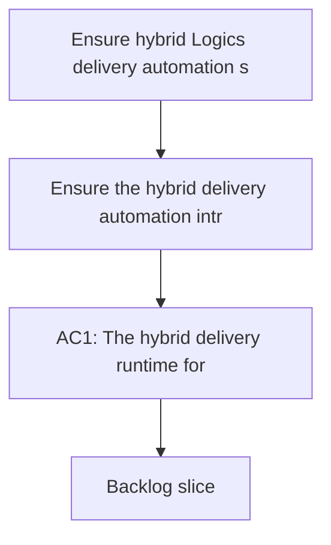

## req_091_ensure_hybrid_logics_delivery_automation_stays_compatible_with_claude_environments_and_windows_runtimes - Ensure hybrid Logics delivery automation stays compatible with Claude environments and Windows runtimes
> From version: 1.12.1
> Schema version: 1.0
> Status: Done
> Understanding: 99%
> Confidence: 97%
> Complexity: High
> Theme: Agent-agnostic hybrid delivery automation and Windows-safe runtime contracts
> Reminder: Update status/understanding/confidence and references when you edit this doc.

# Needs
- Ensure the hybrid delivery automation introduced by `req_089` and the concrete assist flows introduced by `req_090` do not become Codex-only features by accident.
- Define the runtime, skill, and command contracts so the same bounded delivery automations can be used from Codex or from Claude-oriented repository integrations without forking the workflow model.
- Keep the operator path usable on Windows by preventing new hybrid flows from assuming POSIX-only shells, Unix paths, or macOS-only helper scripts as their canonical execution surface.

# Context
- `req_089` and `req_090` establish a direction where repetitive Logics delivery tasks can use `Ollama when available, Codex otherwise` while keeping risky execution under a deterministic runtime or under Codex control.
- That direction is useful only if the resulting flows stay portable across the actual agent environments teams may use:
  - Codex sessions that rely on repo-local skills and workspace overlays;
  - Claude Code or other Claude-oriented setups that rely on thin `.claude/` bridge files rather than Codex-specific manifests;
  - Windows operator environments where the runtime cannot assume POSIX shell syntax, `/tmp`, or shell helpers that only exist on macOS.
- The repo already has two important foundations for this:
  - `req_055` established that Claude integration should remain thin and derivative, with `logics/` staying the source of truth and `.claude/` acting only as a bridge;
  - `req_062`, `req_063`, and `req_077` already pushed the kit toward cross-platform launchers, Windows-safe operator guidance, and environment-check awareness for overlay-backed runtimes.
- The new risk is architectural drift:
  - if the hybrid flows land only as Codex-oriented skills or Codex-only command assumptions, Claude users will lose access to the same delivery automation even though the underlying runtime could have been shared;
  - if command examples and runtime wrappers default back to Bash-only patterns, the hybrid features will regress the Windows contract the kit has already been tightening;
  - if backend contracts mention Codex-specific concepts instead of agent-neutral concepts such as runtime commands, strict payloads, and deterministic execution surfaces, future Claude support will require rework instead of reuse.
- The preferred design should therefore stay layered and portable:
  - the core runtime lives in shared scripts and stable `logics.py flow ...` commands;
  - backend routing, summarization, triage, and bounded decision payloads remain agent-neutral;
  - Codex and Claude integrations become thin adapters that discover and invoke the same runtime surfaces;
  - Windows compatibility is enforced at the command, path, launcher, and validation layers rather than left as a documentation footnote.
- This request is not about building a full Claude-native orchestration stack or replacing existing Codex overlays.
  It is about ensuring the hybrid automation work now being planned does not hard-code a single agent environment or a single OS expectation into the contract.

# Acceptance criteria
- AC1: The hybrid delivery runtime for `req_089` and `req_090` is defined through stable shared command surfaces and strict machine-readable contracts that do not require Codex-specific semantics in order to function.
- AC2: The design explicitly supports thin Claude-facing integration, such as `.claude/` bridge files or equivalent Claude-oriented adapters, that invoke the same shared Logics runtime rather than maintaining a second source of truth for prompts, workflow rules, or task semantics.
- AC3: The supported operator and runtime contract for the hybrid flows is Windows-safe, including cross-platform Python launcher guidance, path handling, quoting expectations, and explicit labeling of intentionally POSIX-only or macOS-only helper assets.
- AC4: New hybrid assist flows and backend-selection logic are specified so they can be discovered and triggered from both Codex-oriented and Claude-oriented repository integrations without changing the underlying workflow semantics.
- AC5: Validation for the hybrid automation includes both agent-surface checks and OS checks, covering at minimum:
  - a Codex-oriented integration path;
  - a Claude-oriented bridge path;
  - a Windows-safe command or CI path for the supported runtime surface.
- AC6: The request makes explicit which parts stay agent-specific, such as Codex overlay sync details or Claude bridge packaging details, while keeping the runtime core, backend contracts, and delivery-flow semantics shared.
- AC7: The request remains compatible with the existing Logics source-of-truth model:
  - `logics/` remains canonical;
  - agent-specific integration layers remain thin adapters;
  - Windows support is enforced through real runtime and validation constraints rather than documentation alone.

# Scope
- In:
  - agent-agnostic runtime contracts for hybrid Logics delivery flows
  - Claude-compatible adapter expectations for the same runtime commands and payloads
  - Windows-safe command, launcher, path, and quoting expectations for the supported hybrid surfaces
  - validation expectations that cover agent and OS portability
  - separation between shared runtime logic and agent-specific integration layers
- Out:
  - replacing existing Codex overlay mechanics with a new universal agent runtime
  - building a large standalone Claude orchestration tree beside `logics/`
  - promising every helper script is cross-platform when some remain intentionally OS-specific
  - broad Windows hardening work outside the hybrid delivery automation surface

# Dependencies and risks
- Dependency: `req_089` remains the platform-level hybrid backend request for `ollama`, `codex`, and `auto` routing.
- Dependency: `req_090` remains the use-case layer for concrete hybrid assist flows such as commit-message generation, summaries, triage, and handoff packets.
- Dependency: `req_055` remains the source-of-truth policy for thin Claude bridge integration.
- Dependency: `req_062`, `req_063`, and `req_077` remain the relevant baseline for Windows-safe launchers, operator guidance, and overlay-aware environment handling.
- Risk: if hybrid flows are documented only through Codex skills, Claude compatibility will look possible in theory but fail in real repository usage.
- Risk: if Claude integration duplicates prompts or workflow rules instead of delegating to shared runtime surfaces, the repo will drift into parallel agent-specific logic trees.
- Risk: if hybrid commands reintroduce `python3`, POSIX-only quoting, or Unix-only temp paths as the default operator story, Windows compatibility will regress despite earlier hardening work.
- Risk: if tests cover only the macOS Codex path, agent portability and Windows compatibility will degrade silently.
- Risk: trying to make every integration perfectly identical across Codex and Claude may overfit the adapter layer; the important invariant is shared runtime behavior, not identical metadata files.

# AC Traceability
- AC1 -> `item_145_make_hybrid_assist_commands_and_payloads_reusable_from_codex_and_claude_adapters` and `task_100_orchestration_delivery_for_req_089_to_req_095_hybrid_assist_runtime_portfolio_governance_portability_and_plugin_exposure`. Proof: the portability wave starts by making commands and payloads agent-neutral at the shared runtime layer.
- AC2 -> `item_145_make_hybrid_assist_commands_and_payloads_reusable_from_codex_and_claude_adapters` and `task_100_orchestration_delivery_for_req_089_to_req_095_hybrid_assist_runtime_portfolio_governance_portability_and_plugin_exposure`. Proof: the Claude-facing integration remains thin and derivative by pointing adapter surfaces back to shared runtime commands.
- AC3 -> `item_146_harden_hybrid_assist_runtime_examples_launchers_and_validation_for_windows_safe_execution` and `task_100_orchestration_delivery_for_req_089_to_req_095_hybrid_assist_runtime_portfolio_governance_portability_and_plugin_exposure`. Proof: Windows-safe launchers, quoting, and validation are isolated as their own portability slice in Wave 2.
- AC4 -> `item_145_make_hybrid_assist_commands_and_payloads_reusable_from_codex_and_claude_adapters`, `item_156_add_plugin_tool_actions_for_high_value_hybrid_assist_flows_through_shared_runtime_commands`, `item_157_add_plugin_audit_visibility_result_panels_and_cross_agent_runtime_messaging_cleanup`, and `task_100_orchestration_delivery_for_req_089_to_req_095_hybrid_assist_runtime_portfolio_governance_portability_and_plugin_exposure`. Proof: discovery is handled through shared runtime commands plus adapter and plugin surfaces rather than by changing workflow semantics per agent.
- AC5 -> `item_146_harden_hybrid_assist_runtime_examples_launchers_and_validation_for_windows_safe_execution`, `item_155_extend_plugin_environment_diagnostics_with_hybrid_runtime_health_backend_selection_and_degraded_state_visibility`, and `task_100_orchestration_delivery_for_req_089_to_req_095_hybrid_assist_runtime_portfolio_governance_portability_and_plugin_exposure`. Proof: the portability plan includes Windows-safe validation and plugin-visible runtime health checks rather than relying on docs alone.
- AC6 -> `item_145_make_hybrid_assist_commands_and_payloads_reusable_from_codex_and_claude_adapters`, `item_157_add_plugin_audit_visibility_result_panels_and_cross_agent_runtime_messaging_cleanup`, and `task_100_orchestration_delivery_for_req_089_to_req_095_hybrid_assist_runtime_portfolio_governance_portability_and_plugin_exposure`. Proof: shared runtime behavior is separated from legitimately adapter-specific metadata and messaging.
- AC7 -> `item_145_make_hybrid_assist_commands_and_payloads_reusable_from_codex_and_claude_adapters`, `item_146_harden_hybrid_assist_runtime_examples_launchers_and_validation_for_windows_safe_execution`, and `task_100_orchestration_delivery_for_req_089_to_req_095_hybrid_assist_runtime_portfolio_governance_portability_and_plugin_exposure`. Proof: the portability work preserves `logics/` as the source of truth and encodes Windows-safe support through real runtime and validation constraints.

# Definition of Ready (DoR)
- [x] Problem statement is explicit and user impact is clear.
- [x] Scope boundaries (in/out) are explicit.
- [x] Acceptance criteria are testable.
- [x] Dependencies and known risks are listed.

# Companion docs
- Product brief(s): (none yet)
- Architecture decision(s): `adr_011_keep_hybrid_assist_runtime_contracts_shared_backend_agnostic_and_safely_bounded`

# AI Context
- Summary: Keep hybrid Logics delivery automation portable by defining agent-neutral runtime contracts that remain usable from Codex or Claude integrations and by enforcing Windows-safe command surfaces for the supported flows.
- Keywords: logics, hybrid automation, codex, claude, windows, cross-platform, runtime contract, thin adapter, ollama
- Use when: Use when planning or reviewing hybrid Logics delivery automation so it stays portable across agent environments and Windows runtimes instead of becoming Codex-only or POSIX-only by drift.
- Skip when: Skip when the work is only about Codex overlay internals, only about broad Windows hardening unrelated to hybrid flows, or only about standalone Claude setup outside shared Logics runtime surfaces.

# References
- `logics/request/req_055_add_a_minimal_claude_code_bridge_for_logics_agents.md`
- `logics/request/req_062_harden_windows_compatibility_across_the_vs_code_plugin_and_logics_kit.md`
- `logics/request/req_063_clarify_windows_operator_guidance_and_platform_specific_helper_boundaries_in_the_logics_docs.md`
- `logics/request/req_077_adapt_logics_bootstrap_and_environment_checks_to_codex_workspace_overlays.md`
- `logics/request/req_089_add_a_hybrid_ollama_or_codex_local_orchestration_backend_for_repetitive_logics_delivery_tasks.md`
- `logics/request/req_090_add_high_roi_hybrid_ollama_or_codex_assist_flows_for_repetitive_logics_delivery_operations.md`
- `logics/skills/logics.py`
- `logics/skills/logics-flow-manager/scripts/logics_flow.py`
- `logics/skills/logics-flow-manager/scripts/logics_codex_workspace.py`
- `logics/skills/logics-flow-manager/SKILL.md`
- `logics/skills/README.md`
- `.claude/commands/logics-flow.md`
- `.claude/agents/logics-flow-manager.md`

# Backlog
- `item_145_make_hybrid_assist_commands_and_payloads_reusable_from_codex_and_claude_adapters`
- `item_146_harden_hybrid_assist_runtime_examples_launchers_and_validation_for_windows_safe_execution`
- Task: `task_100_orchestration_delivery_for_req_089_to_req_095_hybrid_assist_runtime_portfolio_governance_portability_and_plugin_exposure`
