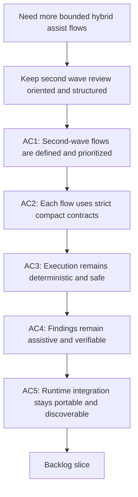

## req_092_add_a_second_wave_of_hybrid_ollama_or_codex_assist_flows_for_risk_triage_commit_planning_closure_summaries_doc_consistency_checks_and_validation_checklists - Add a second wave of hybrid Ollama or Codex assist flows for risk triage commit planning closure summaries doc consistency checks and validation checklists
> From version: 1.12.1
> Schema version: 1.0
> Status: Draft
> Understanding: 99%
> Confidence: 96%
> Complexity: High
> Theme: Second-wave bounded assist flows for delivery review and operational hygiene
> Reminder: Update status/understanding/confidence and references when you edit this doc.

# Needs
- Extend the hybrid `Ollama when available, Codex otherwise` delivery-assist model with a second wave of bounded, repetitive, operator-visible flows that improve review quality and operational hygiene without drifting into unsafe autonomy.
- Prioritize the next shortlist of high-ROI assist tasks: diff-risk triage, commit-plan suggestion, closure-summary drafting, document-consistency checks, and validation-checklist generation.
- Keep these second-wave flows aligned with the same runtime and safety model as `req_089`, `req_090`, and `req_091`: strict contracts, stable commands, thin agent adapters, Windows-safe execution, and Codex or deterministic-runner control for actual mutations.

# Context
- `req_089` defines the hybrid backend layer that can choose `ollama`, `codex`, or `auto` while keeping Codex or deterministic runtime control over risky execution.
- `req_090` defines the first wave of strong-fit and medium-fit hybrid assist flows, centered on commit messages, summaries, next-step dispatch, triage, handoff packets, and split suggestions.
- `req_091` adds the portability guardrails needed to keep those flows usable across Codex and Claude environments and across Windows-safe runtime surfaces.
- The next practical gains are not in broader autonomy but in better operator support around quality review and delivery packaging.
  These are the recurring tasks that still burn attention even when the implementation work itself is done:
  - deciding whether a diff looks low risk, workflow-only, runtime-touching, or worthy of explicit human review;
  - deciding whether the current work should land as one commit, as a submodule-plus-parent pair, or as a small commit sequence;
  - drafting a closure summary for a `task`, `item`, or `req` once implementation and validation are complete;
  - spotting likely documentation inconsistencies before they become workflow drift;
  - generating a tailored validation checklist based on the type of files and runtime surfaces touched.
- These are good second-wave candidates because they remain bounded and review-oriented:
  - they consume compact structured inputs such as `git diff --stat`, changed paths, doc metadata, workflow graph slices, and recent validation outputs;
  - they return short structured outputs such as labels, plans, checklist items, summaries, and anomaly candidates;
  - they do not need the local model to mutate the repository directly.
- The design should stay explicit about boundaries:
  - Ollama may classify, summarize, and propose;
  - Codex or a deterministic runner verifies, stages, commits, edits, or closes workflow state;
  - any anomaly or risk finding returned by the model must still be validated before it is treated as truth.
- This request should remain complementary to `req_090`, not a rewrite of it.
  The first wave covers the most obvious ROI flows.
  This second wave covers adjacent review and packaging work that becomes valuable once the first wave and hybrid backend exist.

# Acceptance criteria
- AC1: The kit defines a second wave of bounded hybrid assist flows covering at minimum:
  - diff-risk triage;
  - commit-plan suggestion;
  - closure-summary drafting for workflow docs;
  - document-consistency checks;
  - validation-checklist generation.
- AC2: Each selected second-wave flow uses a compact structured input contract and a strict bounded output contract so the same operator-facing flow can use Ollama or Codex without changing the surrounding runtime semantics.
- AC3: For all selected second-wave flows, Codex or a deterministic runner remains responsible for actual repository mutation, workflow state changes, and git execution, while Ollama stays proposal-only unless a fully deterministic bounded runner exists.
- AC4: Risk labels, anomaly findings, and consistency warnings produced by the hybrid assist layer are explicitly treated as candidate signals that must be validated by runtime rules, deterministic checks, or human review before they affect repository state.
- AC5: The selected second-wave flows are exposed through stable runtime commands and remain discoverable from supported agent adapters, with the same portability constraints already required for Codex, Claude, and Windows-safe execution.
- AC6: The design explicitly separates these second-wave review and hygiene flows from low-ROI or unsafe expansions such as direct code generation, complex refactor planning, freeform document editing, or unvalidated auto-remediation.

# Scope
- In:
  - diff-risk triage as a bounded hybrid assist flow
  - commit-plan suggestion beyond simple commit-message generation
  - closure-summary drafting for `task`, `item`, and `req` delivery surfaces
  - document-consistency anomaly detection for workflow docs
  - validation-checklist generation from changed-surface context
  - shared runtime contracts, fallback rules, and discovery expectations for those flows
- Out:
  - replacing the first-wave scope of `req_090`
  - direct automatic remediation of every anomaly found by the model
  - code generation, refactor execution, or broad review replacement
  - unrestricted mutation of workflow docs based only on model output

# Dependencies and risks
- Dependency: `req_089` remains the hybrid backend-routing foundation.
- Dependency: `req_090` remains the first-wave use-case portfolio and should land before or alongside this second-wave work.
- Dependency: `req_091` remains the portability contract for Codex, Claude, and Windows-safe execution surfaces.
- Dependency: `req_085` runtime surfaces remain the base for config, indexing, structured outputs, and deterministic flow execution.
- Risk: if risk triage or consistency checks are framed as authoritative instead of assistive, operators may trust weak signals too aggressively.
- Risk: if commit-plan suggestions are too verbose or underspecified, Codex will need to redo the planning and the ROI will collapse.
- Risk: if closure summaries are not grounded in actual refs, validations, and changed files, they will become generic noise.
- Risk: if document-consistency checks rely on loose natural-language heuristics without deterministic follow-up, they will create alert fatigue.
- Risk: if validation-checklist generation is not tied to file categories and runtime surfaces, it will become a repetitive generic template with little value.
- Risk: if these flows are implemented only as hidden helpers rather than stable operator-facing commands, they will not become part of normal delivery practice.

# AC Traceability
- AC1 -> `item_147_add_diff_risk_triage_and_commit_plan_suggestion_flows`, `item_148_add_closure_summary_and_validation_checklist_generation_flows`, `item_149_add_document_consistency_review_flows_with_verified_non_mutative_follow_up`, and `task_100_orchestration_delivery_for_req_089_to_req_095_hybrid_assist_runtime_portfolio_governance_portability_and_plugin_exposure`. Proof: the second-wave portfolio is split into three bounded review-oriented slices and delivered together in Wave 3.
- AC2 -> `item_147_add_diff_risk_triage_and_commit_plan_suggestion_flows`, `item_148_add_closure_summary_and_validation_checklist_generation_flows`, `item_149_add_document_consistency_review_flows_with_verified_non_mutative_follow_up`, `item_150_define_a_shared_hybrid_assist_payload_envelope_and_execution_metadata_contract`, `item_153_define_shared_hybrid_assist_context_pack_profiles_enrichment_rules_and_trimming_strategy`, and `task_100_orchestration_delivery_for_req_089_to_req_095_hybrid_assist_runtime_portfolio_governance_portability_and_plugin_exposure`. Proof: second-wave flows depend on shared payload and context contracts so their commands remain compact and backend-neutral.
- AC3 -> `item_147_add_diff_risk_triage_and_commit_plan_suggestion_flows`, `item_148_add_closure_summary_and_validation_checklist_generation_flows`, `item_149_add_document_consistency_review_flows_with_verified_non_mutative_follow_up`, `item_151_codify_shared_fallback_safety_class_activation_and_rollout_rules_for_hybrid_assist_flows`, and `task_100_orchestration_delivery_for_req_089_to_req_095_hybrid_assist_runtime_portfolio_governance_portability_and_plugin_exposure`. Proof: the review-oriented flows stay assistive and use shared safety classes to keep actual mutation under reviewed execution boundaries.
- AC4 -> `item_149_add_document_consistency_review_flows_with_verified_non_mutative_follow_up`, `item_151_codify_shared_fallback_safety_class_activation_and_rollout_rules_for_hybrid_assist_flows`, and `task_100_orchestration_delivery_for_req_089_to_req_095_hybrid_assist_runtime_portfolio_governance_portability_and_plugin_exposure`. Proof: candidate findings remain non-mutative until deterministic checks or human review validate them.
- AC5 -> `item_145_make_hybrid_assist_commands_and_payloads_reusable_from_codex_and_claude_adapters`, `item_146_harden_hybrid_assist_runtime_examples_launchers_and_validation_for_windows_safe_execution`, `item_156_add_plugin_tool_actions_for_high_value_hybrid_assist_flows_through_shared_runtime_commands`, `item_157_add_plugin_audit_visibility_result_panels_and_cross_agent_runtime_messaging_cleanup`, and `task_100_orchestration_delivery_for_req_089_to_req_095_hybrid_assist_runtime_portfolio_governance_portability_and_plugin_exposure`. Proof: stable runtime commands, adapter reuse, and visible action surfaces make the second-wave flows discoverable across supported activation paths.
- AC6 -> `item_147_add_diff_risk_triage_and_commit_plan_suggestion_flows`, `item_148_add_closure_summary_and_validation_checklist_generation_flows`, `item_149_add_document_consistency_review_flows_with_verified_non_mutative_follow_up`, `item_151_codify_shared_fallback_safety_class_activation_and_rollout_rules_for_hybrid_assist_flows`, and `task_100_orchestration_delivery_for_req_089_to_req_095_hybrid_assist_runtime_portfolio_governance_portability_and_plugin_exposure`. Proof: the second-wave slices stay bounded and explicitly exclude unsafe expansions such as direct mutation or free-form autonomous review.

# Definition of Ready (DoR)
- [x] Problem statement is explicit and user impact is clear.
- [x] Scope boundaries (in/out) are explicit.
- [x] Acceptance criteria are testable.
- [x] Dependencies and known risks are listed.

# Companion docs
- Product brief(s): `prod_001_hybrid_assist_operator_experience_for_repetitive_logics_delivery_flows`
- Architecture decision(s): `adr_011_keep_hybrid_assist_runtime_contracts_shared_backend_agnostic_and_safely_bounded`

# AI Context
- Summary: Define a second wave of bounded hybrid Ollama or Codex assist flows focused on risk triage, commit planning, closure summaries, document-consistency checks, and validation checklist generation.
- Keywords: logics, ollama, codex, hybrid assist, risk triage, commit plan, closure summary, doc consistency, validation checklist
- Use when: Use when planning the next bounded review-oriented hybrid assist flows after the first-wave delivery operations have been defined.
- Skip when: Skip when the work is about backend routing only, first-wave assist flows already covered by `req_090`, or low-ROI autonomous coding work.

# References
- `logics/request/req_085_add_repo_config_runtime_entrypoints_and_transactional_scaling_primitives_to_the_logics_kit.md`
- `logics/request/req_089_add_a_hybrid_ollama_or_codex_local_orchestration_backend_for_repetitive_logics_delivery_tasks.md`
- `logics/request/req_090_add_high_roi_hybrid_ollama_or_codex_assist_flows_for_repetitive_logics_delivery_operations.md`
- `logics/request/req_091_ensure_hybrid_logics_delivery_automation_stays_compatible_with_claude_environments_and_windows_runtimes.md`
- `logics/skills/logics.py`
- `logics/skills/logics-flow-manager/scripts/logics_flow.py`
- `logics/skills/logics-flow-manager/scripts/logics_flow_dispatcher.py`
- `logics/skills/logics-flow-manager/scripts/logics_flow_config.py`
- `logics/skills/logics-flow-manager/scripts/logics_flow_index.py`
- `logics/skills/logics-flow-manager/scripts/logics_codex_workspace.py`
- `logics/skills/logics-ollama-specialist/SKILL.md`
- `logics/skills/README.md`

# Backlog
- `item_147_add_diff_risk_triage_and_commit_plan_suggestion_flows`
- `item_148_add_closure_summary_and_validation_checklist_generation_flows`
- `item_149_add_document_consistency_review_flows_with_verified_non_mutative_follow_up`
- Task: `task_100_orchestration_delivery_for_req_089_to_req_095_hybrid_assist_runtime_portfolio_governance_portability_and_plugin_exposure`
