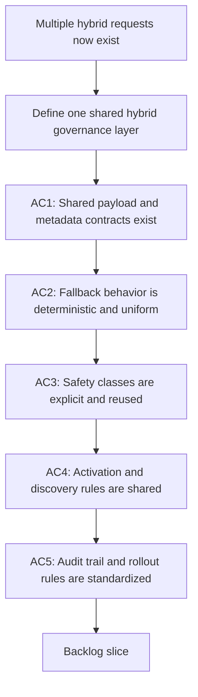

## req_093_add_shared_hybrid_assist_contracts_fallback_policy_activation_rules_and_audit_governance_for_logics_delivery_automation - Add shared hybrid assist contracts fallback policy activation rules and audit governance for Logics delivery automation
> From version: 1.12.1
> Schema version: 1.0
> Status: Draft
> Understanding: 99%
> Confidence: 96%
> Complexity: High
> Theme: Hybrid delivery platform governance and shared runtime contracts
> Reminder: Update status/understanding/confidence and references when you edit this doc.

# Needs
- Add a shared governance layer for the hybrid delivery requests so `req_089`, `req_090`, `req_091`, and `req_092` do not implement incompatible contracts, fallback behavior, activation surfaces, or audit semantics.
- Define the platform-level rules that every hybrid assist flow must reuse: common payload shape, common fallback policy, common safety taxonomy, stable runtime command conventions, activation requirements, audit trail, and rollout expectations.
- Make it possible to add new hybrid assist flows without redesigning backend selection, confidence semantics, verification policy, or observability each time.

# Context
- `req_089` defines the platform ambition for a hybrid `Ollama when available, Codex otherwise` backend on repetitive Logics delivery tasks.
- `req_090` defines the first wave of concrete hybrid assist flows.
- `req_091` ensures those flows remain portable across Codex, Claude-oriented integrations, and Windows-safe runtime surfaces.
- `req_092` extends the hybrid model into a second wave of review-oriented assist flows such as risk triage, commit planning, closure summaries, doc-consistency checks, and validation-checklist generation.
- Those requests describe useful behavior, but they still need a shared contract layer.
  Without that layer, the likely failure modes are predictable:
  - each assist flow invents a slightly different JSON payload shape and confidence model;
  - backend fallback behavior differs between flows, so operators cannot trust what `auto` means;
  - some flows remain `proposal-only` while others silently drift into direct mutation without a clear taxonomy;
  - skills, overlay sync, and Claude bridge triggers are added inconsistently, so some flows are operator-visible and others remain hidden helpers;
  - audit logs and usage metrics diverge, which makes it impossible to compare ROI, failure modes, or human acceptance across flows.
- The right way to prevent that drift is to treat hybrid assist as a platform, not just as a stack of use cases.
  That platform should define reusable invariants:
  - a shared machine-readable envelope for model outputs and backend execution metadata;
  - a deterministic fallback policy for `ollama`, `codex`, and `auto`;
  - a safety taxonomy that distinguishes `proposal-only`, `deterministic-runner`, and `codex-only` execution classes;
  - stable runtime command conventions for discoverability and reuse;
  - common activation rules for Codex skills, Claude adapters, workspace overlay sync, and Windows-safe invocation surfaces;
  - common audit and metrics expectations so the team can tell which hybrid flows are actually helping.
- This request is intentionally horizontal.
  It should not replace the feature-specific requests.
  It should constrain them so their implementations compose into one coherent system.

# Acceptance criteria
- AC1: The hybrid platform defines a shared machine-readable contract for assist-flow outputs and execution metadata, including a common envelope for fields such as backend choice, confidence, rationale, inputs used, proposed action or artifact, validation state, and emitted audit artifacts.
- AC2: The hybrid platform defines one deterministic fallback policy for `ollama`, `codex`, and `auto`, including how flows behave when Ollama is unavailable, unhealthy, too slow, or returns an invalid payload.
- AC3: The platform defines and reuses a common execution-safety taxonomy across hybrid flows, at minimum distinguishing:
  - `proposal-only`;
  - `deterministic-runner`;
  - `codex-only`.
- AC4: The platform defines stable runtime command and activation conventions that all hybrid flows must follow, including:
  - canonical `logics.py flow ...` surfaces;
  - operator-trigger discoverability through Codex skills;
  - thin Claude-compatible adapter expectations;
  - workspace-overlay and Windows-safe invocation requirements.
- AC5: The platform defines a shared audit and metrics contract for hybrid flows, including enough structured data to measure backend choice, fallback rate, invalid-payload rate, operator acceptance, and execution outcomes.
- AC6: The platform defines a rollout policy for hybrid flows, including minimum validation requirements, `suggestion-only` defaults where appropriate, and the conditions under which a flow may graduate to deterministic execution.
- AC7: The request stays horizontal and governance-focused, explicitly leaving flow-specific feature behavior to `req_090` and `req_092` while constraining those requests to use the shared platform contract.

# Scope
- In:
  - shared payload envelope and execution metadata contracts
  - shared fallback policy and error-handling semantics
  - shared safety taxonomy for assist flows
  - shared runtime command naming and activation expectations
  - shared audit, observability, and rollout governance
  - constraints that future hybrid flows must reuse
- Out:
  - implementing all concrete assist flows directly in this request
  - choosing the product wording for each individual operator command
  - replacing feature-specific requests such as `req_090` or `req_092`
  - broad model-evaluation research beyond the operational rules needed for the Logics runtime

# Dependencies and risks
- Dependency: `req_089` remains the backend-routing and hybrid-runtime foundation.
- Dependency: `req_090` and `req_092` remain the feature portfolios that will consume this shared governance layer.
- Dependency: `req_091` remains the portability and compatibility constraint for Codex, Claude, and Windows-safe use.
- Dependency: `req_085` remains the foundation for stable CLI surfaces, structured outputs, config, and deterministic runtime behavior.
- Risk: if each hybrid flow defines its own payload structure, fallback semantics, and audit shape, the platform will become harder to extend than the manual workflows it is meant to improve.
- Risk: if fallback policy is not standardized, operators will not know whether `auto` means “best effort local first” or “sometimes silent fallback with changed semantics.”
- Risk: if safety classes are not explicit, pressure to automate convenience flows may erode the boundary between bounded assistance and unsafe autonomy.
- Risk: if audit and metrics are inconsistent, the team will not be able to evaluate ROI or failure modes honestly.
- Risk: if activation rules are left implicit, some flows will be technically implemented but practically undiscoverable in Codex or Claude sessions.
- Risk: if rollout policy is missing, new flows may go straight to execution without first proving value in `suggestion-only` mode.

# AC Traceability
- AC1 -> `item_150_define_a_shared_hybrid_assist_payload_envelope_and_execution_metadata_contract` and `task_100_orchestration_delivery_for_req_089_to_req_095_hybrid_assist_runtime_portfolio_governance_portability_and_plugin_exposure`. Proof: Wave 1 starts by defining the shared payload envelope and execution metadata contract.
- AC2 -> `item_151_codify_shared_fallback_safety_class_activation_and_rollout_rules_for_hybrid_assist_flows` and `task_100_orchestration_delivery_for_req_089_to_req_095_hybrid_assist_runtime_portfolio_governance_portability_and_plugin_exposure`. Proof: the shared fallback policy is isolated as a dedicated governance slice before feature-specific flows expand.
- AC3 -> `item_151_codify_shared_fallback_safety_class_activation_and_rollout_rules_for_hybrid_assist_flows` and `task_100_orchestration_delivery_for_req_089_to_req_095_hybrid_assist_runtime_portfolio_governance_portability_and_plugin_exposure`. Proof: the same governance slice defines reusable safety classes and execution boundaries.
- AC4 -> `item_151_codify_shared_fallback_safety_class_activation_and_rollout_rules_for_hybrid_assist_flows`, `item_145_make_hybrid_assist_commands_and_payloads_reusable_from_codex_and_claude_adapters`, `item_146_harden_hybrid_assist_runtime_examples_launchers_and_validation_for_windows_safe_execution`, and `task_100_orchestration_delivery_for_req_089_to_req_095_hybrid_assist_runtime_portfolio_governance_portability_and_plugin_exposure`. Proof: shared activation conventions are delivered through governance plus the portability wave.
- AC5 -> `item_152_add_shared_hybrid_audit_metrics_and_observability_governance` and `task_100_orchestration_delivery_for_req_089_to_req_095_hybrid_assist_runtime_portfolio_governance_portability_and_plugin_exposure`. Proof: observability is implemented as a dedicated governance slice before plugin and review loops depend on it.
- AC6 -> `item_151_codify_shared_fallback_safety_class_activation_and_rollout_rules_for_hybrid_assist_flows`, `item_154_add_hybrid_assist_measurement_review_loops_and_degraded_result_policies`, and `task_100_orchestration_delivery_for_req_089_to_req_095_hybrid_assist_runtime_portfolio_governance_portability_and_plugin_exposure`. Proof: rollout defaults and graduation rules are handled across the shared governance and measurement waves.
- AC7 -> `item_150_define_a_shared_hybrid_assist_payload_envelope_and_execution_metadata_contract`, `item_151_codify_shared_fallback_safety_class_activation_and_rollout_rules_for_hybrid_assist_flows`, `item_152_add_shared_hybrid_audit_metrics_and_observability_governance`, and `task_100_orchestration_delivery_for_req_089_to_req_095_hybrid_assist_runtime_portfolio_governance_portability_and_plugin_exposure`. Proof: the governance layer stays separate from use-case slices while the orchestration task keeps those dependencies explicit.

# Definition of Ready (DoR)
- [x] Problem statement is explicit and user impact is clear.
- [x] Scope boundaries (in/out) are explicit.
- [x] Acceptance criteria are testable.
- [x] Dependencies and known risks are listed.

# Companion docs
- Product brief(s): (none yet)
- Architecture decision(s): `adr_011_keep_hybrid_assist_runtime_contracts_shared_backend_agnostic_and_safely_bounded`

# AI Context
- Summary: Define the shared governance contract for hybrid Logics delivery automation so assist flows reuse one payload model, one fallback policy, one safety taxonomy, one activation model, and one audit strategy.
- Keywords: logics, hybrid assist, governance, payload contract, fallback policy, activation, audit, rollout, codex, ollama
- Use when: Use when standardizing hybrid Logics delivery automation across multiple requests so the platform stays coherent as new assist flows are added.
- Skip when: Skip when the work is only about one concrete assist flow, pure Ollama setup, or isolated agent integration with no shared runtime implications.

# References
- `logics/request/req_085_add_repo_config_runtime_entrypoints_and_transactional_scaling_primitives_to_the_logics_kit.md`
- `logics/request/req_089_add_a_hybrid_ollama_or_codex_local_orchestration_backend_for_repetitive_logics_delivery_tasks.md`
- `logics/request/req_090_add_high_roi_hybrid_ollama_or_codex_assist_flows_for_repetitive_logics_delivery_operations.md`
- `logics/request/req_091_ensure_hybrid_logics_delivery_automation_stays_compatible_with_claude_environments_and_windows_runtimes.md`
- `logics/request/req_092_add_a_second_wave_of_hybrid_ollama_or_codex_assist_flows_for_risk_triage_commit_planning_closure_summaries_doc_consistency_checks_and_validation_checklists.md`
- `logics/skills/logics.py`
- `logics/skills/logics-flow-manager/scripts/logics_flow.py`
- `logics/skills/logics-flow-manager/scripts/logics_flow_dispatcher.py`
- `logics/skills/logics-flow-manager/scripts/logics_flow_config.py`
- `logics/skills/logics-flow-manager/scripts/logics_codex_workspace.py`
- `logics/skills/logics-flow-manager/SKILL.md`
- `logics/skills/logics-ollama-specialist/SKILL.md`
- `logics/skills/README.md`
- `.claude/commands/logics-flow.md`
- `.claude/agents/logics-flow-manager.md`

# Backlog
- `item_150_define_a_shared_hybrid_assist_payload_envelope_and_execution_metadata_contract`
- `item_151_codify_shared_fallback_safety_class_activation_and_rollout_rules_for_hybrid_assist_flows`
- `item_152_add_shared_hybrid_audit_metrics_and_observability_governance`
- Task: `task_100_orchestration_delivery_for_req_089_to_req_095_hybrid_assist_runtime_portfolio_governance_portability_and_plugin_exposure`
