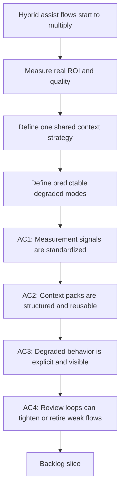

## req_094_add_hybrid_assist_measurement_shared_context_strategy_and_degraded_mode_governance_for_logics_delivery_automation - Add hybrid assist measurement shared context strategy and degraded mode governance for Logics delivery automation
> From version: 1.12.1
> Schema version: 1.0
> Status: Draft
> Understanding: 99%
> Confidence: 96%
> Complexity: High
> Theme: Hybrid assist evaluation, context discipline, and degraded-mode behavior
> Reminder: Update status/understanding/confidence and references when you edit this doc.

# Needs
- Add a shared way to measure whether hybrid assist flows are actually improving delivery quality, latency, and operator effort instead of assuming ROI from intuition alone.
- Define a common context-pack and prompt-input strategy for hybrid assist flows so Ollama and Codex do not receive inconsistent, bloated, or low-signal inputs from one flow to another.
- Define degraded-mode and failure-handling behavior for hybrid assist flows so the system stays predictable when local models are slow, unavailable, invalid, or operating with insufficient context.

# Context
- `req_089` establishes the hybrid backend model where Logics may choose `ollama`, `codex`, or `auto`.
- `req_090` and `req_092` define first-wave and second-wave assist flows that can benefit from a local model for bounded summarization, triage, planning, and review tasks.
- `req_091` ensures those flows remain portable across Codex, Claude-oriented integrations, and Windows-safe execution surfaces.
- `req_093` defines the shared governance layer for payload contracts, fallback policy, activation rules, safety taxonomy, and audit expectations.
- Even with those foundations, three practical problems remain:
  - the team still needs a reliable way to tell whether a hybrid flow is worth keeping, tightening, or removing;
  - the flows still need a disciplined strategy for what context to gather, summarize, trim, and pass into the model;
  - the runtime still needs explicit behavior for degraded states beyond the narrow “fallback if invalid” rule.
- These are not minor implementation details.
  They strongly affect the real operator experience:
  - if the context pack is too small, the model returns shallow or wrong outputs;
  - if the context pack is too large or inconsistent, token usage and latency increase while quality becomes harder to reason about;
  - if degraded behavior is vague, operators cannot tell whether a result came from a healthy backend, a partial fallback, or a low-confidence path;
  - if no metrics are captured, the team cannot tell which flows save time and which ones merely add complexity.
- The right design should therefore define:
  - a reusable context-pack strategy by assist-flow class, including core metadata, optional enrichments, and truncation rules;
  - measurement signals that are good enough to evaluate real usage, such as backend selection, latency, fallback frequency, invalid-payload rate, operator acceptance, and execution outcome quality;
  - degraded-mode rules for cases such as backend timeout, health-check failure, missing context, low confidence, parser failure, and repeated backend instability;
  - operator-visible explanations for degraded results, so users can distinguish “clean result,” “fallback result,” and “needs human review.”
- This request should stay horizontal like `req_093`, but it is narrower:
  - `req_093` defines the platform contract;
  - `req_094` defines how the platform gathers context, evaluates value, and behaves under stress or partial failure.

# Acceptance criteria
- AC1: The hybrid platform defines a shared measurement contract for assist flows, including enough structured signals to evaluate backend choice, latency, fallback frequency, invalid-payload rate, operator acceptance or rejection, and downstream execution outcome quality.
- AC2: The platform defines a reusable context-pack strategy for hybrid assist flows, including:
  - a minimal core context shared across flows;
  - optional enrichments such as diff stats, graph slices, registry summaries, validation outputs, or related workflow refs;
  - explicit trimming or truncation rules so context size remains bounded and explainable.
- AC3: The platform defines degraded-mode behavior for at least these conditions:
  - Ollama unavailable or health check failure;
  - backend timeout or repeated slowness;
  - invalid or unparsable model payload;
  - missing or insufficient context;
  - low-confidence result that should not silently proceed as normal.
- AC4: The degraded-mode design includes operator-visible result states or explanations that distinguish healthy execution, fallback execution, reduced-context execution, and `needs human review` outcomes.
- AC5: The platform defines review-loop rules that use measurement data to decide whether a hybrid assist flow should stay enabled, stay `suggestion-only`, be tightened, or be removed.
- AC6: The request stays complementary to `req_093` by focusing on evaluation, context discipline, and degraded behavior rather than redefining the shared payload envelope, safety taxonomy, or activation model already governed there.

# Scope
- In:
  - measurement and ROI signals for hybrid assist flows
  - shared context-pack design and context-trimming rules
  - degraded-mode rules and operator-visible result states
  - review loops for tightening, graduating, or removing flows
  - guidance reusable across first-wave and second-wave assist flows
- Out:
  - implementing every individual assist flow directly
  - replacing the governance role of `req_093`
  - deep experimentation with model fine-tuning or benchmark suites outside runtime needs
  - broad observability infrastructure unrelated to hybrid assist usage

# Dependencies and risks
- Dependency: `req_089` remains the backend-selection foundation.
- Dependency: `req_090` and `req_092` remain the feature layers that consume shared context and degraded-mode rules.
- Dependency: `req_091` remains the portability constraint across Codex, Claude, and Windows-safe runtime paths.
- Dependency: `req_093` remains the shared governance layer for payload contracts, fallback taxonomy, activation, and audit envelopes.
- Risk: if measurement focuses only on latency or token cost, the team may optimize away usefulness while keeping low-quality outputs.
- Risk: if context packs are not standardized, every flow will re-implement context gathering and produce inconsistent quality.
- Risk: if degraded results are silent, operators may treat a low-confidence or partial result as if it were a healthy one.
- Risk: if review-loop thresholds are too vague, poor flows may linger indefinitely because nobody can prove they should be tightened or removed.
- Risk: if context enrichment is unbounded, the hybrid platform will leak tokens and increase latency enough to erase the local-backend benefit.

# AC Traceability
- AC1 -> `item_154_add_hybrid_assist_measurement_review_loops_and_degraded_result_policies`, `item_152_add_shared_hybrid_audit_metrics_and_observability_governance`, and `task_100_orchestration_delivery_for_req_089_to_req_095_hybrid_assist_runtime_portfolio_governance_portability_and_plugin_exposure`. Proof: the measurement wave combines review-loop rules with the shared observability fields that make those rules measurable.
- AC2 -> `item_153_define_shared_hybrid_assist_context_pack_profiles_enrichment_rules_and_trimming_strategy` and `task_100_orchestration_delivery_for_req_089_to_req_095_hybrid_assist_runtime_portfolio_governance_portability_and_plugin_exposure`. Proof: context-pack profiles, enrichments, and trimming rules are isolated as a dedicated Wave 1 slice.
- AC3 -> `item_154_add_hybrid_assist_measurement_review_loops_and_degraded_result_policies` and `task_100_orchestration_delivery_for_req_089_to_req_095_hybrid_assist_runtime_portfolio_governance_portability_and_plugin_exposure`. Proof: degraded-mode behavior is handled directly in the shared measurement and review-policy slice.
- AC4 -> `item_154_add_hybrid_assist_measurement_review_loops_and_degraded_result_policies`, `item_155_extend_plugin_environment_diagnostics_with_hybrid_runtime_health_backend_selection_and_degraded_state_visibility`, `item_157_add_plugin_audit_visibility_result_panels_and_cross_agent_runtime_messaging_cleanup`, and `task_100_orchestration_delivery_for_req_089_to_req_095_hybrid_assist_runtime_portfolio_governance_portability_and_plugin_exposure`. Proof: operator-visible degraded result states are defined in the shared policy and then surfaced through plugin diagnostics and results.
- AC5 -> `item_154_add_hybrid_assist_measurement_review_loops_and_degraded_result_policies` and `task_100_orchestration_delivery_for_req_089_to_req_095_hybrid_assist_runtime_portfolio_governance_portability_and_plugin_exposure`. Proof: the review-loop slice explicitly governs when flows stay enabled, stay assistive, are tightened, or are removed.
- AC6 -> `item_153_define_shared_hybrid_assist_context_pack_profiles_enrichment_rules_and_trimming_strategy`, `item_154_add_hybrid_assist_measurement_review_loops_and_degraded_result_policies`, and `task_100_orchestration_delivery_for_req_089_to_req_095_hybrid_assist_runtime_portfolio_governance_portability_and_plugin_exposure`. Proof: req_094 stays focused on context discipline, measurement, and degraded modes while reusing the payload and safety governance from req_093.

# Definition of Ready (DoR)
- [x] Problem statement is explicit and user impact is clear.
- [x] Scope boundaries (in/out) are explicit.
- [x] Acceptance criteria are testable.
- [x] Dependencies and known risks are listed.

# Companion docs
- Product brief(s): `prod_001_hybrid_assist_operator_experience_for_repetitive_logics_delivery_flows`
- Architecture decision(s): `adr_011_keep_hybrid_assist_runtime_contracts_shared_backend_agnostic_and_safely_bounded`

# AI Context
- Summary: Define how hybrid Logics assist flows should measure real value, build compact reusable context packs, and behave predictably under degraded backend or low-context conditions.
- Keywords: logics, hybrid assist, measurement, context pack, degraded mode, fallback, roi, latency, review loop
- Use when: Use when standardizing how hybrid assist flows collect context, expose degraded behavior, and prove their real value over time.
- Skip when: Skip when the work is only about one feature-specific assist flow, only about shared payload envelopes already covered by `req_093`, or only about pure backend setup.

# References
- `logics/request/req_089_add_a_hybrid_ollama_or_codex_local_orchestration_backend_for_repetitive_logics_delivery_tasks.md`
- `logics/request/req_090_add_high_roi_hybrid_ollama_or_codex_assist_flows_for_repetitive_logics_delivery_operations.md`
- `logics/request/req_091_ensure_hybrid_logics_delivery_automation_stays_compatible_with_claude_environments_and_windows_runtimes.md`
- `logics/request/req_092_add_a_second_wave_of_hybrid_ollama_or_codex_assist_flows_for_risk_triage_commit_planning_closure_summaries_doc_consistency_checks_and_validation_checklists.md`
- `logics/request/req_093_add_shared_hybrid_assist_contracts_fallback_policy_activation_rules_and_audit_governance_for_logics_delivery_automation.md`
- `logics/skills/logics.py`
- `logics/skills/logics-flow-manager/scripts/logics_flow.py`
- `logics/skills/logics-flow-manager/scripts/logics_flow_dispatcher.py`
- `logics/skills/logics-flow-manager/scripts/logics_flow_config.py`
- `logics/skills/logics-flow-manager/scripts/logics_flow_index.py`
- `logics/skills/logics-flow-manager/scripts/logics_codex_workspace.py`
- `logics/skills/logics-flow-manager/SKILL.md`
- `logics/skills/README.md`

# Backlog
- `item_153_define_shared_hybrid_assist_context_pack_profiles_enrichment_rules_and_trimming_strategy`
- `item_154_add_hybrid_assist_measurement_review_loops_and_degraded_result_policies`
- Task: `task_100_orchestration_delivery_for_req_089_to_req_095_hybrid_assist_runtime_portfolio_governance_portability_and_plugin_exposure`
