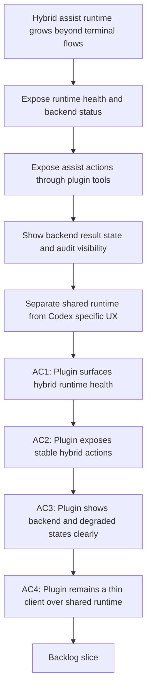

## req_095_adapt_the_vs_code_logics_plugin_to_expose_hybrid_assist_runtime_status_actions_audit_and_cross_agent_messaging - Adapt the VS Code Logics plugin to expose hybrid assist runtime status actions audit and cross-agent messaging
> From version: 1.12.1
> Schema version: 1.0
> Status: Done
> Understanding: 99%
> Confidence: 97%
> Complexity: High
> Theme: VS Code plugin UX for hybrid assist runtime visibility and control
> Reminder: Update status/understanding/confidence and references when you edit this doc.

# Needs
- Adapt the VS Code Logics plugin so the new hybrid assist runtime becomes visible and usable from the extension instead of living only in terminal commands and agent skills.
- Keep the plugin as a thin UX layer above shared `logics.py` runtime commands rather than reimplementing hybrid backend logic inside the extension.
- Make the plugin less Codex-only in its operator messaging by distinguishing:
  - shared hybrid assist runtime surfaces;
  - Codex-specific overlay and handoff affordances;
  - Claude-oriented bridge compatibility where relevant.

# Context
- The plugin already became overlay-aware through `req_076` and related work:
  - it can inspect Codex overlay health;
  - expose overlay launch and sync actions;
  - guide bootstrap and environment remediation from repo-local Logics state.
- The current implementation still reflects a predominantly Codex-oriented mental model:
  - environment reporting exposes `codexOverlay` and `codexRuntime` capabilities in [src/logicsEnvironment.ts](/Users/alexandreagostini/Documents/cdx-logics-vscode/src/logicsEnvironment.ts#L15);
  - the Tools menu emphasizes `Launch Codex` and `Sync Codex Overlay` in [src/logicsWebviewHtml.ts](/Users/alexandreagostini/Documents/cdx-logics-vscode/src/logicsWebviewHtml.ts#L67);
  - the webview action handling is oriented around bootstrap, repair, overlay, and guided Codex flows in [src/logicsViewProvider.ts](/Users/alexandreagostini/Documents/cdx-logics-vscode/src/logicsViewProvider.ts#L83);
  - the README still frames several plugin surfaces as Codex-first, including “Context pack for Codex” and overlay-centric tools in [README.md](/Users/alexandreagostini/Documents/cdx-logics-vscode/README.md#L204).
- That was coherent before the hybrid-assist request set existed.
  It is now incomplete for the direction defined by `req_089` through `req_094`:
  - the plugin needs to surface hybrid backend health, such as Ollama availability, model readiness, backend auto resolution, and degraded states;
  - the plugin needs operator-visible actions for the first-wave and second-wave assist flows, such as commit-all, next-step suggestion, validation summary, triage, handoff, and later risk triage or closure-summary flows;
  - the plugin needs to show which backend actually produced a result and whether the result came from a healthy path, a fallback path, or a degraded path;
  - the plugin needs to expose audit summaries and remediation actions instead of leaving users to inspect raw logs manually.
- The extension should still avoid becoming a second runtime:
  - the flow manager and shared CLI remain the source of truth for hybrid assist behavior;
  - the plugin should invoke canonical runtime commands and render their results;
  - agent-specific integrations remain additive adapters, not separate business logic trees in the extension.
- The preferred plugin outcome is therefore:
  - environment diagnostics enriched with hybrid runtime health;
  - Tools menu actions that launch supported hybrid flows through stable runtime commands;
  - clear UI states for backend selection, degraded execution, and audit visibility;
  - wording that distinguishes shared assist runtime from Codex-specific launch surfaces;
  - tests that cover those UX surfaces instead of assuming terminal-only usage.

# Acceptance criteria
- AC1: The plugin environment and diagnostics surfaces expose hybrid assist runtime health in addition to current repo-local and Codex-overlay state, covering at minimum:
  - Ollama reachability or unavailability;
  - expected model readiness;
  - backend auto-selection outcome when relevant;
  - degraded or fallback status when the hybrid runtime is not in a healthy state.
- AC2: The plugin exposes operator-facing actions for supported hybrid assist flows through stable runtime commands rather than bespoke extension logic, with at least an initial surface for representative high-ROI flows such as commit-all, next-step suggestion, validation summary, or workflow triage.
- AC3: The plugin makes backend provenance and degraded-mode state visible when a hybrid flow runs, so operators can distinguish:
  - healthy Ollama-backed output;
  - Codex fallback output;
  - reduced-context or low-confidence output;
  - `needs human review` outcomes.
- AC4: The plugin provides a user-visible audit or result-summary surface for hybrid runs, including enough information to inspect what action was proposed or executed, which backend was used, and why a fallback or degraded result occurred.
- AC5: The plugin UX and documentation distinguish between:
  - shared hybrid assist runtime actions;
  - Codex-specific launch or overlay actions;
  - agent-neutral compatibility expectations required by Claude-oriented bridges and Windows-safe runtime paths.
- AC6: The implementation remains additive and thin: the plugin invokes shared `logics.py` runtime surfaces and interprets structured results, but does not become the owner of hybrid backend routing, payload semantics, or assist-flow business logic.
- AC7: The plugin test and documentation surface is extended so the new hybrid runtime UX is covered by meaningful harness or integration checks rather than only by README prose.

# Scope
- In:
  - hybrid runtime status in plugin diagnostics and environment views
  - hybrid assist actions surfaced through the plugin tools UI
  - backend provenance, degraded-state visibility, and audit-result presentation
  - UX wording cleanup to separate shared assist runtime from Codex-specific surfaces
  - documentation and tests for the new plugin surfaces
- Out:
  - moving hybrid runtime ownership into the extension
  - replacing the shared CLI or flow-manager scripts with TypeScript reimplementations
  - promising every assist flow gets a first-class plugin button immediately
  - removing Codex overlay support, which remains a supported specialized path

# Dependencies and risks
- Dependency: `req_076` remains the baseline plugin adaptation for Codex overlays and additive runtime awareness.
- Dependency: `req_089` through `req_094` remain the shared runtime, portability, governance, measurement, and degraded-mode foundations that the plugin should consume rather than redefine.
- Dependency: `src/logicsEnvironment.ts`, `src/logicsViewProvider.ts`, `src/logicsWebviewHtml.ts`, and the README remain the primary plugin integration surfaces.
- Risk: if the plugin adds buttons without exposing backend provenance or degraded states, operators will treat hybrid runs as opaque magic and lose trust quickly.
- Risk: if the extension duplicates backend routing or payload logic in TypeScript, it will drift from the shared runtime and become expensive to maintain.
- Risk: if plugin wording stays Codex-only while the runtime becomes agent-neutral, users will misunderstand what is generic versus Codex-specific.
- Risk: if hybrid audit visibility is missing, debugging fallback and low-confidence behavior will remain terminal-only and reduce adoption.
- Risk: if the initial plugin surface tries to expose every new assist flow at once, the UI may become noisy before the most valuable actions prove themselves.

# AC Traceability
- AC1 -> `item_155_extend_plugin_environment_diagnostics_with_hybrid_runtime_health_backend_selection_and_degraded_state_visibility` and `task_100_orchestration_delivery_for_req_089_to_req_095_hybrid_assist_runtime_portfolio_governance_portability_and_plugin_exposure`. Proof: the plugin wave starts by extending diagnostics with backend health, auto-selection, and degraded-state visibility.
- AC2 -> `item_156_add_plugin_tool_actions_for_high_value_hybrid_assist_flows_through_shared_runtime_commands` and `task_100_orchestration_delivery_for_req_089_to_req_095_hybrid_assist_runtime_portfolio_governance_portability_and_plugin_exposure`. Proof: representative assist actions are added through shared runtime commands rather than extension-owned logic.
- AC3 -> `item_155_extend_plugin_environment_diagnostics_with_hybrid_runtime_health_backend_selection_and_degraded_state_visibility`, `item_157_add_plugin_audit_visibility_result_panels_and_cross_agent_runtime_messaging_cleanup`, and `task_100_orchestration_delivery_for_req_089_to_req_095_hybrid_assist_runtime_portfolio_governance_portability_and_plugin_exposure`. Proof: backend provenance and degraded-result visibility are defined in diagnostics and then reflected in plugin result surfaces.
- AC4 -> `item_157_add_plugin_audit_visibility_result_panels_and_cross_agent_runtime_messaging_cleanup` and `task_100_orchestration_delivery_for_req_089_to_req_095_hybrid_assist_runtime_portfolio_governance_portability_and_plugin_exposure`. Proof: audit and run-summary visibility are implemented as a dedicated plugin slice instead of staying terminal-only.
- AC5 -> `item_145_make_hybrid_assist_commands_and_payloads_reusable_from_codex_and_claude_adapters`, `item_157_add_plugin_audit_visibility_result_panels_and_cross_agent_runtime_messaging_cleanup`, and `task_100_orchestration_delivery_for_req_089_to_req_095_hybrid_assist_runtime_portfolio_governance_portability_and_plugin_exposure`. Proof: messaging cleanup separates shared hybrid runtime concepts from Codex-specific overlay behavior while staying compatible with Claude-oriented adapters.
- AC6 -> `item_155_extend_plugin_environment_diagnostics_with_hybrid_runtime_health_backend_selection_and_degraded_state_visibility`, `item_156_add_plugin_tool_actions_for_high_value_hybrid_assist_flows_through_shared_runtime_commands`, and `task_100_orchestration_delivery_for_req_089_to_req_095_hybrid_assist_runtime_portfolio_governance_portability_and_plugin_exposure`. Proof: each plugin slice explicitly consumes shared runtime surfaces instead of reimplementing backend routing or payload logic in TypeScript.
- AC7 -> `item_155_extend_plugin_environment_diagnostics_with_hybrid_runtime_health_backend_selection_and_degraded_state_visibility`, `item_156_add_plugin_tool_actions_for_high_value_hybrid_assist_flows_through_shared_runtime_commands`, `item_157_add_plugin_audit_visibility_result_panels_and_cross_agent_runtime_messaging_cleanup`, and `task_100_orchestration_delivery_for_req_089_to_req_095_hybrid_assist_runtime_portfolio_governance_portability_and_plugin_exposure`. Proof: the plugin wave requires harness or integration coverage for hybrid runtime status, actions, and result presentation.

# Definition of Ready (DoR)
- [x] Problem statement is explicit and user impact is clear.
- [x] Scope boundaries (in/out) are explicit.
- [x] Acceptance criteria are testable.
- [x] Dependencies and known risks are listed.

# Companion docs
- Product brief(s): `prod_002_plugin_hybrid_assist_runtime_visibility_and_action_ux`
- Architecture decision(s): `adr_012_keep_the_vs_code_plugin_as_a_thin_client_over_shared_hybrid_runtime_commands`

# AI Context
- Summary: Adapt the VS Code plugin so it surfaces hybrid assist runtime status, representative actions, backend provenance, degraded states, and audit visibility while staying a thin client over shared Logics runtime commands.
- Keywords: plugin, hybrid assist, ollama, codex, diagnostics, audit, degraded mode, tools menu, runtime status
- Use when: Use when planning how the VS Code extension should expose the hybrid Logics assist runtime without reimplementing its business logic.
- Skip when: Skip when the work is purely terminal-side runtime design, pure Codex overlay internals, or standalone Claude bridge work outside the plugin UX.

# References
- `logics/request/req_076_adapt_the_vs_code_logics_plugin_to_codex_workspace_overlays.md`
- `logics/request/req_089_add_a_hybrid_ollama_or_codex_local_orchestration_backend_for_repetitive_logics_delivery_tasks.md`
- `logics/request/req_090_add_high_roi_hybrid_ollama_or_codex_assist_flows_for_repetitive_logics_delivery_operations.md`
- `logics/request/req_091_ensure_hybrid_logics_delivery_automation_stays_compatible_with_claude_environments_and_windows_runtimes.md`
- `logics/request/req_092_add_a_second_wave_of_hybrid_ollama_or_codex_assist_flows_for_risk_triage_commit_planning_closure_summaries_doc_consistency_checks_and_validation_checklists.md`
- `logics/request/req_093_add_shared_hybrid_assist_contracts_fallback_policy_activation_rules_and_audit_governance_for_logics_delivery_automation.md`
- `logics/request/req_094_add_hybrid_assist_measurement_shared_context_strategy_and_degraded_mode_governance_for_logics_delivery_automation.md`
- `src/logicsEnvironment.ts`
- `src/logicsViewProvider.ts`
- `src/logicsWebviewHtml.ts`
- `src/logicsViewDocumentController.ts`
- `README.md`

# Backlog
- `item_155_extend_plugin_environment_diagnostics_with_hybrid_runtime_health_backend_selection_and_degraded_state_visibility`
- `item_156_add_plugin_tool_actions_for_high_value_hybrid_assist_flows_through_shared_runtime_commands`
- `item_157_add_plugin_audit_visibility_result_panels_and_cross_agent_runtime_messaging_cleanup`
- Task: `task_100_orchestration_delivery_for_req_089_to_req_095_hybrid_assist_runtime_portfolio_governance_portability_and_plugin_exposure`
