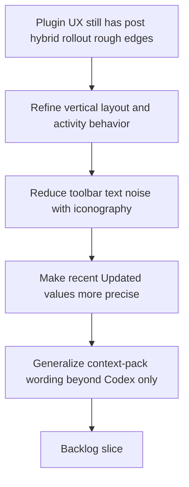

## req_096_refine_plugin_responsive_activity_toolbar_iconography_timestamp_precision_and_agent_neutral_context_pack_wording - Refine plugin responsive activity behavior, toolbar iconography, timestamp precision, and agent-neutral context-pack wording
> From version: 1.12.1
> Schema version: 1.0
> Status: Done
> Understanding: 98%
> Confidence: 97%
> Complexity: Medium
> Theme: Plugin UX polish, responsive behavior, and agent-neutral wording
> Reminder: Update status/understanding/confidence and references when you edit this doc.

# Needs
- Refine several plugin UX details that now feel inconsistent or overly Codex-specific after the broader hybrid-assist work landed.
- Make the vertical layout behave more intentionally when `Activity` is opened and the details panel already occupies the lower region.
- Reduce toolbar text noise by replacing the current `Activity`, `Attention`, `List`, and `Board` labels with icon-led controls that still remain accessible.
- Make the `Updated` field more precise for recently modified docs and generalize `Context pack for Codex` wording so the plugin no longer frames a shared AI handoff surface as if it belonged only to Codex.

# Context
- Recent plugin work already strengthened responsive layout, activity visibility, details behavior, and hybrid-assist surfaces, but several small UX seams remain visible:
  - in vertical layout, the lower details region and the activity panel compete for the same scarce height budget;
  - the top toolbar still mixes terse icon controls with large text buttons, which makes the header look denser than necessary;
  - relative update timestamps stay too coarse for recently changed docs, which weakens the usefulness of `Updated` in active delivery sessions;
  - the details panel still says `Context pack for Codex` even though the surrounding product direction increasingly treats that surface as a compact handoff or context package usable by multiple AI agents.
- These issues are plugin-side concerns rather than kit/runtime behavior:
  - collapsing or preserving the bottom details panel when opening `Activity` is a webview layout rule;
  - text-vs-icon toolbar controls belong to plugin rendering and accessibility decisions;
  - relative timestamp precision is a presentation-layer formatting choice;
  - the wording shown in the details panel and README is plugin copy, even if it should stay aligned with shared runtime concepts.
- The layout change should remain compatible with the existing responsive design rules:
  - when the split is vertical and details already sit below the main browsing surface, opening `Activity` should not create an awkward double-stack that leaves too little usable space;
  - collapsing the details panel when `Activity` opens in that specific mode is acceptable if the behavior stays explicit and reversible;
  - non-vertical layouts should not inherit a surprising collapse side effect unless there is a comparable space conflict.
- The wording change should remain careful:
  - the goal is not to erase Codex-specific features such as overlays or direct injection actions;
  - the goal is to rename or frame the shared context-pack surface so it describes a generic AI handoff/context package while preserving Codex-specific affordances where they truly remain specialized.

# Acceptance criteria
- AC1: When the plugin is in the vertical layout where the details panel is docked below the main browsing area, opening `Activity` collapses the bottom details panel automatically so the lower viewport budget is not split between two competing panels at once.
- AC2: The toolbar controls currently labeled `Activity`, `Attention`, and the view-mode toggle (`List` / `Board`) are redesigned around icons while preserving accessible labels, discoverable tooltips, and clear selected-state feedback.
- AC3: Relative `Updated` display becomes more precise for recently modified docs, with a finer-grained format when the underlying timestamp is less than 24 hours old.
- AC4: The details panel and related plugin documentation replace `Context pack for Codex` framing with agent-neutral wording for the shared AI context package, while keeping explicitly Codex-only affordances labeled as such where needed.
- AC5: The implementation remains plugin-scoped: it adjusts webview rendering, interaction, wording, and documentation without moving context-pack logic or AI backend ownership into the extension.
- AC6: Webview and plugin regression coverage is extended so the new collapse rule, icon-led controls, timestamp precision, and wording changes do not regress silently.

# Scope
- In:
  - vertical-layout activity behavior when details are docked at the bottom
  - toolbar iconography for `Activity`, `Attention`, and view-mode controls
  - more precise recent `Updated` presentation in plugin surfaces
  - agent-neutral naming for the shared context-pack UI and plugin docs
  - plugin tests and documentation for those UX changes
- Out:
  - redesigning the entire toolbar or replacing the existing responsive layout system
  - changing the shared kit/runtime context-pack payload contract
  - removing legitimate Codex-specific overlay or injection surfaces
  - runtime-level timestamp storage changes outside presentation needs

# Dependencies and risks
- Dependency: `req_095` remains the baseline for plugin hybrid-assist UX and thin-client boundaries.
- Dependency: existing responsive-layout and detail-panel rules remain relevant constraints, especially the prior work around bounded activity height and bottom-docked details.
- Dependency: the current context-pack surface and AI handoff wording in the details panel and README remain the primary copy surfaces to adapt.
- Risk: if `Activity` silently collapses details outside the specific vertical conflict case, the plugin may feel unpredictable.
- Risk: if icons replace text without strong accessible names, keyboard and screen-reader discoverability will regress.
- Risk: if relative timestamps become too noisy, cards may feel visually unstable instead of more informative.
- Risk: if wording becomes generic but still points to Codex-only actions without clear separation, users may become more confused rather than less.

# AC Traceability
- AC1 -> plugin responsive layout and activity-panel interaction updates. Proof: the request explicitly narrows the collapse behavior to the vertical layout where details are bottom-docked and space conflict is real.
- AC2 -> toolbar rendering and interaction states. Proof: the request requires icon-led replacements for `Activity`, `Attention`, and the view-mode label while preserving accessibility and active-state clarity.
- AC3 -> plugin timestamp formatting surfaces. Proof: the request requires finer-grained `Updated` output when the doc age is below 24 hours.
- AC4 -> details-panel wording and README/plugin copy. Proof: the request requires replacing `Context pack for Codex` framing with an agent-neutral shared context-pack label while preserving truly Codex-specific affordances.
- AC5 -> thin plugin boundary. Proof: the request explicitly excludes moving shared context-pack or AI backend logic into the extension.
- AC6 -> plugin/webview regression coverage. Proof: the request explicitly requires tests for the new collapse, iconography, timestamp, and wording behavior.

# Definition of Ready (DoR)
- [x] Problem statement is explicit and user impact is clear.
- [x] Scope boundaries (in/out) are explicit.
- [x] Acceptance criteria are testable.
- [x] Dependencies and known risks are listed.

# Companion docs
- Product brief(s): (none yet)
- Architecture decision(s): `adr_005_define_responsive_layout_scroll_and_sizing_rules_for_plugin_views`

# AI Context
- Summary: Refine the plugin with vertical-layout activity behavior, icon-led toolbar controls, better recent timestamp precision, and agent-neutral context-pack wording.
- Keywords: plugin, activity panel, details panel, vertical layout, icons, timestamps, context pack, codex, ai handoff
- Use when: Use when planning plugin-only UX polish around responsive layout, toolbar density, relative timestamps, and AI handoff wording.
- Skip when: Skip when the work is about shared runtime contracts, local-model selection, or kit-side model support.

# References
- `logics/request/req_054_keep_detail_panel_actions_fixed_at_the_bottom_while_content_scrolls.md`
- `logics/request/req_056_context_pack_attention_explain_and_dependency_map.md`
- `logics/request/req_095_adapt_the_vs_code_logics_plugin_to_expose_hybrid_assist_runtime_status_actions_audit_and_cross_agent_messaging.md`
- `src/logicsWebviewHtml.ts`
- `src/logicsViewProvider.ts`
- `media/main.js`
- `media/mainInteractions.js`
- `media/renderDetails.js`
- `README.md`

# Backlog
- `item_158_collapse_bottom_details_when_activity_opens_in_vertical_plugin_layout`
- `item_159_replace_textual_activity_attention_and_view_mode_labels_with_accessible_toolbar_icons`
- `item_160_make_recent_plugin_updated_timestamps_more_precise_under_twenty_four_hours`
- `item_161_generalize_plugin_context_pack_wording_beyond_codex_while_preserving_codex_specific_actions`
- Task: `task_101_orchestration_delivery_for_req_096_and_req_097_plugin_polish_and_hybrid_local_model_profile_flexibility`
